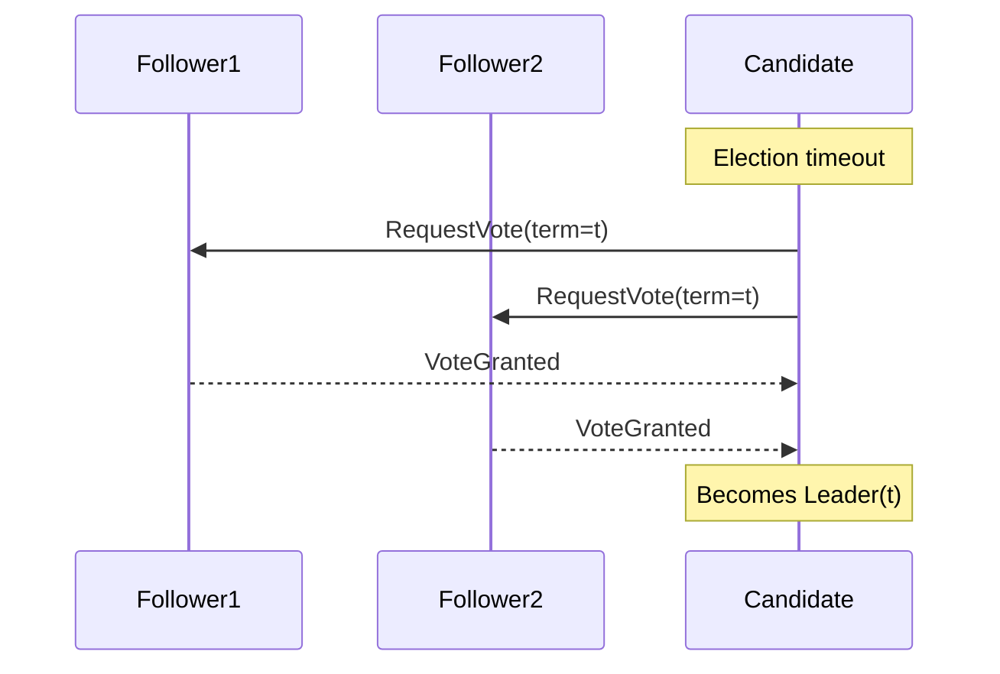
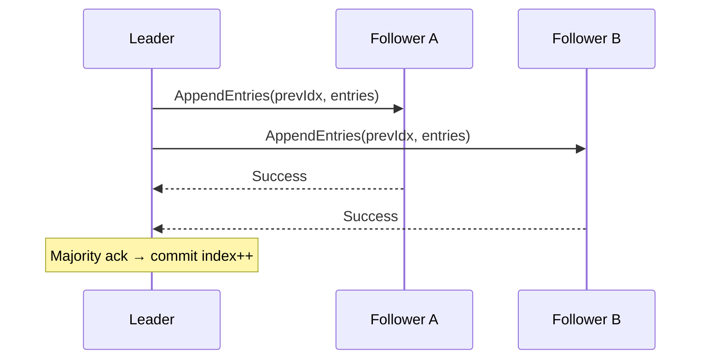
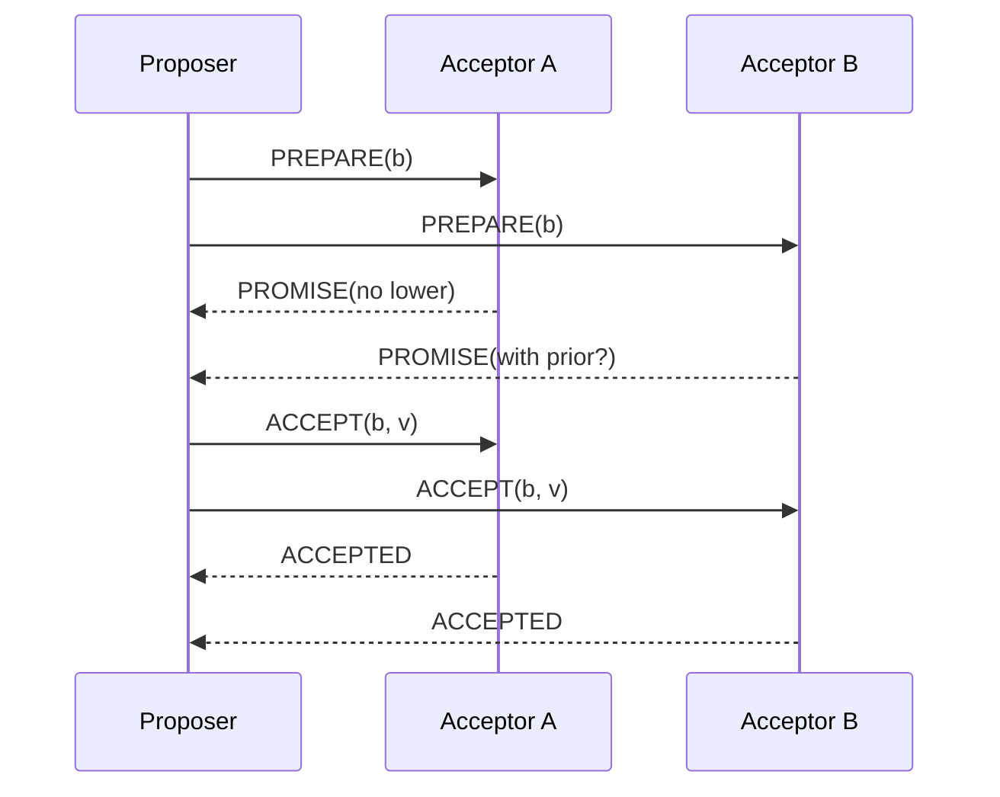

# 🤝 Consensus Algorithms — Beginner to Advanced Guide (Expanded)

## 0) Executive Summary
Consensus algorithms let a distributed system **agree on a single, correct value or ordered log of operations** despite machine crashes, partitions, slow disks, GC pauses, or even malicious actors (BFT). They underpin **leader election**, **replicated logs**, **metadata stores**, **locks**, and **strongly consistent key‑value stores** that power service discovery, config, and transactions.

---

## 1) Overview & When to Use Consensus
Use consensus when you need **strong consistency** and a **single, linearizable source of truth**:
- Cluster coordination, locks/leases, leader election
- Metadata/config stores (etcd, Consul, ZooKeeper)
- Strongly consistent DB shards (Spanner, CockroachDB)
- Transaction managers, fencing tokens

Avoid consensus when **eventual consistency suffices** (analytics, feed fan‑out, caches) or where **conflict resolution/CRDTs** are preferred.

---

## 1.1 CAP vs. PACELC & Consistency Models
| Concept | What it says | Practical takeaway |
|---|---|---|
| **CAP** | Under partitions, you must choose C or A. | Consensus chooses **C** (safety) over A during partitions. |
| **PACELC** | Else (no partition) trade **Latency vs Consistency**. | Cross‑region consensus adds latency even without faults. |
| **Linearizability** | Reads/writes behave as if instant at a single point in time. | Strongest single‑object guarantee; consensus targets this. |
| **Serializability** | Transactions appear as some serial order. | DB‑level; can be built atop replicated logs. |
| **Sequential Consistency** | Per‑client order preserved; global timing not guaranteed. | Weaker than linearizability. |

---

## 2) Core Concepts (Crash‑fault & Byzantine)

| Concept | What it means | Why it matters |
|---|---|---|
| Fault model | **Crash‑Fault (CFT)** vs **Byzantine (BFT)**. | Dictates node count & quorum math. |
| Synchrony | **Synchronous / Async / Partially synchronous**. | Liveness depends on timeouts & clocks. |
| Quorum | Subset large enough to decide (e.g., majority). | Two quorums must **intersect** → safety. |
| Term/Epoch/View | Logical leadership period. | Prevents split‑brain/stale leaders. |
| Replicated Log | Ordered ops; commit once quorum durable. | **State Machine Replication (SMR)**. |
| FLP | Async + 1 crash ⇒ no deterministic termination. | Real systems assume partial synchrony + failure detectors. |

**Node counts to tolerate `f` faults**
- **CFT:** `N = 2f + 1` → 3 nodes tolerate 1 fault; 5 → 2.
- **BFT:** `N = 3f + 1` → 4 nodes tolerate 1 Byzantine.

---

## 2.1 Failure Detectors & Elections
- **Heartbeat/Timeout** or **φ‑accrual** failure detector (tunes for network jitter).
- **Election timeouts:** choose uniformly from `[Tmin, Tmax]` with `Tmin >= 2×heartbeat` to reduce split votes.
- **Clock skew & leases:** for lease‑based reads, require `skew < lease/2`.

---

## 3) Safety vs Liveness
- **Safety:** Never decide two different values; committed entries never roll back.
- **Liveness:** System eventually decides given partial synchrony (timeouts eventually exceed delays).

> 🧭 Favor **safety first**. Improve liveness by careful timeout/batching/placement, never by breaking quorums.

---

## 4) Algorithms at a Glance

| Family | Model | Core idea | Pros | Cons | Real systems |
|---|---|---|---|---|---|
| **Raft** | CFT | Leader‑based log replication; joint consensus reconfig | Understandable; fast in LAN; strong ecosystem | Single leader bottleneck across regions | etcd, Consul, CockroachDB ranges, Kafka KRaft metadata |
| **(Multi)‑Paxos** | CFT | Stable leader after Phase‑1; 1 RTT steady‑state | WAN friendly with leader locality | Harder to implement/explain | Spanner, Azure Storage |
| **Zab / VRR** | CFT | View‑stamped replication / atomic broadcast | Production‑hardened ordering | Needs leader | ZooKeeper |
| **EPaxos / Fast Paxos** | CFT | Leaderless fast path via flexible quorums | Lower latency; parallel commits | Conflict handling complexity | Research/limited prod |
| **PBFT / Tendermint / HotStuff** | BFT | Voting phases (3‑phase) with view changes | Tolerates malicious faults | O(n²) msgs; larger quorums | Cosmos (Tendermint), Diem/Libra (HotStuff) |

---

## 5) Quorums: Majority, Read/Write & Flexible
- **Majority quorum:** any two majorities intersect.
- **Linearizable reads:** either quorum reads, **read‑index** (Raft), or **leader lease**.
- **Read/Write quorums:** ensure `Qw + Qr > N` and `Qw > N/2`.

**Flexible Paxos:** allow different P1/P2 quorums if **intersection** holds → lower steady‑state latency.

---

## 6) Deep Dive: Raft (SMR)

### 6.1 Roles & RPCs
- **Leader, Follower, Candidate**
- RPCs: `RequestVote`, `AppendEntries` (heartbeat + replication), `InstallSnapshot`

### 6.2 Leader Election (Mermaid)


### 6.3 Log Replication & Commit (Mermaid)


### 6.4 Membership Change (Joint Consensus)
1) Start joint config `{old ∪ new}` (decisions need both majorities)  
2) Commit joint config  
3) Transition to `{new}` only

### 6.5 Snapshotting & Install
- Truncate prefixes; followers catch up via snapshots; throttle snapshot xfer to avoid leadership loss.

### 6.6 Linearizable Reads
- **Read‑Index:** round‑trip heartbeat to confirm leadership before serving read.
- **Lease Reads:** serve locally if lease valid and `clockSkew < lease/2`.

#### Java‑like `AppendEntries` handler
```java
class RaftNode {
  int currentTerm, commitIndex;
  String leaderId; Log log;

  AppendEntriesResult onAppendEntries(AppendEntries rpc) {
    if (rpc.term < currentTerm) return fail(currentTerm);
    currentTerm = rpc.term; leaderId = rpc.leaderId;

    if (!log.matches(rpc.prevLogIndex, rpc.prevLogTerm)) return fail(currentTerm);
    log.appendFrom(rpc.prevLogIndex + 1, rpc.entries);

    if (rpc.leaderCommit > commitIndex) {
      commitIndex = Math.min(rpc.leaderCommit, log.lastIndex());
      applyToStateMachine(commitIndex);
    }
    return ok(currentTerm);
  }
}
```

---

## 7) Deep Dive: Paxos / Multi‑Paxos

### Phases
1. **Prepare / Promise** (P1): proposer chooses ballot `b`; acceptors promise not to accept `< b`.  
2. **Accept** (P2): proposer sends value (highest seen or new); acceptors accept.  
3. **Multi‑Paxos**: after leader established, skip P1 for subsequent slots (1 RTT writes).

### Pseudocode
```text
propose(v):
  choose unique ballot b
  send PREPARE(b)
  wait for majority PROMISE
  v' = highestAcceptedOr(v)
  send ACCEPT(b, v')
  wait for majority ACCEPTED
  decide v'
```

### Mermaid — single slot


---

## 8) EPaxos / Fast Paxos (Leaderless)
- **Idea:** commands carry dependency info; if non‑conflicting, commit with a **fast path** quorum.
- **Benefit:** lower tail latency; **no central leader**.
- **Trade‑off:** conflict detection & recovery slow paths; more complex implementation.

---

## 9) BFT Consensus
| Algo | Quorum | Messages | Notes | Systems |
|---|---|---|---|---|
| **PBFT** | `3f+1` | O(n²) | Classic; practical BFT | Research, permissioned chains |
| **Tendermint** | `3f+1` | O(n²) | Rounds: propose/prevote/precommit | Cosmos |
| **HotStuff** | `3f+1` | O(n) view‑change | Simpler view changes | Diem/Libra |

Use BFT for **adversarial/permissioned** environments; expect more nodes & latency.

---

## 10) TrueTime & External Consistency (Spanner)
- Leader localized per shard; **Paxos** for commit.
- **Commit‑wait:** wait out clock uncertainty `ε` so clients observe a **global** serial order.
- Requires tightly synchronized clocks (GPS + atomic clocks).

---

## 11) Client Patterns: Leases, Locks & Fencing
- **Fencing tokens:** monotonically increasing token for each lock holder; downstream systems reject stale tokens.  
- **Idempotent writes** and **retries** with timeouts.  
- **Session/lease expirations** to avoid orphan locks.

**Java (etcd lock & fencing)**
```java
long token = kv.seqIncrement("locks/jobA"); // fencing token
if (kv.cas("locks/jobA/holder", "free", myId + ":" + token)) {
  try { doWorkWithFencing(token); }
  finally { kv.put("locks/jobA/holder", "free"); }
}
```

---

## 12) Performance & Latency
**Commit latency** ≈ **1 RTT** to quorum (steady‑state, leader local) + disk fsync.  
Cross‑region adds WAN RTT: prefer **leader near writers** or **per‑shard regional leaders**.  
Tune:
- Batching/pipelining (`maxInflight`, `appendBatch`)
- WAL fsync & segment size; SSD/NVMe
- GC & stop‑the‑world pauses; isolate compaction

---

## 13) Deployment & Sizing
- Use **odd** voters: 3 (1 fault), 5 (2 faults). Avoid 4 voters.
- Separate **voters** from **learners** for read scale.
- Avoid stretching a single quorum across distant regions; use per‑region shards with local leaders.

**etcd example (3 voters)**
```bash
etcd --name n1 --initial-cluster n1=http://10.0.0.1:2380,n2=http://10.0.0.2:2380,n3=http://10.0.0.3:2380 \
     --heartbeat-interval=100 --election-timeout=1000
```

**Kafka KRaft (controller quorum)**
```properties
process.roles=broker,controller
controller.quorum.voters=1@q1:9093,2@q2:9093,3@q3:9093
```

---

## 14) Monitoring & Alerting
| Metric | Why | Example |
|---|---|---|
| Leader changes | Elections/flapping | alert if &gt;N/hour |
| Append latency p95/p99 | Health + placement | rising → disk/WAN issue |
| Apply/commit lag | Risk of stale reads | `commitIndex - appliedIndex` |
| Snapshot/compaction time | Catch‑up health | long → I/O bottleneck |
| RPC timeout rate | Liveness | tune timeouts or placement |

**PromQL**
```promql
increase(raft_leader_changes_total[1h]) > 3
histogram_quantile(0.99, sum(rate(raft_append_latency_bucket[5m])) by (le))
raft_commit_index - raft_applied_index > 1000
```

---

## 15) Testing & Verification
- **Chaos engineering:** partitions, packet loss, clock skew.
- **Jepsen‑style checks:** linearizability under failures.
- **Model checking:** TLA+/Ivy for protocol invariants.
- **Property‑based tests:** random schedules, crash injection.

---

## 16) Failure Modes & Drills
- **Leader crash:** expect election within `[Tmin, Tmax]`.
- **Minority partition:** stop committing; serve stale‑read only.
- **Slow disk/GC:** followers time out leader → storms; monitor GC/IO.

---

## 17) Security Considerations
- **mTLS** between peers; rotate certs safely (use joint config).
- Encrypt logs/snapshots; restrict admin APIs & snapshot endpoints.
- Audit leadership changes and membership edits.

---

## 18) Thought Process / Decision Matrix
| Requirement | Env | Recommended | Notes |
|---|---|---|---|
| Config store / coordination | Single region | **Raft (3 or 5)** | Simple, robust |
| Global DB shard ordering | Multi‑region | **Paxos + TrueTime‑like API** | Place leaders near writers |
| Adversarial / cross‑org | Multi‑party | **PBFT/HotStuff/Tendermint** | `3f+1` nodes |
| Lower latency, leaderless | LAN / research | **EPaxos** | Conflicts → slow path |

---

## 19) Hands‑On Mini Examples

### 19.1 Go + HashiCorp Raft
```go
fsm := &KVStore{} // implements raft.FSM
raftNode, _ := raft.NewRaft(cfg, fsm, logStore, stableStore, snapStore, transport)
cmd := []byte("SET user:42 Alice")
if err := raftNode.Apply(cmd, 5*time.Second).Error(); err != nil { log.Fatal(err) }
```

### 19.2 Java client (ZooKeeper ephemeral lock)
```java
CuratorFramework client = CuratorFrameworkFactory.newClient(zk, new ExponentialBackoffRetry(1000,3));
client.start();
InterProcessMutex lock = new InterProcessMutex(client, "/locks/jobA");
if (lock.acquire(5, TimeUnit.SECONDS)) try { doWork(); } finally { lock.release(); }
```

---

## 19. Real-World Implementation Examples

### 19.1 Distributed Lock Service with etcd
```java
public class DistributedLock {
    private final Client etcdClient;
    private final String lockPath;
    private final String leaseId;

    public boolean acquireLock(long timeoutMs) {
        // Create lease with TTL
        long leaseId = etcdClient.leaseGrant(10);
        
        try {
            // Try to acquire lock with lease
            etcdClient.putIfAbsent(lockPath, clientId, leaseId);
            
            // Keep lease alive
            etcdClient.keepAlive(leaseId);
            return true;
        } catch (EtcdException e) {
            return false;
        }
    }
}
```

### 19.2 Raft Leader Election Implementation
```java
public class RaftNode {
    private State state = State.FOLLOWER;
    private long currentTerm = 0;
    private String votedFor = null;
    
    public void startElection() {
        state = State.CANDIDATE;
        currentTerm++;
        votedFor = nodeId;
        
        RequestVote request = new RequestVote(currentTerm, nodeId, 
            log.lastIndex(), log.lastTerm());
            
        // Send RequestVote RPCs to all peers
        CompletableFuture.allOf(
            peers.stream()
                .map(peer -> peer.requestVote(request))
                .toArray(CompletableFuture[]::new)
        ).thenAccept(this::handleVoteResults);
    }
}
```

### 19.3 Consensus-based Configuration Service
```java
@Service
public class ConfigurationService {
    private final ConsensusClient consensus;
    private final Cache<String, String> configCache;
    
    @Transactional
    public void updateConfig(String key, String value) {
        // Propose configuration change
        ConsensusProposal proposal = new ConsensusProposal(
            "CONFIG_UPDATE",
            Map.of("key", key, "value", value)
        );
        
        // Wait for consensus
        consensus.propose(proposal)
            .thenAccept(result -> {
                if (result.isCommitted()) {
                    configCache.invalidate(key);
                    notifyConfigUpdate(key, value);
                }
            });
    }
}
```

## 20. Advanced Consensus Patterns

### 20.1 Multi-Datacenter Consensus
```yaml
# Raft cluster configuration for multi-DC setup
cluster:
  dc1:
    - id: "node1"
      address: "dc1-node1:8001"
      voter: true
    - id: "node2"
      address: "dc1-node2:8001"
      voter: true
  dc2:
    - id: "node3"
      address: "dc2-node1:8001"
      voter: true
    - id: "node4"
      address: "dc2-node2:8001"
      learner: true
```

### 20.2 Performance Optimization Patterns
```java
public class OptimizedConsensus {
    // Batch multiple proposals
    private final BatchingQueue<Proposal> proposalQueue;
    
    public CompletableFuture<Result> propose(Proposal proposal) {
        return proposalQueue.addAndWait(proposal, Duration.ofMillis(50))
            .thenCompose(batch -> consensus.proposeAll(batch));
    }
    
    // Read-lease optimization
    public CompletableFuture<String> readWithLease(String key) {
        if (hasValidLease()) {
            return CompletableFuture.completedFuture(
                store.get(key)
            );
        }
        return consensus.linearizableRead(key);
    }
}
```

---

## 20) Common Pitfalls
- Even number of voters; leader placed far from majority.
- Over‑aggressive retries/timeouts → election storms.
- Serving linearizable reads from followers or expired leases.
- No snapshotting/compaction → unbounded logs.
- Assuming BFT guarantees from CFT systems.

---

## 21) Further Reading
- Lamport — *Paxos Made Simple*  
- Ongaro & Ousterhout — *In Search of an Understandable Consensus Algorithm (Raft)*  
- Liskov & Cowling — *Viewstamped Replication Revisited*  
- Junqueira et al. — *Zab: High‑Performance Broadcast*  
- Castro & Liskov — *Practical Byzantine Fault Tolerance*  
- Yin et al. — *HotStuff: BFT Consensus*  
- Kleppmann — *Designing Data‑Intensive Applications*