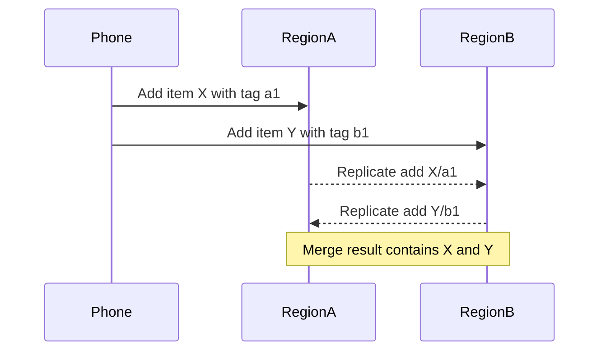

# CRDTs, Vector Clocks, and Eventual Consistency Patterns

Navigation: [README](README.md) | Previous: [Data Replication](19_data_replication.md) | Related: [System Design Q&A](../Question%20Bank/system-design.md)

This file expands the distributed-systems section with conflict-resolution patterns used when coordination is too expensive or availability matters more than immediate consistency.

## When this matters

Use these ideas for:

- Collaborative editing.
- Offline-first mobile apps.
- Multi-region shopping carts.
- Distributed counters.
- Presence and typing indicators.
- Feed/social state that can tolerate merge semantics.

Avoid these ideas when:

- Payments or ledger correctness require strict ordering.
- Legal or compliance state must not conflict.
- Conflict resolution cannot be expressed safely.

## Eventual consistency

Eventual consistency means replicas may temporarily disagree, but if no new writes happen, they converge to the same state.

Key questions:

- What conflicts can happen?
- How are conflicts detected?
- How are conflicts merged?
- Is convergence deterministic?
- What does the user see while replicas disagree?

## Vector clocks

A vector clock tracks causality across replicas.

```text
Replica A writes x: {A:1, B:0}
Replica B writes y concurrently: {A:0, B:1}
Merge sees neither clock dominates the other, so the writes are concurrent.
```

Use vector clocks to detect whether one version happened before another or whether two versions are concurrent.

## CRDT overview

Conflict-free replicated data types are data structures that can be updated independently on multiple replicas and merged deterministically.

| CRDT | Use case | Merge idea |
|------|----------|------------|
| G-Counter | likes, views, monotonic counts | per-replica max then sum |
| PN-Counter | increments and decrements | two G-Counters |
| OR-Set | add/remove sets | unique tags for adds, tombstones for removes |
| LWW-Register | profile field | keep value with latest timestamp |
| RGA / sequence CRDT | collaborative text | stable operation ordering |

## Example: shopping cart OR-Set



## Conflict-resolution patterns

| Pattern | Use when | Risk |
|---------|----------|------|
| Last-write-wins | simple profile fields | can lose concurrent updates |
| Merge by business rule | cart items, preferences | rules must be deterministic |
| Manual conflict resolution | documents, admin workflows | slower user experience |
| CRDT merge | high availability collaborative state | more metadata and complexity |
| Consensus | strict ordering required | higher latency, lower availability |

## Interview talking points

- Eventual consistency is not a shortcut; it requires explicit merge semantics.
- Vector clocks detect concurrency, but do not decide the business resolution.
- CRDTs are great when the data type has a natural merge.
- Tombstones and metadata can grow; cleanup/compaction matters.
- Use strong consistency where the business cannot tolerate conflicts.

