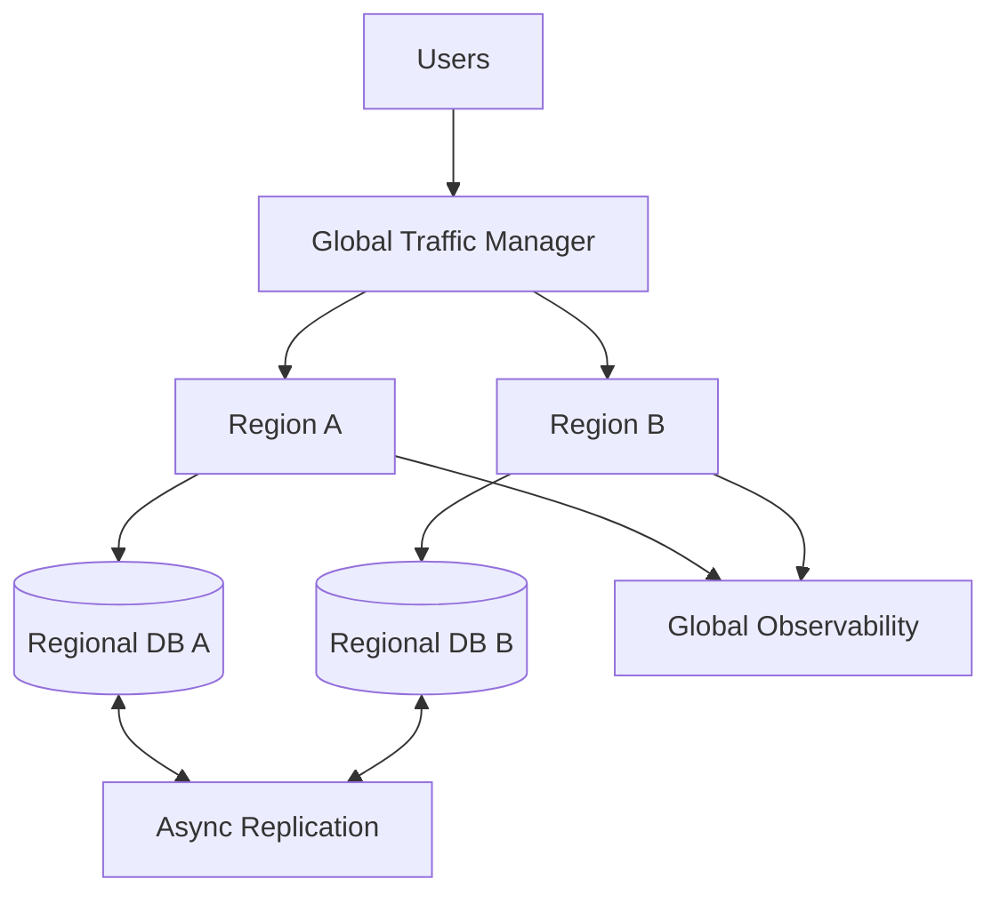

# Multi-Region Deployments and Chaos Engineering

Navigation: [README](README.md) | Previous: [Observability Monitoring](29_observability_monitoring.md) | Related: [High Availability](../System%20Design%20Fundamentals/02_high_availability.md)

This file covers advanced cloud architecture patterns for resilient, multi-region systems.

## Deployment models

| Model | Description | Best for | Trade-off |
|-------|-------------|----------|-----------|
| Active-passive | one primary region, standby secondary | simpler disaster recovery | slower failover, idle cost |
| Active-active | multiple serving regions | low latency, high availability | data consistency complexity |
| Cell-based | isolated cells/shards per customer or region | blast-radius reduction | routing and operations complexity |
| Global edge + regional core | CDN/edge handles reads, regional APIs handle writes | media and content platforms | split data/control planes |

## Multi-region architecture

## Data strategy

- Keep read-mostly data replicated globally.
- Keep user-owned data close to the user when possible.
- Use single-writer per entity when strong ordering matters.
- Use event sourcing or outbox for reliable cross-region propagation.
- Define conflict resolution before launching active-active writes.

## Chaos engineering

Chaos engineering intentionally injects controlled failure to validate resilience.

Examples:

- Kill a pod or instance.
- Add network latency between services.
- Drop traffic to a dependency.
- Exhaust connection pools in staging.
- Simulate a region outage with traffic shift.

## Experiment template

| Field | Example |
|-------|---------|
| Hypothesis | If one app instance dies, load balancer removes it within 30 seconds |
| Blast radius | staging or 1% production traffic |
| Steady-state metric | p99 latency < 500ms, error rate < 1% |
| Abort condition | error rate > 5% for 5 minutes |
| Rollback | disable experiment and restore traffic |
| Learning | update timeout, retry, capacity, or runbook |

## Reliability patterns

- Timeouts and bounded retries.
- Circuit breakers.
- Bulkheads.
- Idempotent writes.
- Graceful degradation.
- Read-only mode.
- Feature flags.
- Queue-based load leveling.
- Automated rollback.

## Interview talking points

- Multi-region is a product decision, not just an infrastructure setting.
- Active-active improves availability but complicates writes.
- Chaos tests should be scoped, measurable, and reversible.
- Health checks must test real dependencies, not just process liveness.
- Every critical service needs a runbook and clear ownership.

