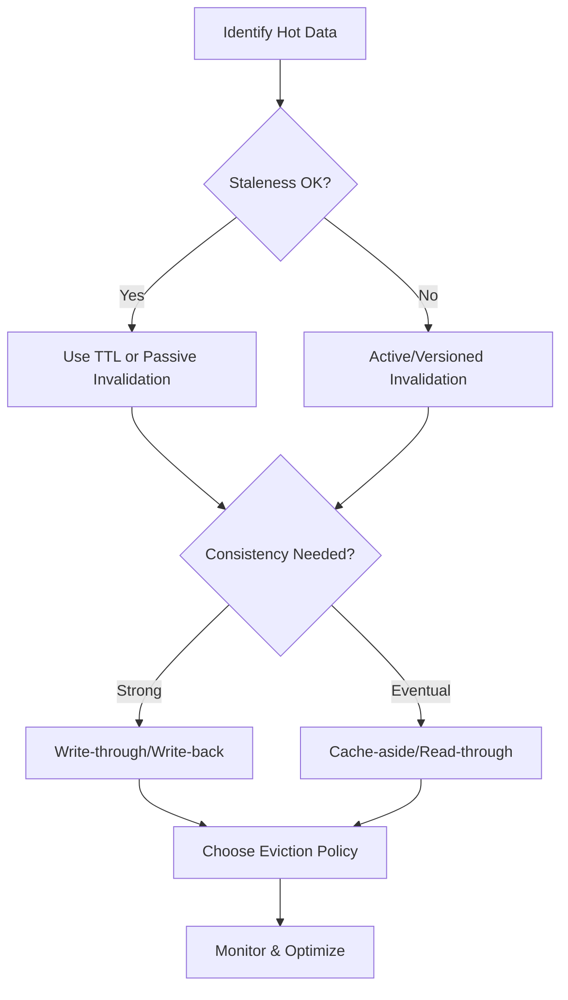

<!--
 07_caching.md
  Comprehensive Caching Guide: From Fundamentals to Advanced Design
-->

# Caching

## Introduction

**Caching** is the process of storing copies of data in a high-speed storage layer (the cache) so that future requests for that data can be served faster. Caching is a fundamental technique in system design, used to improve application performance, reduce latency, and decrease load on backend resources. By keeping frequently accessed ("hot") data closer to the user or application, caching enables scalable, responsive systems.

Caching is omnipresent in modern computing—from CPU memory hierarchies to distributed web architectures, gaming, IoT, and big data. This guide covers basic to advanced topics, practical scenarios, and real-world implementation patterns.

---

## Core Concepts

| Term           | Definition                                                                                      |
|----------------|------------------------------------------------------------------------------------------------|
| **Latency**    | The time taken to retrieve data. Caching reduces latency by serving data from a faster layer.  |
| **Throughput** | The number of requests served in a given time. Caching increases throughput by offloading backends. |
| **Hot Data**   | Frequently accessed data that benefits most from being cached.                                 |
| **Cache Hit**  | When requested data is found in the cache.                                                     |
| **Cache Miss** | When requested data is not found in the cache, requiring retrieval from the original source.   |
| **Eviction**   | The process of removing items from the cache to make space for new data.                       |
| **TTL (Time To Live)** | Duration for which a cache entry is valid before expiring.                            |

---

## Architectural View

```mermaid
flowchart LR
  User[User/Client]
  CDN[CDN/Edge Cache]
  APIGW[API Gateway]
  App[Application Server]
  SharedCache[Shared Cache (e.g., Redis/Memcached)]
  DB[Database]

  User -->|Request| CDN
  CDN -- Hit -->|Response| User
  CDN -- Miss --> APIGW
  APIGW -- Hit -->|Response| CDN
  APIGW -- Miss --> App
  App -- Hit -->|Response| APIGW
  App -- Miss --> SharedCache
  SharedCache -- Hit -->|Response| App
  SharedCache -- Miss --> DB
  DB --> SharedCache
  SharedCache --> App
  App --> APIGW
  APIGW --> CDN
  CDN --> User
```

### Multi-level Cache Architecture

Below is a diagram illustrating a multi-level cache (L1/L2/L3) architecture, commonly used to balance speed and capacity:

```mermaid
flowchart TB
  subgraph L1 [L1: In-Process Cache (Caffeine/Guava)]
    L1Cache
  end
  subgraph L2 [L2: Distributed Cache (Redis/Memcached)]
    L2Cache
  end
  subgraph L3 [L3: Database/Source of Truth]
    DB
  end
  Client --> L1Cache
  L1Cache -- Miss --> L2Cache
  L2Cache -- Miss --> DB
  DB --> L2Cache
  L2Cache --> L1Cache
```

---

## Caching Layers

| Layer           | Description                                                      | Examples                       |
|-----------------|------------------------------------------------------------------|--------------------------------|
| Client-side     | Caching in browser or mobile app                                 | Browser cache, Service Worker  |
| CDN             | Edge servers cache static and dynamic content                    | Cloudflare, Akamai, Fastly     |
| API Gateway     | Gateway-level cache for API responses                            | AWS API Gateway, Kong          |
| App Cache       | In-memory cache within the application process                   | Guava Cache, Caffeine          |
| Shared Cache    | External cache shared across instances                           | Redis, Memcached               |
| DB Cache        | Caching at the database layer                                    | MySQL Query Cache, Aurora      |
| OS/Kernel Cache | File system or OS-level caching                                  | Linux page cache, Varnish      |

---

## Caching Strategies

| Strategy         | Description                                                                 |
|------------------|-----------------------------------------------------------------------------|
| **Cache Aside**  | Application loads data into cache on miss and updates cache on write.        |
| **Read Through** | Cache fetches data from DB on miss automatically.                           |
| **Write Through**| Data written to cache and DB simultaneously.                                 |
| **Write Back**   | Data written to cache first, then batch-updated to DB.                      |

**Example: Cache Aside Pattern (Java)**
```java
// Pseudocode for Cache Aside
public String getUserProfile(String userId) {
    String profile = redisCache.get(userId);
    if (profile == null) { // Cache miss
        profile = db.queryUserProfile(userId);
        if (profile != null) {
            redisCache.set(userId, profile, 60 * 60); // Set TTL = 1 hour
        }
    }
    return profile;
}
```

**Example: Read-Through Pattern (Node.js, Redis)**
```js
// Node.js pseudocode with async/await
async function getUserProfile(userId) {
  let profile = await redis.get(userId);
  if (!profile) {
    profile = await db.queryUserProfile(userId);
    if (profile) await redis.setex(userId, 3600, JSON.stringify(profile));
  }
  return JSON.parse(profile);
}
```

**Example: Write-Through Pattern (Python, Redis)**
```python
def update_user_profile(user_id, profile):
    db.update_user_profile(user_id, profile)
    redis.setex(f"user:{user_id}", 3600, json.dumps(profile))
```

---

## Cache Design Considerations

| Consideration    | Description                                                                 |
|------------------|-----------------------------------------------------------------------------|
| **Freshness**    | How up-to-date is cached data?                                              |
| **Serialization**| How objects are converted to/from cache (e.g., JSON, ProtoBuf, Java object) |
| **Expiry Policy**| When does data become stale? (TTL, LRU, LFU)                                |
| **Consistency**  | How do cache and source of truth stay in sync?                              |
| **Capacity**     | How much data can be cached? What eviction policy is used?                  |
| **Security**     | Is sensitive data properly protected in cache?                              |

---

## Cache Invalidation Patterns

| Pattern           | Description                                                      |
|-------------------|------------------------------------------------------------------|
| **Passive**       | Let cache expire via TTL or eviction (LRU, LFU, etc.)            |
| **Active**        | Explicitly remove or update cache on data change                 |
| **Versioned Key** | Use versioned cache keys to force new data                       |
| **Write Invalidate** | Invalidate cache on every write to DB                         |

**Versioned Key Example (Java)**
```java
String key = "userProfile:v2:" + userId; // Change version to invalidate old cache
redisCache.set(key, profile, 3600);
```

**Active Invalidation Example (Node.js)**
```js
// On user update, delete cache entry
redis.del(`userProfile:${userId}`);
```

---

## Load & Warm-up Strategies

| Strategy          | Description                                                                 |
|-------------------|-----------------------------------------------------------------------------|
| **Lazy Loading**  | Load data into cache only on demand (on first request).                     |
| **Preload/Warm-up**| Load hot data into cache at startup or on schedule.                        |
| **Async Prefetch**| Predictively load data into cache before it's requested.                    |

**Cache Warm-up Example (Java)**
```java
// Preload hot user profiles at app startup
List<String> hotUserIds = Arrays.asList("1", "2", "3");
for (String userId : hotUserIds) {
    String profile = db.queryUserProfile(userId);
    redisCache.set("userProfile:" + userId, profile, 3600);
}
```

**Async Prefetch Example (Python)**
```python
import asyncio
async def prefetch_profiles(user_ids):
    for uid in user_ids:
        profile = await db.query_user_profile(uid)
        await redis.set(f"user:{uid}", json.dumps(profile), ex=3600)
```

---

## Real-world Case Study: Netflix EVCache

**Problem:** Netflix needed a fast, scalable cache to serve millions of users globally with low latency and high availability.

**Solution:** Netflix built [EVCache](https://netflix.github.io/EVCache/), a custom, multi-region, multi-tenant caching solution built on top of Memcached. EVCache supports automatic failover, data replication across regions, and is used for session storage, recommendation data, and more.

**Architecture:**
```
User Request
   |
   V
App Server (Java) ----> EVCache Cluster (Memcached) ----> Source of Truth (DB, S3, etc.)
```
Benefits: Sub-millisecond latency for hot data, resilience to regional failures, and massive scalability.

---

## Types of Cache Eviction Policies

Eviction policies determine which data is removed from the cache when it reaches capacity.

| Policy | Description | Use Case | Pros | Cons |
|--------|-------------|----------|------|------|
| **LRU (Least Recently Used)** | Removes least recently accessed item | General, session data | Simple, effective | Can evict frequently used items under bursty patterns |
| **LFU (Least Frequently Used)** | Removes least frequently accessed item | Analytics, trending data | Keeps hot data | More complex, slow to adapt to access pattern changes |
| **FIFO (First-In, First-Out)** | Removes oldest item | Streaming, queue-like | Simple to implement | Doesn't consider usage frequency |
| **ARC (Adaptive Replacement Cache)** | Balances recency and frequency | Databases, OS caches | High hit rates, adapts to workload | More complex to implement |

**Comparison Table:**

| Feature | LRU | LFU | FIFO | ARC |
|---------|-----|-----|------|-----|
| Recency-aware | ✅ | ❌ | ❌ | ✅ |
| Frequency-aware | ❌ | ✅ | ❌ | ✅ |
| Adaptive | ❌ | ❌ | ❌ | ✅ |
| Complexity | Low | Medium | Low | High |

---

## Observability & Metrics

| Metric             | Description                                      |
|--------------------|--------------------------------------------------|
| **Hit Ratio**      | Fraction of requests served from cache           |
| **Evictions**      | Number of items removed from cache               |
| **Load Time**      | Time taken to load data into cache on miss       |
| **JVM Heap Usage** | Memory usage for in-process caches               |
| **Stale Reads**    | Number of times expired data was served          |

---

## Scaling Cache

| Technique            | Description                                                      |
|----------------------|------------------------------------------------------------------|
| **Horizontal Scaling** | Add more cache nodes/servers to increase capacity             |
| **Partitioning**     | Split data across multiple caches (e.g., by key hashing)         |
| **Replication**      | Duplicate data across nodes for fault tolerance                  |
| **Sharding**         | Distribute data shards across nodes to balance load              |
| **Compression**      | Store compressed data to fit more entries                        |
| **Batching**         | Aggregate cache updates/reads to reduce load                     |
| **Async Prefetch**   | Load data into cache before it's requested                       |

---

## Advanced Topics

| Problem                | Description                                                            |
|------------------------|------------------------------------------------------------------------|
| **Cache Stampede**     | Many clients request same missing key simultaneously, overloading DB   |
| **Dogpile Effect**     | Cache expires, many requests hit backend at once                       |
| **Cache Pollution**    | Irrelevant or rarely used data fills the cache, evicting hot data      |
| **Negative Caching**   | Caching of "not found" or error responses to prevent repeated lookups  |
| **Distributed Invalidation** | Ensuring cache invalidation propagates across nodes              |

---

## Spring Boot Advanced Redis Cache Configuration

**Example: Configure Redis Cache with JSON Serialization and TTL**

```java
// application.properties
spring.cache.type=redis
spring.redis.host=localhost
spring.redis.port=6379

// Java Config
import org.springframework.cache.annotation.EnableCaching;
import org.springframework.context.annotation.Bean;
import org.springframework.context.annotation.Configuration;
import org.springframework.data.redis.cache.RedisCacheConfiguration;
import org.springframework.data.redis.serializer.GenericJackson2JsonRedisSerializer;
import org.springframework.data.redis.serializer.RedisSerializationContext;
import java.time.Duration;

@Configuration
@EnableCaching
public class CacheConfig {
    @Bean
    public RedisCacheConfiguration cacheConfiguration() {
        return RedisCacheConfiguration.defaultCacheConfig()
          .entryTtl(Duration.ofHours(1))
          .serializeValuesWith(
            RedisSerializationContext.SerializationPair.fromSerializer(
              new GenericJackson2JsonRedisSerializer()
            )
          );
    }
}
```

---

## Implementation Examples

### 1. Redis Caching Implementation (Java)
```java
@Service
public class ProductCacheService {
    private final RedisTemplate<String, Product> redisTemplate;
    private final ProductRepository repository;

    // Cache-aside pattern with retry mechanism
    public Product getProduct(String productId) {
        String cacheKey = "product:" + productId;
        // Try cache first
        Product product = redisTemplate.opsForValue().get(cacheKey);
        if (product != null) {
            return product;
        }
        // Cache miss - get from DB with retry
        product = repository.findById(productId)
            .orElseThrow(() -> new NotFoundException());
        // Update cache with TTL
        redisTemplate.opsForValue().set(cacheKey, product, 1, TimeUnit.HOURS);
        return product;
    }
    // Batch cache warm-up
    @Scheduled(fixedRate = 3600000) // Every hour
    public void warmUpCache() {
        List<String> hotProductIds = getHotProductIds();
        hotProductIds.forEach(this::getProduct);
    }
}
```

### 2. Multi-Level Cache Strategy (Java)
```java
@Service
public class MultiLevelCache {
    private final Cache localCache; // Caffeine
    private final RedisTemplate<String, Object> redisCache;
    private final Repository repository;

    public Object get(String key) {
        // L1: Check local cache
        Object value = localCache.get(key);
        if (value != null) return value;
        // L2: Check Redis
        value = redisCache.opsForValue().get(key);
        if (value != null) {
            localCache.put(key, value); // Populate L1
            return value;
        }
        // L3: Load from DB
        value = repository.get(key);
        if (value != null) {
            redisCache.opsForValue().set(key, value); // Populate L2
            localCache.put(key, value); // Populate L1
        }
        return value;
    }
}
```

### 3. Real-World Scenario: Social Media Feed (Java)
```plaintext
Problem: High-traffic social media platform needs to cache user feeds

Solution Architecture:
1. Content Delivery:
   - Edge Cache (CDN): Static content, images
   - Redis Cache Cluster: User feeds, relationships
   - Local Cache: User metadata, configurations
```

```java
@Service
public class FeedService {
    private final RedisTemplate<String, List<Post>> feedCache;
    private final CacheManager localCache;

    public List<Post> getUserFeed(String userId) {
        String feedKey = "feed:" + userId;
        // Try cache first
        List<Post> feed = feedCache.opsForValue().get(feedKey);
        if (feed != null) {
            return feed;
        }
        // Generate feed
        feed = generateUserFeed(userId);
        // Cache with TTL
        feedCache.opsForValue().set(feedKey, feed, 15, TimeUnit.MINUTES);
        return feed;
    }

    // Handle new post event
    @EventListener
    public void onNewPost(PostCreatedEvent event) {
        // Invalidate affected user feeds
        List<String> followerIds = getFollowerIds(event.getUserId());
        followerIds.forEach(id -> feedCache.delete("feed:" + id));
    }
}
```

### 4. Gaming Leaderboard Caching (Node.js)
```js
// Cache top N scores in Redis for fast leaderboard queries
async function getLeaderboard(gameId) {
  const cacheKey = `leaderboard:${gameId}`;
  let leaderboard = await redis.get(cacheKey);
  if (!leaderboard) {
    leaderboard = await db.queryLeaderboard(gameId, { limit: 100 });
    await redis.setex(cacheKey, 60, JSON.stringify(leaderboard)); // 1 min cache
  }
  return JSON.parse(leaderboard);
}
```

### 5. IoT Telemetry Caching (Python)
```python
# Cache recent telemetry for a device, batch write to DB
def cache_telemetry(device_id, data):
    cache_key = f"telemetry:{device_id}"
    redis.lpush(cache_key, json.dumps(data))
    redis.expire(cache_key, 600)  # Keep for 10 minutes
    # Periodic batch flush to DB (not shown)
```

---

## Performance Optimization Techniques

| Technique          | Description                                   | Implementation              |
|--------------------|-----------------------------------------------|-----------------------------|
| Write-Behind       | Batch writes to DB                            | Use message queue           |
| Read-Ahead         | Predictive loading                            | Background jobs             |
| Cache Sharding     | Distribute cache                              | Consistent hashing          |
| Compression        | Store compressed data in cache                | Gzip, LZ4, Snappy           |
| Batching           | Group cache updates/reads to reduce overhead  | Bulk operations             |
| Async Prefetch     | Load data into cache before needed            | Worker threads, cron jobs   |

**Compression Example (Java, Redis)**
```java
// Compress data before storing
byte[] compressed = Snappy.compress(profileBytes);
redisCache.set(key, compressed, 3600);
```

**Batching Example (Node.js, Redis)**
```js
// Use pipeline for batch cache set
const pipeline = redis.pipeline();
hotKeys.forEach(key => pipeline.set(key, data[key]));
await pipeline.exec();
```

**Async Prefetch Example (Python)**
```python
async def prefetch_hot_items(hot_ids):
    for id in hot_ids:
        data = await db.get_item(id)
        await redis.set(f"hot:{id}", json.dumps(data), ex=300)
```

### Cache Monitoring Implementation (Java)
```java
@Configuration
public class CacheMetrics {
    @Bean
    MeterRegistry registry() {
        return new SimpleMeterRegistry();
    }

    @Bean
    CacheMetricsCollector collector(MeterRegistry registry) {
        return new CacheMetricsCollector(registry)
            .recordHits()
            .recordMisses()
            .recordLoadTime();
    }
}
```

---

## Best Practices Recap

- ✅ Cache only hot, frequently accessed data
- ✅ Set appropriate TTL and eviction policy (LRU, LFU, etc.)
- ✅ Use cache versioning for schema/data changes
- ✅ Monitor hit/miss ratio and evictions
- ✅ Handle cache stampede/dogpile with locks or request coalescing
- ✅ Secure sensitive data if caching is necessary (see below)
- ❌ Don't cache sensitive or user-specific data unless secure (encryption, access control)
- ❌ Don't use cache as the only source of truth
- ❌ Don't let cache grow unbounded

---

## Tools & References

| Tool/Resource    | Description                                     | Link                                      |
|------------------|-------------------------------------------------|-------------------------------------------|
| Redis            | In-memory key-value store, supports persistence | https://redis.io/                         |
| Memcached        | High-performance distributed memory object cache| https://memcached.org/                    |
| Caffeine         | High-performance Java in-memory cache           | https://github.com/ben-manes/caffeine     |
| Spring Cache     | Spring Boot abstraction for caching             | https://docs.spring.io/spring-boot/docs/current/reference/html/io.html#io.caching |
| Netflix EVCache  | Netflix's distributed cache                     | https://netflix.github.io/EVCache/        |
| AWS ElastiCache  | Managed Redis/Memcached service                 | https://aws.amazon.com/elasticache/       |
| Hazelcast        | Distributed in-memory data grid                 | https://hazelcast.com/                    |
| Guava Cache      | Google Java in-memory cache                     | https://github.com/google/guava           |

**Further Reading:**
- [Caching at Scale (Martin Kleppmann)](https://martin.kleppmann.com/2016/02/08/caching-at-scale.html)
- [Spring Boot Caching Guide](https://www.baeldung.com/spring-cache-tutorial)
- [Google Cloud Caching Strategies](https://cloud.google.com/architecture/caching)

---

## Real-life Scenario: E-commerce Product Catalog

**Problem:**  
An e-commerce platform experiences slow product detail page loads due to frequent database queries for product information, especially during sale events.

**Solution:**  
Implement a multi-layered caching strategy:
- **CDN** caches static assets and product images.
- **API Gateway** caches product API responses for common queries.
- **Shared Redis Cache** stores product details keyed by product ID.
- **App Server** uses in-memory cache (Caffeine) for ultra-hot items.

**Architecture:**
```
User -> CDN -> API Gateway -> App Server -> Redis Cache -> Database
```
On product update, the system actively invalidates affected cache entries (active invalidation). Hot products are preloaded into cache before major sales (cache warm-up).

**Result:**  
Page load times dropped from 2s to <300ms, backend load reduced by 80%, and system scaled smoothly during high-traffic sales.

---

## Extended Cache Stampede Prevention Techniques

When a cached item expires, many clients may simultaneously request the same data, causing a stampede on the backend. Techniques to prevent this:

| Technique                   | Description                                               |
|-----------------------------|----------------------------------------------------------|
| **Mutex Locking**           | Only one client loads data on miss, others wait          |
| **Request Coalescing**      | Aggregate concurrent requests for same key               |
| **Early Expiry/Refresh Ahead** | Start refresh before expiry, serve old data in meantime|
| **Randomized TTLs**         | Reduce likelihood of simultaneous expiry                 |
| **Negative Caching**        | Cache "not found" to avoid repeated DB hits              |

**Mutex Locking Pseudocode (Java):**
```java
public Data getData(String key) {
    Data data = cache.get(key);
    if (data == null) {
        synchronized (getMutex(key)) {
            data = cache.get(key);
            if (data == null) {
                data = db.load(key);
                cache.set(key, data, 60);
            }
        }
    }
    return data;
}
```

**Request Coalescing Pseudocode (Node.js):**
```js
// Use a map to track in-flight requests
if (inFlight.has(key)) {
  return inFlight.get(key); // Return pending promise
}
const promise = db.load(key).then(data => {
  cache.set(key, data, 60);
  inFlight.delete(key);
  return data;
});
inFlight.set(key, promise);
return promise;
```

**Early Refresh Pseudocode (Python):**
```python
def get_cached_data(key):
    data, expiry = redis.get_with_expiry(key)
    if expiry < now() + REFRESH_THRESHOLD:
        # Trigger background refresh
        refresh_in_background(key)
    return data
```

---

## Security Considerations for Caching Sensitive Data

Caching can inadvertently expose sensitive data if not handled properly.

- **Encrypt sensitive data** stored in external/shared caches.
- **Restrict cache access** using network ACLs, authentication, and role-based access.
- **Avoid caching PII** (personally identifiable information) unless absolutely necessary.
- **Set short TTLs** for sensitive session tokens or credentials.
- **Clear cache on user logout or permission change**.
- **Audit cache usage** and monitor for unauthorized access.

**Example: Encrypting Cache Data (Java)**
```java
String encrypted = encrypt(profile);
redisCache.set("user:" + userId, encrypted, 600);
```

---

## Distributed Cache Synchronization Strategies

When using distributed caches (e.g., Redis clusters, Memcached), keeping data consistent and synchronized is critical.

| Strategy             | Description                                                   |
|----------------------|--------------------------------------------------------------|
| **Write-through/write-behind** | All writes go through cache, then DB                |
| **Pub/Sub Invalidation** | Use publish/subscribe to notify all nodes to invalidate   |
| **Consistent Hashing** | Distribute keys so each node is responsible for a subset    |
| **Gossip Protocols** | Nodes share state changes with peers                          |
| **Versioned Keys**   | Changing key version forces all nodes to fetch new data       |

**Pub/Sub Example (Redis, Python):**
```python
# On data change
redis.publish('invalidate', key)

# On all cache nodes
def on_invalidate(msg):
    redis.delete(msg['data'])
```

---

## Thought Process for Designing a Cache Strategy

**Step-by-step approach for architects:**

1. **Identify Caching Candidates**  
   - What data is read most frequently?  
   - Is the data expensive to compute or fetch?
2. **Determine Cache Location**  
   - Client, CDN, API Gateway, App server, Shared cache, DB cache?
3. **Define Freshness & Consistency Needs**  
   - How stale can the data be?  
   - Is strong consistency required?
4. **Choose Caching Pattern**  
   - Cache-aside, read-through, write-through, write-back?
5. **Select Eviction & Expiry Policies**  
   - TTL, LRU, LFU, ARC, FIFO?
6. **Capacity Planning**  
   - How much memory/storage is needed?  
   - What is the expected cache hit ratio?
7. **Plan Invalidation & Synchronization**  
   - How will you invalidate or update cache on data change?  
   - For distributed caches, how will you sync invalidations?
8. **Handle Cache Stampede & Dogpile**  
   - Implement mutex/request coalescing/early refresh.
9. **Security & Compliance**  
   - Is sensitive data protected?  
   - Are audit/logging controls in place?
10. **Monitor & Tune**  
    - Track hit/miss/eviction metrics.  
    - Adjust policies as usage evolves.

**Diagram: Cache Design Decision Tree**



---