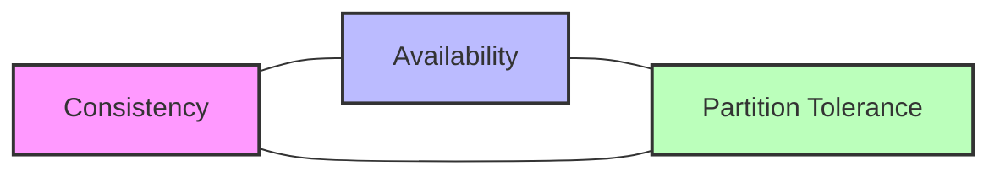
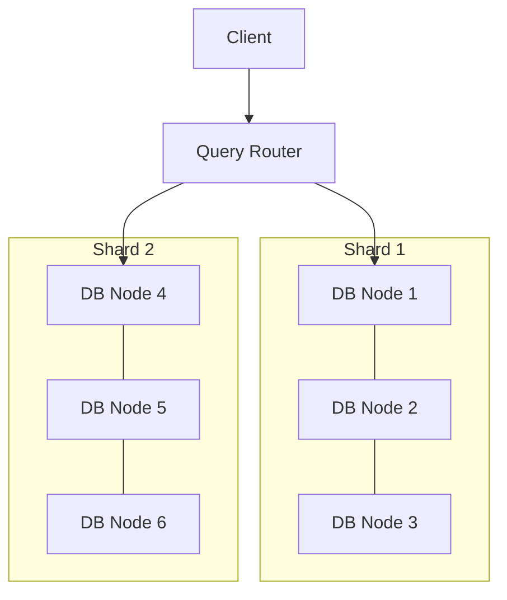

# 🗄️ Data Storage in System Design

## 1. Introduction
Data storage refers to the process of saving digital information in various formats and systems for future use. It’s a fundamental building block for all software systems — from small applications to massive distributed platforms.

---

## 2. Key Concepts

| Term | Description |
|------|-------------|
| Persistence | Data remains intact beyond program execution |
| Volatility | Whether data is lost when power is off |
| Latency | Time to retrieve/store data |
| Throughput | Amount of data processed in a given time |
| Durability | Assurance data won’t be lost |
| Scalability | Ability to handle growth in data volume/traffic |

---

## 3. Types of Data Storage

| Type | Example | Use Case |
|------|---------|----------|
| Volatile | RAM | Temporary, fast computations |
| Non-Volatile | HDD, SSD | Long-term storage |
| Object Storage | AWS S3, MinIO | Media files, backups |
| Block Storage | EBS, SAN | Databases, VMs |
| File Storage | NFS, SMB | Shared files, logs |
| In-Memory Store | Redis, Memcached | Caching, session storage |
| Cold Storage | AWS Glacier, Backblaze B2 | Archival, compliance, low-cost storage |

*Cold Storage* is optimized for data that is infrequently accessed but must be retained for long periods, such as compliance archives or backups. It offers low cost but higher retrieval latency.

---

## 4. Storage Architectures

| Architecture | Description | Pros | Cons |
|--------------|-------------|------|------|
| Centralized | Single storage node | Simple, easy to manage | Single point of failure |
| Distributed | Multiple nodes with replication | Scalable, fault tolerant | Complexity, consistency challenges |
| Cloud | Managed by provider | Highly available, scalable | Vendor lock-in, ongoing costs |
| Hybrid | Mix of on-prem + cloud | Flexibility | Integration complexity |

---

## 5. Databases and Data Models

| Model | Example | Strengths |
|-------|---------|-----------|
| Relational | MySQL, PostgreSQL | ACID, structured queries |
| NoSQL - Document | MongoDB, CouchDB | Flexible schema, nested data |
| NoSQL - Key-Value | Redis, DynamoDB | Fast lookups |
| NoSQL - Columnar | Cassandra, HBase | Analytical workloads |
| Graph | Neo4j, ArangoDB | Relationship-heavy queries |
| Time-Series | InfluxDB, TimescaleDB | Efficient storage and querying of time-stamped data |

### 5.1 Time-Series Databases

Time-series databases are optimized for handling data indexed by time, making them ideal for IoT telemetry, monitoring, financial data, and real-time analytics. They provide efficient compression, downsampling, and fast queries over time ranges.

#### Example: TimescaleDB Hypertable Creation

```sql
-- Create a regular table for sensor data
CREATE TABLE sensor_readings (
    time TIMESTAMPTZ NOT NULL,
    device_id TEXT NOT NULL,
    temperature DOUBLE PRECISION,
    humidity DOUBLE PRECISION,
    PRIMARY KEY (time, device_id)
);

-- Convert it into a hypertable for efficient time-series management
SELECT create_hypertable('sensor_readings', 'time');
```

---

## 6. Real-World Scenarios

### 6.1 Social Media Platform Storage Architecture
```plaintext
Components:
1. User Data: PostgreSQL
   - Profile information
   - Relationships
   - Settings

2. Media Storage: Object Storage (S3)
   - Photos
   - Videos
   - Documents

3. Caching Layer: Redis
   - Session data
   - Frequently accessed content
   - Feed cache

4. Search Index: Elasticsearch
   - User search
   - Content search
   - Hashtag search
```

### 6.2 E-commerce Platform Implementation
```java
@Service
public class StorageService {
    private final S3Client s3Client;
    private final ProductRepository productRepo;
    private final RedisTemplate<String, Object> cache;

    public void uploadProductImage(String productId, MultipartFile file) {
        // Upload to S3
        PutObjectRequest request = PutObjectRequest.builder()
            .bucket("product-images")
            .key(productId + "/" + file.getOriginalFilename())
            .build();
        s3Client.putObject(request, RequestBody.fromBytes(file.getBytes()));

        // Update database
        Product product = productRepo.findById(productId)
            .orElseThrow(() -> new NotFoundException());
        product.setImageUrl(generateS3Url(productId, file.getOriginalFilename()));
        productRepo.save(product);

        // Invalidate cache
        cache.delete("product:" + productId);
    }
}
```

### 6.3 IoT Device Telemetry Storage

```plaintext
Architecture:
1. Time-Series Database (e.g., TimescaleDB, InfluxDB)
   - Stores sensor readings with timestamps
   - Supports efficient time-range queries and aggregations

2. Object Storage (e.g., AWS S3)
   - Stores raw telemetry data dumps, logs, and firmware updates

3. In-Memory Store (Redis)
   - Holds hot data for real-time dashboards and alerts
   - Caches recent sensor statuses for quick access
```

This architecture balances fast read/write for recent data with scalable archival of raw data and efficient querying of historical time-series data.

---

## 7. Data Storage Lifecycle

1. **Creation/Collection**: Data is ingested from various sources.
2. **Storage**: Stored in chosen storage system.
3. **Processing**: Data is transformed, enriched.
4. **Archival**: Moved to cheaper long-term storage.
5. **Deletion**: Removed securely after retention period.

---

## 8. Consistency, Availability, Partitioning (CAP Theorem)

| Property | Meaning |
|----------|---------|
| Consistency | Every read gets the latest write |
| Availability | System responds to every request |
| Partition Tolerance | Continues operating despite network splits |

*You can only guarantee two of the three at a time.*

### CAP Theorem Diagram



This visualization shows the three properties and their trade-offs. Systems typically choose two to optimize based on use case.

---

## 9. Performance Optimization Techniques

### 9.1 Database Optimization
```sql
-- Partitioning Example
CREATE TABLE orders (
    id SERIAL,
    created_at TIMESTAMP,
    total DECIMAL(10,2)
) PARTITION BY RANGE (created_at);

-- Create partitions
CREATE TABLE orders_2023 PARTITION OF orders
    FOR VALUES FROM ('2023-01-01') TO ('2024-01-01');
```

### 9.2 Caching Strategy
```java
@Configuration
public class CacheConfig {
    @Bean
    public CacheManager cacheManager(RedisConnectionFactory factory) {
        RedisCacheConfiguration config = RedisCacheConfiguration.defaultCacheConfig()
            .entryTtl(Duration.ofMinutes(10))
            .serializeKeysWith(RedisSerializationContext.SerializationPair
                .fromSerializer(new StringRedisSerializer()))
            .serializeValuesWith(RedisSerializationContext.SerializationPair
                .fromSerializer(new GenericJackson2JsonRedisSerializer()));

        return RedisCacheManager.builder(factory)
            .cacheDefaults(config)
            .build();
    }
}
```

### 9.3 Compression Techniques

| Compression Algorithm | Use Case | Compression Speed | Decompression Speed | Compression Ratio |
|----------------------|----------|-------------------|---------------------|-------------------|
| gzip                 | General purpose, compatibility | Moderate | Fast | High |
| snappy               | Low-latency, real-time systems | Very Fast | Very Fast | Moderate |
| zstd                 | Balanced performance and ratio | Fast | Fast | Very High |

- **gzip** is widely supported and compresses well but is slower.
- **snappy** prioritizes speed over compression ratio, ideal for caching and streaming.
- **zstd** offers a good trade-off with fast compression and decompression and better compression ratios.

### 9.4 Indexing Strategies

Indexes speed up data retrieval but add overhead to writes. Choosing the right indexing strategy is critical.

#### Composite Index Example (PostgreSQL)

```sql
-- Create a composite index on columns 'user_id' and 'created_at'
CREATE INDEX idx_user_created_at ON user_activity (user_id, created_at DESC);
```

Composite indexes help optimize queries filtering on multiple columns and sorting.

---

## 10. Security Considerations

- Encryption at rest (AES-256)
- Encryption in transit (TLS)
- Access control & IAM policies
- Secure deletion & data wiping
- Backup & disaster recovery
- Tokenized storage to protect sensitive data by replacing it with tokens
- Database Activity Monitoring (DAM) to detect unauthorized or anomalous access
- Row-Level Security (RLS) for fine-grained access control

#### Row-Level Security Example (PostgreSQL)

```sql
-- Enable RLS on the table
ALTER TABLE orders ENABLE ROW LEVEL SECURITY;

-- Create a policy to allow users to see only their own orders
CREATE POLICY user_order_policy ON orders
    USING (user_id = current_setting('app.current_user_id')::int);
```

RLS ensures that users can only access rows they are authorized to see, enhancing data privacy.

---

## 11. Code Example: AWS S3 Upload (Python)

```python
import boto3

s3 = boto3.client('s3')
s3.upload_file('local_file.txt', 'my-bucket', 'remote_file.txt')
```

---

## 12. Monitoring and Maintenance

| Metric | Tool |
|--------|------|
| Disk Usage | Prometheus, Grafana |
| Read/Write Latency | CloudWatch |
| Error Rates | ELK Stack |
| Replication Lag | Database monitoring tools |

---

## 13. Best Practices

- Choose storage based on workload patterns
- Regularly back up and test restore procedures
- Monitor storage health and capacity
- Apply the principle of least privilege for access
- Implement lifecycle policies for archival

---

## 14. Thought Process Before Choosing a Storage Solution

1. What is the data size and growth rate?
2. What is the required read/write speed?
3. What consistency guarantees are needed?
4. Is the workload transactional or analytical?
5. What are the retention and compliance needs?
6. What is the budget and cost trade-off?

---

## 15. References

- [AWS Storage Services Overview](https://aws.amazon.com/products/storage/)
- [Google Cloud Storage](https://cloud.google.com/storage)
- [Azure Storage](https://azure.microsoft.com/en-us/products/storage)
- [Database Design - Martin Kleppmann](https://dataintensive.net)

---

## 16. Distributed Storage Strategies

Distributed storage systems use multiple nodes to store data, improving availability, fault tolerance, and scalability.

### Replication

- **Synchronous Replication**: Data is written to multiple nodes before confirming success. Guarantees consistency but adds latency.
- **Asynchronous Replication**: Data is written to the primary node first and replicated later. Improves latency but risks data loss on failure.

### Sharding

- **Range Sharding**: Data is partitioned by key ranges (e.g., user IDs 1-1000). Simple but can cause hotspots.
- **Hash Sharding**: Data is partitioned by hashing keys, distributing load evenly.

### Quorum Reads/Writes

Systems like Cassandra use quorum-based protocols where a majority of nodes must acknowledge reads or writes to ensure consistency.

### Sharded Storage Architecture Diagram



The query router directs requests to the correct shard based on the sharding key, and replication ensures data durability within shards.

---

## 17. Thought Process for Data Storage Architecture Design

When designing a data storage architecture, consider the following checklist:

1. **Understand the Data**
   - What type of data (structured, unstructured, time-series)?
   - What is the data volume and growth rate?

2. **Define Access Patterns**
   - Read-heavy or write-heavy?
   - Random or sequential access?
   - Latency requirements?

3. **Consistency and Availability Needs**
   - Strong consistency or eventual consistency?
   - Tolerance for downtime or partitioning?

4. **Scalability Requirements**
   - Vertical or horizontal scaling?
   - Need for sharding or replication?

5. **Durability and Backup**
   - How critical is data loss prevention?
   - Backup and disaster recovery plans?

6. **Security and Compliance**
   - Data encryption, access controls, auditing?
   - Compliance regulations (GDPR, HIPAA)?

7. **Cost Constraints**
   - Budget for infrastructure and maintenance?
   - Trade-offs between performance and cost?

8. **Choose Storage Type and Architecture**
   - Match data and access patterns to storage types (block, object, file, in-memory, cold storage).
   - Select architecture (centralized, distributed, cloud, hybrid).

9. **Optimize and Monitor**
   - Implement indexing, caching, compression as needed.
   - Set up monitoring and alerting for performance and faults.

10. **Iterate and Evolve**
    - Continuously assess system performance and adapt architecture as requirements change.

---

This comprehensive guide covers foundational and advanced topics to help design effective data storage solutions in system design.