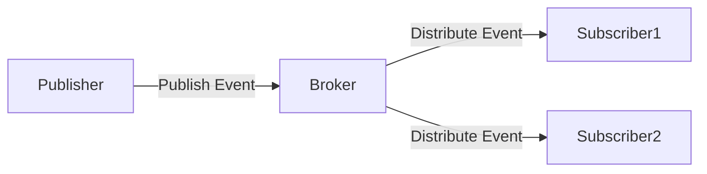

# 🔗 Service Communication in System Design

## 1. Introduction
Service communication refers to the exchange of data between different components or services in a distributed system. It’s a critical element in microservices, SOA (Service-Oriented Architecture), and modern cloud-native applications. Effective communication patterns and protocols ensure scalability, reliability, and maintainability of complex systems.

---

## 2. Communication Types

| Type                | Description                                   | Examples               |
|---------------------|-----------------------------------------------|------------------------|
| Synchronous         | Sender waits for a response                    | HTTP/REST, gRPC        |
| Asynchronous        | Sender does not wait for response              | Message queues, Event streams |
| One-way             | Sender sends message without expecting response| Fire-and-forget logging|
| Bidirectional Streaming | Continuous two-way communication             | WebSockets, gRPC streaming |
| Event-driven        | Communication based on events and pub-sub model| Kafka, RabbitMQ        |

### Synchronous vs Asynchronous Communication Comparison

| Aspect            | Synchronous                          | Asynchronous                        |
|-------------------|------------------------------------|-----------------------------------|
| Latency           | Lower latency, immediate response  | Higher latency, eventual response  |
| Coupling          | Tighter coupling                   | Looser coupling                    |
| Complexity        | Simpler to implement               | More complex, requires messaging infrastructure |
| Scalability       | Limited by request-response cycle  | More scalable due to decoupling   |
| Failure Handling  | Failures propagate immediately     | Failures can be retried or queued |

---

## 3. Protocols and Formats

| Protocol   | Description                               | Pros                              | Cons                      | Typical Use Cases                   |
|------------|-------------------------------------------|----------------------------------|---------------------------|-----------------------------------|
| HTTP/REST  | Text-based, JSON/XML payload over HTTP/2  | Simple, widely supported, HTTP/2 improves performance | Higher overhead             | Web APIs, CRUD operations          |
| gRPC       | Binary, Protobuf-based RPC over HTTP/2     | Fast, type-safe, streaming support | Requires tooling           | Microservices, low-latency RPC     |
| WebSockets | Persistent full-duplex channel              | Real-time data push               | Complex to scale           | Chat apps, live notifications      |
| AMQP       | Advanced messaging protocol                  | Reliable delivery                | More setup                 | Enterprise messaging, financial systems |
| MQTT       | Lightweight IoT messaging                    | Low bandwidth                   | Limited payload size       | IoT device communication           |
| GraphQL    | Query language for APIs with flexible responses | Efficient data fetching, single endpoint | Complexity in caching and tooling | Client-driven APIs, mobile apps    |

---

## 4. Message Patterns & Implementations

### 4.1 REST API Example (Spring Boot)
```java
@RestController
@RequestMapping("/api/orders")
public class OrderController {
    @PostMapping
    public ResponseEntity<OrderResponse> createOrder(@RequestBody OrderRequest request) {
        // Process order
        return ResponseEntity.ok(new OrderResponse(true, "Order created"));
    }
}
```

### 4.2 Kafka Event Publishing
```java
@Service
public class OrderEventPublisher {
    private final KafkaTemplate<String, OrderEvent> kafkaTemplate;

    public void publishOrderCreated(Order order) {
        OrderEvent event = new OrderEvent("ORDER_CREATED", order);
        kafkaTemplate.send("order-events", event);
    }
}
```

### 4.3 WebSocket Real-time Updates
```java
@ServerEndpoint("/websocket/inventory")
public class InventoryWebSocket {
    @OnMessage
    public void onMessage(String message, Session session) {
        // Handle real-time inventory updates
        broadcast(new InventoryUpdate(message));
    }
}
```

### 4.4 Request-Reply over Messaging Pattern
In this pattern, services communicate asynchronously via message queues but expect a response message. Typically implemented with correlation IDs to match requests and responses.

```java
// Pseudocode for sending request and waiting for reply
String correlationId = UUID.randomUUID().toString();
message.setCorrelationId(correlationId);
messageQueue.send(requestQueue, message);

// Listener waits for response with matching correlationId
```

### 4.5 Saga Pattern for Distributed Transactions
Saga coordinates a series of local transactions in distributed systems using events or commands, ensuring eventual consistency.

```java
// Simplified Saga steps
1. Order Service creates order
2. Inventory Service reserves stock
3. Payment Service processes payment
4. If any step fails, compensating transactions rollback previous steps
```

### 4.6 Publish-Subscribe Architecture Diagram



---

## 5. Real-World Scenarios

### 5.1 E-commerce Order Processing
```plaintext
Flow:
1. REST API receives order (Synchronous)
2. Publishes OrderCreated event to Kafka (Async)
3. Inventory Service consumes event
4. Payment Service processes payment (Sync)
5. WebSocket notifies admin dashboard
```

### 5.2 Implementation Example
```java
@Service
@Transactional
public class OrderProcessor {
    private final OrderRepository orderRepo;
    private final KafkaTemplate<String, OrderEvent> kafka;
    private final PaymentClient paymentClient;
    private final WebSocketHandler wsHandler;

    public OrderResult processOrder(OrderRequest request) {
        // 1. Create order
        Order order = orderRepo.save(new Order(request));

        // 2. Publish event
        kafka.send("orders", new OrderEvent(order));

        // 3. Process payment
        PaymentResult payment = paymentClient.processPayment(order);

        // 4. Notify via WebSocket
        wsHandler.notifyOrderCreated(order);

        return new OrderResult(order, payment);
    }
}
```

### 5.3 IoT Sensor Data Processing
```plaintext
Flow:
1. Devices send sensor data to cloud via MQTT (Lightweight, low power)
2. Cloud ingests data and publishes events to Kafka for internal processing
3. Analytics and alerting services consume Kafka events asynchronously
```

---

## 6. Serialization Formats

| Format   | Pros                               | Cons                          |
|----------|-----------------------------------|-------------------------------|
| JSON     | Human-readable, widely supported  | Larger size                   |
| Protobuf | Compact, fast parsing             | Requires schema definition    |
| Avro     | Dynamic schema resolution         | More complex tooling          |
| MsgPack  | Binary JSON alternative           | Less tooling support          |
| Thrift   | Cross-language, compact, RPC support | Complex setup, less popular  |

> **Note:** Choose serialization format based on latency requirements, payload size, language interoperability, and tooling support.

---

## 7. Security Considerations

- TLS for encryption in transit
- Mutual TLS (mTLS) for service-to-service authentication
- Authentication (OAuth2, JWT)
- Authorization (RBAC, ABAC)
- Message signing and integrity checks
- Throttling and rate-limiting

### Example: JWT Validation in Spring Security
```java
@EnableWebSecurity
public class SecurityConfig extends WebSecurityConfigurerAdapter {
    @Override
    protected void configure(HttpSecurity http) throws Exception {
        http
            .oauth2ResourceServer()
            .jwt();
    }
}
```

---

## 8. Performance Optimization

### 8.1 Circuit Breaker Pattern
```java
@Service
public class ResilientOrderService {
    private final CircuitBreaker circuitBreaker;

    public OrderResult processOrder(OrderRequest request) {
        return circuitBreaker.run(
            () -> orderProcessor.process(request),
            throwable -> handleFallback(request)
        );
    }
}
```

### 8.2 Batch Processing
```java
@Service
public class BatchOrderProcessor {
    @Scheduled(fixedRate = 1000)
    public void processBatch() {
        List<Order> orders = orderQueue.drainTo(100);
        if (!orders.isEmpty()) {
            kafkaTemplate.send("orders-batch", new OrderBatch(orders));
        }
    }
}
```

### 8.3 gRPC Connection Pooling
Reuse gRPC channels to reduce connection overhead and improve throughput.

### 8.4 Asynchronous HTTP Client Usage
```java
HttpClient client = HttpClient.newHttpClient();
HttpRequest request = HttpRequest.newBuilder()
    .uri(URI.create("http://example.com"))
    .build();

client.sendAsync(request, BodyHandlers.ofString())
    .thenApply(HttpResponse::body)
    .thenAccept(System.out::println);
```

### 8.5 Message Compression
Compress messages to reduce network bandwidth, especially for large payloads. Supported in gRPC, Kafka, and HTTP.

---

## 9. Code Example: gRPC Service Definition and Implementation

```proto
syntax = "proto3";

service OrderService {
  rpc PlaceOrder(OrderRequest) returns (OrderResponse);
}

message OrderRequest {
  string product_id = 1;
  int32 quantity = 2;
}

message OrderResponse {
  bool success = 1;
  string message = 2;
}
```

### Server Implementation (Java)
```java
public class OrderServiceImpl extends OrderServiceGrpc.OrderServiceImplBase {
    @Override
    public void placeOrder(OrderRequest request, StreamObserver<OrderResponse> responseObserver) {
        // Business logic here
        OrderResponse response = OrderResponse.newBuilder()
            .setSuccess(true)
            .setMessage("Order placed successfully")
            .build();
        responseObserver.onNext(response);
        responseObserver.onCompleted();
    }
}
```

### Client Invocation (Java)
```java
ManagedChannel channel = ManagedChannelBuilder.forAddress("localhost", 50051)
    .usePlaintext()
    .build();
OrderServiceGrpc.OrderServiceBlockingStub stub = OrderServiceGrpc.newBlockingStub(channel);

OrderRequest request = OrderRequest.newBuilder()
    .setProductId("1234")
    .setQuantity(2)
    .build();

OrderResponse response = stub.placeOrder(request);
System.out.println("Response: " + response.getMessage());

channel.shutdown();
```

---

## 10. Monitoring and Troubleshooting

| Tool       | Purpose                 |
|------------|-------------------------|
| Jaeger     | Distributed tracing     |
| Prometheus | Metrics                 |
| ELK Stack  | Logging                 |
| Wireshark  | Network packet analysis |
| OpenTelemetry | Unified telemetry data collection |

> **Note:** Set up alerts for latency spikes, error rates, and throughput anomalies to proactively detect issues.

---

## 11. Thought Process for Designing Service Communication

1. Identify if communication is synchronous or asynchronous.
2. Choose protocol based on performance, tooling, and compatibility.
3. Decide serialization format based on payload size and processing needs.
4. Ensure fault tolerance with retries, circuit breakers, and queues.
5. Secure all endpoints and messages.
6. Monitor and tune performance continuously.

### Decision Matrix: Use Case → Protocol → Serialization

| Use Case                  | Recommended Protocol | Serialization Format        |
|---------------------------|---------------------|-----------------------------|
| CRUD Web APIs             | HTTP/REST (HTTP/2)  | JSON                        |
| Low-latency RPC           | gRPC                | Protobuf                    |
| Real-time updates         | WebSockets          | JSON or MsgPack             |
| Event-driven Architecture | Kafka, RabbitMQ     | Avro, Protobuf              |
| IoT Device Communication  | MQTT                | JSON, Protobuf, or custom   |

---

## Common Pitfalls

- Overusing synchronous calls in microservices, leading to tight coupling and cascading failures.
- Lack of proper backpressure handling in asynchronous messaging, causing resource exhaustion.
- Not versioning message schemas, leading to compatibility issues during service evolution.
- Ignoring idempotency in retries, causing duplicate processing and inconsistent state.

---

## 12. References

- [gRPC Docs](https://grpc.io/docs/)
- [REST API Best Practices](https://restfulapi.net/)
- [Apache Kafka](https://kafka.apache.org/)
- [Event-Driven Architecture](https://microservices.io/patterns/data/event-driven-architecture.html)
- [GraphQL Official Site](https://graphql.org/)
- [Spring Security JWT](https://spring.io/guides/tutorials/spring-boot-oauth2/)
- [OpenTelemetry](https://opentelemetry.io/)