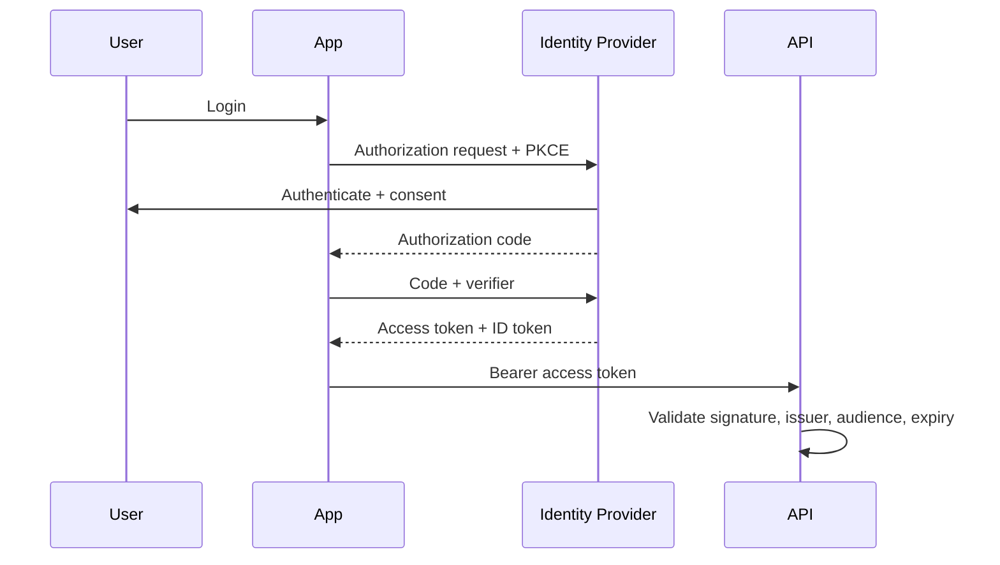

# Security Deep Dive: OAuth, JWT, and Secure Coding

Navigation: [README](README.md) | Previous: [Frontend Integration](25_frontend_integration.md) | Related: [Spring Security](../Java%20%26%20Spring%20Interview%20Preparation/Spring%20Boot/04_security_practices.md) | [Security Q&A](../Question%20Bank/security.md)

This file deepens the security track with interview-ready OAuth flows, JWT pitfalls, and secure coding practices.

## OAuth and OIDC flow selection

| Flow | Use for | Notes |
|------|---------|-------|
| Authorization Code + PKCE | browser/mobile login | preferred for public clients |
| Client Credentials | service-to-service | no user context |
| Device Code | TV/CLI devices | user authorizes on another device |
| Refresh Token | session continuity | rotate and revoke carefully |

OpenID Connect adds identity on top of OAuth through the ID token. OAuth answers "what can this client access?" OIDC answers "who is the user?"

## OAuth sequence



## JWT vulnerabilities and fixes

| Vulnerability | Risk | Fix |
|---------------|------|-----|
| Accepting `alg=none` | unsigned tokens accepted | enforce allowed algorithms |
| Not checking issuer/audience | token from wrong system accepted | validate `iss` and `aud` |
| Long-lived access tokens | stolen token works too long | short TTL + refresh rotation |
| Storing JWT in localStorage | XSS can steal token | prefer HttpOnly Secure SameSite cookies for browsers |
| No key rotation | compromised key persists | JWKS rotation and `kid` handling |
| Trusting claims blindly | privilege escalation | authorize server-side against current permissions |

## Secure coding checklist

- Validate input at boundaries.
- Use parameterized SQL and ORM query binding.
- Encode output for the target context.
- Enforce authorization at the service/domain layer, not only the controller.
- Avoid logging secrets, tokens, PII, or full request bodies.
- Use secure defaults for CORS, cookies, TLS, and headers.
- Rate limit login, password reset, and expensive endpoints.
- Store passwords with adaptive hashing such as bcrypt, scrypt, or Argon2.
- Keep dependencies patched and scan for vulnerabilities.

## Spring Boot resource server checklist

```java
@Bean
SecurityFilterChain api(HttpSecurity http) throws Exception {
    return http
            .csrf(csrf -> csrf.disable())
            .authorizeHttpRequests(auth -> auth
                    .requestMatchers("/actuator/health").permitAll()
                    .requestMatchers("/admin/**").hasRole("ADMIN")
                    .anyRequest().authenticated())
            .oauth2ResourceServer(oauth -> oauth.jwt())
            .build();
}
```

Important checks:

- Configure trusted issuer URI.
- Validate audience when needed.
- Map scopes/roles explicitly.
- Add integration tests for forbidden endpoints.

## Incident example: over-permissive CORS

**Symptom:** Browser clients from untrusted origins could call authenticated APIs.

**Root cause:** CORS was configured with wildcard origins and credentials enabled.

**Fix:** Allow only known origins, block credentials for public origins, and add automated config tests.

## Interview talking points

- Explain OAuth vs OIDC clearly.
- JWT is a format, not a complete auth system.
- Authorization must be checked server-side.
- Secure token storage depends on client type.
- Security is defense-in-depth: identity, transport, input, secrets, logging, monitoring.

