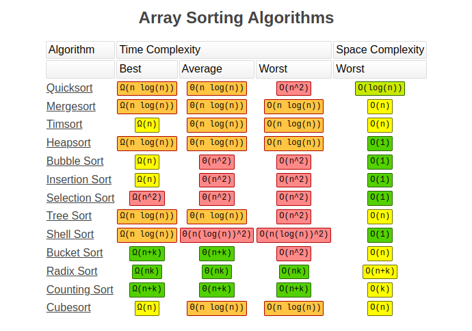

# 12. Performance Comparison Table for Java Collections

## 🚀 Overview
Java provides a wide array of collection types, each suited to specific use cases. Understanding their performance implications across different operations is crucial for writing optimized and scalable code. This table provides an advanced, comprehensive comparison of popular implementations in terms of time complexity for core operations.

---

## 📘 Complexity Legend

| Symbol      | Meaning              |
|-------------|-----------------------|
| O(1)        | Constant time         |
| O(log n)    | Logarithmic time      |
| O(n)        | Linear time           |
| O(n log n)  | Linearithmic time     |
| O(n^2)      | Quadratic time        |

---

## 📝 List Implementations

| Operation         | `ArrayList`   | `LinkedList`  | `Vector`      | `CopyOnWriteArrayList` |
|------------------|---------------|---------------|---------------|------------------------|
| Add (end)        | O(1)*         | O(1)          | O(1)*         | O(n)                   |
| Add (middle)     | O(n)          | O(n)          | O(n)          | O(n)                   |
| Remove (index)   | O(n)          | O(n)          | O(n)          | O(n)                   |
| Remove (iterator)| O(n)          | O(1)          | O(n)          | O(n)                   |
| Get (index)      | O(1)          | O(n)          | O(1)          | O(1)                   |
| Search           | O(n)          | O(n)          | O(n)          | O(n)                   |

*Amortized constant time.

---

## 🌿 Set Implementations

| Operation     | `HashSet` | `LinkedHashSet` | `TreeSet` | `CopyOnWriteArraySet` |
|---------------|-----------|------------------|-----------|------------------------|
| Add           | O(1)      | O(1)             | O(log n)  | O(n)                   |
| Remove        | O(1)      | O(1)             | O(log n)  | O(n)                   |
| Contains      | O(1)      | O(1)             | O(log n)  | O(n)                   |
| Iteration     | Unordered| Insertion        | Sorted    | Insertion              |

---

## 🗺️ Map Implementations

| Operation      | `HashMap` | `LinkedHashMap` | `TreeMap` | `Hashtable` | `ConcurrentHashMap` | `WeakHashMap` |
|----------------|-----------|------------------|-----------|-------------|----------------------|----------------|
| Put            | O(1)      | O(1)             | O(log n)  | O(1)        | O(1)                 | O(1)           |
| Get            | O(1)      | O(1)             | O(log n)  | O(1)        | O(1)                 | O(1)           |
| Remove         | O(1)      | O(1)             | O(log n)  | O(1)        | O(1)                 | O(1)           |
| Null keys/vals | 1/nulls   | 1/nulls          | No/nulls  | ❌          | 1/nulls              | ✅             |
| Thread-safe    | ❌        | ❌               | ❌         | ✅          | ✅                   | ❌             |
| Maintains order| ❌        | Insertion/Access | Sorted    | ❌          | ❌                   | ❌             |

---

## 🔄 Queue and Deque Implementations

| Operation | `ArrayDeque` | `LinkedList` | `PriorityQueue` | `BlockingQueue` (e.g., `LinkedBlockingQueue`) |
|-----------|--------------|---------------|------------------|---------------------------------------------|
| Add       | O(1)         | O(1)          | O(log n)         | O(1)                                        |
| Remove    | O(1)         | O(1)          | O(log n)         | O(1)                                        |
| Peek      | O(1)         | O(1)          | O(1)             | O(1)                                        |
| Poll      | O(1)         | O(1)          | O(log n)         | O(1)                                        |

---

## 🧠 Advanced Insights

- Prefer `ArrayList` for frequent random access and less insertion/removal.
- Use `LinkedList` for queue, stack, or frequent modification scenarios.
- `HashSet` and `HashMap` provide excellent average-case performance.
- `TreeSet`/`TreeMap` are ideal for sorted and range-based operations.
- Use `ConcurrentHashMap` for high-concurrency environments.
- `CopyOnWriteArrayList/Set` are ideal for read-heavy, low-write scenarios.
- `WeakHashMap` is useful for caching with automatic key removal when no longer referenced.

---

## 📊 Big O Notation

### Introduction
Big O notation is used in computer science to define an upper bound of an algorithm. It is mostly used to define the maximum time of an algorithm as a function of the input size, but it can also be used to define memory usage. Big O notation tells you how fast an algorithm is. Big O doesn't tell you the speed in seconds. Big O notation lets you compare the number of operations.

### Why is Big O Important?
Big O notation helps developers and computer scientists analyze the efficiency of algorithms. It provides a way to predict how an algorithm will scale as the size of the input grows. This is crucial for optimizing code and ensuring that applications perform well under different conditions.


> The chart above visually represents the growth rates of different Big O complexities. It helps in understanding how the runtime or memory usage of an algorithm increases with input size.

### Complete Asymptotic Notation Family

#### Big O (O) - Upper Bound
- Represents the worst-case scenario
- Formal definition: f(n) = O(g(n)) if there exist constants c and n₀ such that f(n) ≤ c·g(n) for all n ≥ n₀

#### Big Omega (Ω) - Lower Bound
- Represents the best-case scenario
- Formal definition: f(n) = Ω(g(n)) if there exist constants c and n₀ such that f(n) ≥ c·g(n) for all n ≥ n₀

#### Big Theta (Θ) - Tight Bound
- Represents both upper and lower bounds
- Formal definition: f(n) = Θ(g(n)) if f(n) = O(g(n)) and f(n) = Ω(g(n))

#### Little o (o) and Little omega (ω)
- Used for strictly less than or strictly greater than relationships
- Less commonly used in practical algorithm analysis

### Space vs. Time Complexity
When analyzing algorithms, we consider two types of complexity:

- **Time Complexity**: How the runtime scales with input size
- **Space Complexity**: How the memory usage scales with input size

An algorithm with O(n) time complexity and O(1) space complexity might be preferred over an O(log n) time complexity with O(n) space complexity for memory-constrained environments.

### Common Complexities

#### O(1) - Constant Time
A real-world example of an O(1) operation is accessing an array by its index. The runtime does not depend on the size of the input.

**Example:**
```java
int[] arr = {1, 2, 3, 4, 5};
System.out.println(arr[2]);  // Accessing the third element is O(1)
```
**Explanation:** Accessing an element in an array by its index is a constant-time operation because it does not depend on the size of the array.

#### O(log n) - Logarithmic Time
The most common real-world example of an O(log n) operation is a binary search of an ordered array. The runtime grows logarithmically as the input size increases.

**Example:**
```java
public static int binarySearch(int[] arr, int target) {
    int low = 0, high = arr.length - 1;
    while (low <= high) {
        int mid = (low + high) / 2;
        if (arr[mid] == target) {
            return mid;
        } else if (arr[mid] < target) {
            low = mid + 1;
        } else {
            high = mid - 1;
        }
    }
    return -1;
}
```
**Explanation:** Binary search repeatedly divides the search interval in half, reducing the problem size logarithmically.

#### O(n) - Linear Time
An example of an O(n) operation is a naive search for an item in an array. The runtime grows linearly with the input size.

**Example:**
```java
public static int naiveSearch(int[] arr, int target) {
    for (int i = 0; i < arr.length; i++) {
        if (arr[i] == target) {
            return i;
        }
    }
    return -1;
}
```
**Explanation:** The algorithm iterates through the array, checking each element, so the runtime grows linearly with the input size.

#### O(n log n) - Linearithmic Time
Sorting algorithms like Merge Sort and Quick Sort often have O(n log n) complexity. This is a combination of linear and logarithmic growth.

**Example:**
```java
public static void mergeSort(int[] arr, int left, int right) {
    if (left < right) {
        int mid = (left + right) / 2;
        mergeSort(arr, left, mid);
        mergeSort(arr, mid + 1, right);
        merge(arr, left, mid, right);
    }
}
```
**Explanation:** Merge Sort divides the array into halves recursively and then merges them in sorted order, resulting in O(n log n) complexity.

#### O(n²) - Quadratic Time
A real-world example of an O(n²) operation is a naive search for duplicates in an array.

**Example:**
```java
public static List<Integer> findDuplicates(int[] arr) {
    List<Integer> duplicates = new ArrayList<>();
    for (int i = 0; i < arr.length; i++) {
        for (int j = i + 1; j < arr.length; j++) {
            if (arr[i] == arr[j] && !duplicates.contains(arr[i])) {
                duplicates.add(arr[i]);
            }
        }
    }
    return duplicates;
}
```

#### O(2^n) - Exponential Time
Algorithms that solve problems using recursion with multiple branches often have O(2^n) complexity.

**Example:**
```java
public static int fibonacci(int n) {
    if (n <= 1) return n;
    return fibonacci(n - 1) + fibonacci(n - 2);
}
```

#### O(n!) - Factorial Time
Real-world examples of O(n!) operations are algorithms that generate all permutations.

**Example:**
```java
public static List<List<Integer>> generatePermutations(int[] arr) {
    List<List<Integer>> result = new ArrayList<>();
    permute(arr, 0, result);
    return result;
}
```

### Advanced Concepts in Algorithm Analysis

#### Amortized Analysis
Amortized analysis considers the average performance of a sequence of operations, rather than the worst-case scenario for each individual operation. This is particularly useful for data structures like ArrayList in Java, where the occasional resizing operation is expensive but happens infrequently.

**Example: ArrayList's add operation**
- Most additions are O(1)
- Occasional resizing requires O(n)
- Amortized time for n operations: O(n) total, or O(1) per operation

#### Multi-Parameter Complexity
Some algorithms have complexity dependent on multiple input parameters:

**Example: Graph Algorithms**
```java
// Time complexity: O(V + E) where V is vertices and E is edges
public void breadthFirstTraversal(Graph graph, Vertex start) {
    Queue<Vertex> queue = new LinkedList<>();
    Set<Vertex> visited = new HashSet<>();
    
    queue.add(start);
    visited.add(start);
    
    while (!queue.isEmpty()) {
        Vertex current = queue.poll();
        System.out.println(current);
        
        for (Vertex neighbor : graph.getNeighbors(current)) {
            if (!visited.contains(neighbor)) {
                visited.add(neighbor);
                queue.add(neighbor);
            }
        }
    }
}
```

#### Recursive Algorithm Analysis
Analyzing recursive algorithms often involves solving recurrence relations:

**Example: Binary Search Recurrence Relation**
```
T(n) = T(n/2) + c
T(1) = d
Solution: T(n) = O(log n)
```

#### Complexity Classes
Complexity theory categorizes problems into classes:
- **P**: Problems solvable in polynomial time
- **NP**: Problems verifiable in polynomial time
- **NP-Complete**: Hardest problems in NP
- **NP-Hard**: At least as hard as NP problems

### Optimization Techniques

#### Memoization & Dynamic Programming
Technique to avoid redundant calculations by storing previously computed results.

**Example: Optimized Fibonacci using memoization**
```java
public static int fibonacciMemoized(int n, Map<Integer, Integer> memo) {
    if (memo.containsKey(n)) return memo.get(n);
    if (n <= 1) return n;
    
    int result = fibonacciMemoized(n - 1, memo) + fibonacciMemoized(n - 2, memo);
    memo.put(n, result);
    return result;
}
```
Reduces complexity from O(2^n) to O(n).

#### Space-Time Trade-offs
Sometimes we can trade space for time or vice versa:

**Example: Precomputation**
```java
// Trading space for time
Map<Integer, Integer> squareMap = new HashMap<>();
for (int i = 1; i <= 1000; i++) {
    squareMap.put(i, i * i); // O(n) space
}

// Later lookups are O(1) instead of O(1) calculation
public int getSquare(int n) {
    return squareMap.get(n);
}
```

### Common Data Structure Operations

> The image above summarizes the time complexities of common operations on data structures like arrays, linked lists, stacks, and queues.

### Sorting Algorithms Comparison

> This image provides a comparison of different sorting algorithms and their time complexities in best, average, and worst-case scenarios.

### Advanced Data Structures and Their Complexities

#### Trie (Prefix Tree)
- **Insert/Search/Delete**: O(m) where m is key length
- **Space**: O(ALPHABET_SIZE * m * n) where n is number of keys
- **Usage**: Efficient for dictionary operations and prefix searches

#### Segment Tree
- **Build**: O(n)
- **Query/Update**: O(log n)
- **Space**: O(n)
- **Usage**: Range queries and updates

#### Bloom Filter
- **Insert/Search**: O(k) where k is number of hash functions
- **Space**: O(m) where m is size of bit array
- **Usage**: Space-efficient probabilistic set membership testing

#### B-Tree
- **Search/Insert/Delete**: O(log n)
- **Usage**: Database indexing and file systems

### Resources
- [Big-O Cheat Sheet](https://www.bigocheatsheet.com/)
- [Introduction to Algorithms](https://mitpress.mit.edu/9780262046305/introduction-to-algorithms/) - Cormen, Leiserson, Rivest, Stein
- [Algorithm Design Manual](http://www.algorist.com/) - Steven Skiena

---

## ❓ Interview Questions & Answers

### General Collection Questions

### Q1: Why is `ArrayList` more efficient than `LinkedList` for indexing?
**A:** Because it uses a dynamic array internally, allowing direct access by index in O(1) time. `LinkedList` must traverse the list to access an element, resulting in O(n) time complexity.

### Q2: How does `HashMap` handle collisions?
**A:** Initially by chaining (using linked lists); since Java 8, it switches to balanced trees (red-black) for buckets with many entries (typically 8 or more) to improve worst-case performance from O(n) to O(log n).

### Q3: What are the advantages of `LinkedHashMap`?
**A:** It maintains insertion order or access order (depending on constructor parameters), making it suitable for LRU cache implementations while still providing near-constant time performance for basic operations.

### Q4: When would you use a `TreeSet` over a `HashSet`?
**A:** When you need elements in a sorted order or need to perform range queries such as finding closest matches, ceiling/floor values, or subsets based on ranges.

### Q5: What's the difference between `HashMap`, `Hashtable`, and `ConcurrentHashMap`?
**A:** 
- `HashMap` is unsynchronized, allows one null key and multiple null values, and offers best performance in single-threaded environments
- `Hashtable` is synchronized, doesn't allow nulls, and is legacy (since Java 1.0)
- `ConcurrentHashMap` provides thread-safety with better concurrency than `Hashtable` by using segment locking (pre-Java 8) or fine-grained node locking (Java 8+), and supports concurrent retrieval operations

### Advanced Collection Questions

### Q6: How does `CopyOnWriteArrayList` achieve thread safety, and what are its performance implications?
**A:** It creates a fresh copy of the underlying array for every mutation operation, allowing for lock-free reads but expensive writes. This makes it ideal for situations where reads vastly outnumber writes, such as observer lists or configuration snapshots. The time complexity is O(n) for mutations and O(1) for reads.

### Q7: What is the time complexity of `contains()` in `HashSet` and in what scenario might it degrade?
**A:** Average-case O(1), worst-case O(n). Performance degrades when many elements hash to the same bucket due to poor hash function implementation, many hash collisions, or if the initial capacity is too small causing a high load factor before rehashing occurs.

### Q8: How would you implement an LRU cache using Java Collections?
**A:** Using a `LinkedHashMap` with access-order enabled:
```java
class LRUCache<K, V> extends LinkedHashMap<K, V> {
    private final int capacity;
    
    public LRUCache(int capacity) {
        super(capacity, 0.75f, true); // true for access-order
        this.capacity = capacity;
    }
    
    @Override
    protected boolean removeEldestEntry(Map.Entry<K, V> eldest) {
        return size() > capacity;
    }
}
```

### Q9: What is the underlying data structure of `PriorityQueue` and how does it maintain heap property?
**A:** A binary heap implemented as an array. It maintains the heap property (where a parent is always smaller/greater than its children depending on min/max heap) through the sift-up operation during insertion and sift-down during removal, both with O(log n) complexity.

### Big O and Algorithm Analysis Questions

### Q10: How does amortized analysis differ from worst-case analysis?
**A:** Worst-case analysis considers the maximum time an operation could take in any scenario, while amortized analysis considers the average time over a sequence of operations. For example, ArrayList's add() has a worst-case of O(n) when resizing occurs, but amortized O(1) because resizing happens infrequently.

### Q11: Why is quicksort preferred in practice despite having a worst-case time complexity of O(n²)?
**A:** Quicksort has excellent average-case performance of O(n log n) with low constant factors and good cache locality. Its worst case can be avoided with proper pivot selection strategies like randomized pivoting or median-of-three. Additionally, it sorts in-place with O(log n) auxiliary space in typical implementations.

### Q12: How would you determine which data structure to use for a specific problem based on time complexity requirements?
**A:** I would:
1. Identify the most frequent operations (access, insertion, deletion, search)
2. Determine if ordering is important (natural, insertion, or none)
3. Consider memory constraints and thread-safety requirements
4. Match these requirements with data structures that provide optimal complexity for the dominant operations
For example, if frequent random access is needed with rare modifications, ArrayList is preferred. If elements must be sorted and range queries are common, TreeSet/TreeMap would be appropriate.

### Q13: How does the complexity of traversing a balanced binary search tree compare with that of an unbalanced one?
**A:** 
- Balanced BST: O(log n) for traversal to any node
- Unbalanced BST: Could degrade to O(n) in worst case (effectively a linked list)
This is why self-balancing trees like AVL trees and Red-Black trees are important, as they guarantee O(log n) operations even in worst-case scenarios.

### Q14: How would you optimize an algorithm with O(2^n) time complexity?
**A:** Several approaches:
1. Dynamic programming/memoization to avoid redundant calculations
2. Branch and bound techniques to prune unpromising paths early
3. Use heuristics if approximate solutions are acceptable
4. Identify if the problem has special cases that can be solved more efficiently
5. Consider if the problem can be reformulated using a more efficient approach

### Q15: Compare and contrast the space complexity of DFS versus BFS for graph traversal.
**A:** 
- DFS typically uses O(h) space where h is the maximum depth of the recursion stack (or height of the graph)
- BFS typically uses O(w) space where w is the maximum width of the graph (maximum number of nodes at any level)
- For wide and shallow graphs, DFS may use less memory
- For narrow and deep graphs, BFS may use less memory
- In the worst case (complete graph), both could use O(V) space where V is the number of vertices
- Implementation matters: recursive DFS adds function call overhead, while iterative implementations of both require explicit data structures

### System Design and Collection Selection Questions

### Q16: When designing a high-throughput, multi-threaded system in Java, how would you choose between `ConcurrentHashMap`, `Collections.synchronizedMap()`, and thread-local storage?
**A:**
- Use `ConcurrentHashMap` for shared maps that need high concurrent read/write access with good performance
- Use `Collections.synchronizedMap()` when compatibility with older code is required or when complete table locking is acceptable
- Use ThreadLocal when each thread needs its own independent copy with no sharing required
- For read-heavy scenarios with occasional updates, consider using `CopyOnWriteArrayList` or a custom solution with read-write locks

### Q17: How would you design a data structure that supports O(1) operations for insert, delete, search and getRandom?
**A:** Combine a HashMap with an ArrayList:
```java
class O1DataStructure<T> {
    private ArrayList<T> elements = new ArrayList<>();
    private HashMap<T, Integer> indices = new HashMap<>();
    
    // O(1) insertion
    public void insert(T item) {
        if (indices.containsKey(item)) return;
        indices.put(item, elements.size());
        elements.add(item);
    }
    
    // O(1) deletion using swap with last element
    public void delete(T item) {
        if (!indices.containsKey(item)) return;
        
        int index = indices.get(item);
        T lastElement = elements.get(elements.size() - 1);
        
        elements.set(index, lastElement);
        indices.put(lastElement, index);
        
        elements.remove(elements.size() - 1);
        indices.remove(item);
    }
    
    // O(1) search
    public boolean search(T item) {
        return indices.containsKey(item);
    }
    
    // O(1) getRandom
    public T getRandom() {
        if (elements.isEmpty()) throw new NoSuchElementException();
        int randomIndex = new Random().nextInt(elements.size());
        return elements.get(randomIndex);
    }
}
```

### Q18: How would you implement a cache with O(1) access time that automatically removes the least frequently used items?
**A:** Using a combination of HashMap and Min-Heap:
```java
class LFUCache<K, V> {
    private final int capacity;
    private int minFrequency;
    private Map<K, V> cache;
    private Map<K, Integer> keyFreq;
    private Map<Integer, LinkedHashSet<K>> freqKeys;
    
    public LFUCache(int capacity) {
        this.capacity = capacity;
        this.minFrequency = 0;
        this.cache = new HashMap<>();
        this.keyFreq = new HashMap<>();
        this.freqKeys = new HashMap<>();
    }
    
    public V get(K key) {
        if (!cache.containsKey(key)) return null;
        
        int freq = keyFreq.get(key);
        freqKeys.get(freq).remove(key);
        if (freqKeys.get(freq).isEmpty()) {
            freqKeys.remove(freq);
            if (minFrequency == freq) minFrequency++;
        }
        
        freq++;
        keyFreq.put(key, freq);
        freqKeys.computeIfAbsent(freq, k -> new LinkedHashSet<>()).add(key);
        
        return cache.get(key);
    }
    
    public void put(K key, V value) {
        if (capacity <= 0) return;
        
        if (cache.containsKey(key)) {
            cache.put(key, value);
            get(key); // Update frequency
            return;
        }
        
        if (cache.size() >= capacity) {
            K evictKey = freqKeys.get(minFrequency).iterator().next();
            freqKeys.get(minFrequency).remove(evictKey);
            if (freqKeys.get(minFrequency).isEmpty()) {
                freqKeys.remove(minFrequency);
            }
            
            cache.remove(evictKey);
            keyFreq.remove(evictKey);
        }
        
        cache.put(key, value);
        keyFreq.put(key, 1);
        minFrequency = 1;
        freqKeys.computeIfAbsent(1, k -> new LinkedHashSet<>()).add(key);
    }
}
```

### Q19: How would you implement a thread-safe, non-blocking FIFO queue?
**A:** Using `java.util.concurrent.ConcurrentLinkedQueue` which is a thread-safe, non-blocking implementation based on Michael-Scott queue algorithm:

```java
ConcurrentLinkedQueue<Task> taskQueue = new ConcurrentLinkedQueue<>();

// Producer
public void addTask(Task task) {
    taskQueue.offer(task);
}

// Consumer
public Task getTask() {
    return taskQueue.poll();
}
```

For more control, you can use `java.util.concurrent.atomic` classes to build custom non-blocking data structures with Compare-And-Swap (CAS) operations.

### Q20: What data structure would you use to implement a spell checker, and why?
**A:** A Trie (prefix tree) is ideal for a spell checker because:
1. It provides O(L) lookup time where L is the length of the word
2. It efficiently stores words with common prefixes
3. It enables prefix-based operations like autocomplete
4. It can be modified to support fuzzy matching and suggestions
5. Common misspellings can be handled by implementing edit distance algorithms like Levenshtein distance

Implementation:
```java
class TrieNode {
    Map<Character, TrieNode> children = new HashMap<>();
    boolean isEndOfWord;
}

class SpellChecker {
    private TrieNode root = new TrieNode();
    
    public void addWord(String word) {
        TrieNode current = root;
        for (char c : word.toCharArray()) {
            current = current.children.computeIfAbsent(c, k -> new TrieNode());
        }
        current.isEndOfWord = true;
    }
    
    public boolean isWordCorrect(String word) {
        TrieNode node = searchPrefix(word);
        return node != null && node.isEndOfWord;
    }
    
    public List<String> getSuggestions(String prefix) {
        List<String> suggestions = new ArrayList<>();
        TrieNode prefixNode = searchPrefix(prefix);
        if (prefixNode != null) {
            collectWords(prefixNode, prefix, suggestions);
        }
        return suggestions;
    }
    
    private TrieNode searchPrefix(String prefix) {
        TrieNode current = root;
        for (char c : prefix.toCharArray()) {
            if (!current.children.containsKey(c)) {
                return null;
            }
            current = current.children.get(c);
        }
        return current;
    }
    
    private void collectWords(TrieNode node, String prefix, List<String> words) {
        if (node.isEndOfWord) {
            words.add(prefix);
        }
        
        for (Map.Entry<Character, TrieNode> child : node.children.entrySet()) {
            collectWords(child.getValue(), prefix + child.getKey(), words);
        }
    }
}
```

---

> 🔗 Next: [Concurrent Collections](./13_Concurrent_Collections.md)
