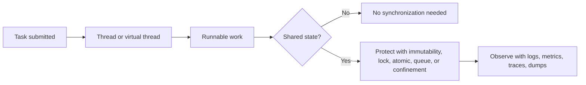

# Multithreading and Concurrency in Java

Concurrency is the ability to make progress on multiple tasks during the same time period. In Java interviews, the goal is not only to know APIs, but to explain correctness, visibility, ordering, contention, and operational trade-offs.

**Navigation:** [Java Hub](README.md) | [Java Memory Management](Java%20Memory%20Management.md) | [Performance Engineering](../../Performance%20Engineering/README.md) | [Multithreading Q&A](../../Question%20Bank/multithreading.md)

## Core model



## Thread lifecycle

| State | Meaning | Interview cue |
|------|---------|---------------|
| `NEW` | Thread object created, not started | Calling `run()` directly does not start a new thread |
| `RUNNABLE` | Eligible to run on CPU | Includes running and ready states |
| `BLOCKED` | Waiting to enter a synchronized block/method | Usually lock contention |
| `WAITING` | Waiting indefinitely for another signal | `wait()`, `join()`, `LockSupport.park()` |
| `TIMED_WAITING` | Waiting with timeout | `sleep()`, timed `join()`, timed locks |
| `TERMINATED` | Work finished or failed | Exceptions end the thread unless handled |

## Correctness principles

- **Atomicity:** an operation must happen as one indivisible step. Use `AtomicInteger`, locks, or single-thread ownership for shared updates.
- **Visibility:** one thread's write must become visible to another thread. Use `volatile`, locks, thread-safe collections, or safe publication.
- **Ordering:** the JVM and CPU can reorder operations unless a happens-before relationship exists.
- **Liveness:** the system should keep making progress without deadlock, starvation, livelock, or thread-pool exhaustion.
- **Isolation:** avoid shared mutable state when possible; prefer immutable values, message passing, and request-scoped objects.

## Synchronization tools

| Tool | Best use | Risk |
|------|----------|------|
| `synchronized` | Simple mutual exclusion and monitor wait/notify | Coarse locks can reduce throughput |
| `ReentrantLock` | Explicit lock/unlock, timed lock, fair lock option | Must release in `finally` |
| `volatile` | Visibility for independent reads/writes | Not enough for compound operations |
| `Atomic*` | Lock-free counters, flags, references | CAS loops can spin under heavy contention |
| `ConcurrentHashMap` | Concurrent reads/writes by key | Compound multi-key operations still need design |
| `BlockingQueue` | Producer-consumer handoff and backpressure | Unbounded queues can hide overload |
| `Semaphore` | Limit concurrent access to scarce resources | Permit leaks if release is missed |
| `CompletableFuture` | Async composition and fan-out/fan-in | Default pool misuse can cause starvation |

## Bad code to good code

### Race condition

```java
class UnsafeCounter {
    private int count;

    void increment() {
        count++;
    }
}
```

`count++` is read, add, write. Multiple threads can overwrite each other.

```java
class SafeCounter {
    private final AtomicInteger count = new AtomicInteger();

    int incrementAndGet() {
        return count.incrementAndGet();
    }
}
```

### Thread pool with bounded backpressure

```java
ExecutorService executor = new ThreadPoolExecutor(
    8,
    8,
    0L,
    TimeUnit.MILLISECONDS,
    new ArrayBlockingQueue<>(500),
    new ThreadPoolExecutor.CallerRunsPolicy()
);
```

This avoids unbounded memory growth. `CallerRunsPolicy` slows submitters when workers are saturated, which is often safer than accepting unlimited work.

## CompletableFuture pattern

```java
CompletableFuture<User> userFuture =
    CompletableFuture.supplyAsync(() -> userClient.getUser(userId), executor);

CompletableFuture<List<Order>> orderFuture =
    CompletableFuture.supplyAsync(() -> orderClient.getOrders(userId), executor);

Profile profile = userFuture
    .thenCombine(orderFuture, Profile::new)
    .orTimeout(500, TimeUnit.MILLISECONDS)
    .exceptionally(error -> Profile.fallback(userId))
    .join();
```

Use explicit executors, timeouts, fallbacks, and clear ownership of failure handling. Do not block inside the same saturated pool that must complete the futures.

## Virtual threads

Virtual threads are useful for high-concurrency blocking IO, such as request-per-task servers that call databases or downstream APIs.

Use them when:
- Work is mostly blocking IO.
- You want simpler synchronous code without a large platform-thread pool.
- Libraries are compatible and do not pin carrier threads for long periods.

Be careful with:
- CPU-bound work, which still needs CPU-sized pools.
- Long synchronized blocks or native calls that can pin carrier threads.
- Database connection pools, downstream rate limits, and other real bottlenecks.

## Deadlock checklist

Deadlock typically requires mutual exclusion, hold-and-wait, no preemption, and circular wait.

Prevention strategies:
- Use one global lock ordering rule.
- Keep lock scopes small.
- Avoid calling external systems while holding a lock.
- Prefer timed locks for operational recovery.
- Capture thread dumps when the system appears stuck.

## Producer-consumer pattern

```java
BlockingQueue<Job> queue = new ArrayBlockingQueue<>(1000);

void submit(Job job) throws InterruptedException {
    queue.put(job);
}

void workerLoop() throws InterruptedException {
    while (!Thread.currentThread().isInterrupted()) {
        Job job = queue.take();
        process(job);
    }
}
```

Bounded queues communicate overload. In production, pair this with metrics for queue depth, enqueue latency, processing latency, retry count, and dead-letter count.

## Interview talking points

- Start with shared state: what is shared, who writes it, who reads it, and what invariant must hold?
- Explain the happens-before relationship, not just the keyword.
- Mention test limits: concurrency bugs need stress tests, deterministic design, logs, metrics, and production diagnostics.
- Tie concurrency to system design: thread pools, queue depth, timeout budgets, backpressure, and graceful degradation.
- For Spring Boot services, align executor size with workload type, database pool size, and downstream capacity.

## Practice prompts

1. Make a counter thread-safe three different ways and compare trade-offs.
2. Design a bounded background job executor with retries and dead-letter handling.
3. Explain why `volatile int count; count++;` is still unsafe.
4. Debug a service where all request threads are blocked waiting for a saturated async pool.
5. Compare platform threads, virtual threads, reactive IO, and message queues for high-concurrency APIs.

## Related docs

- [Java Memory Management](Java%20Memory%20Management.md)
- [Performance flame graphs, async-profiler, and GC tuning](../../Performance%20Engineering/advanced_flame_graphs_async_profiler_gc_tuning.md)
- [Microservices resilience patterns](../../Microservices%20and%20Architecture/15_resilience_patterns.md)
- [Multithreading question bank](../../Question%20Bank/multithreading.md)
