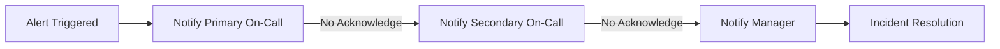

# 6. Observability & Monitoring

#### Overview
This document provides a comprehensive guide to observability and monitoring for Spring Boot applications. It covers distributed tracing, metrics, logging, alerting, visualization, error handling, security, and best practices for building observable, debuggable, and reliable systems.

---

## Table of Contents

1. [Introduction to Observability](#introduction-to-observability)
2. [Distributed Tracing](#distributed-tracing)
3. [Metrics Collection](#metrics-collection)
4. [Logging Best Practices](#logging-best-practices)
5. [Health Checks & Readiness Probes](#health-checks--readiness-probes)
6. [Alerting & Incident Response](#alerting--incident-response)
7. [Visualization & Dashboards](#visualization--dashboards)
8. [Error Handling & Diagnostics](#error-handling--diagnostics)
9. [Security & Compliance](#security--compliance)
10. [Best Practices & Patterns](#best-practices--patterns)
11. [References](#references)

---

## Introduction to Observability

Observability is the capability to infer the internal state of a system by examining its external outputs. It enables teams to monitor, debug, and understand complex systems effectively, especially in distributed microservices architectures.

### Key Concepts

| Pillar    | Description                                                                                   | Use Cases                                      |
|-----------|-----------------------------------------------------------------------------------------------|------------------------------------------------|
| Tracing   | Tracks requests as they flow through distributed components, providing end-to-end visibility. | Debugging latency issues, root cause analysis. |
| Metrics   | Numerical measurements collected over time to monitor system health and performance.          | Alerting on SLA breaches, capacity planning.   |
| Logging   | Records detailed event data for auditing and troubleshooting.                                 | Post-mortem analysis, forensic debugging.      |

### Golden Signals of Monitoring

- **Latency:** Time taken to service a request.
- **Traffic:** Number of requests per second.
- **Errors:** Rate of failed requests.
- **Saturation:** System resource utilization (CPU, memory, etc.).

Effective observability combines these pillars to provide a comprehensive view of system health and behavior.

---

## Distributed Tracing

Distributed tracing allows tracking of a single request as it propagates through multiple microservices, providing insights into latency and failure points.

### Core Concepts

- **Trace:** A collection of spans representing the lifecycle of a request.
- **Span:** A unit of work or operation within a trace.
- **Context Propagation:** Passing trace/span identifiers through service boundaries.
- **Correlation ID:** A unique identifier propagated through logs and traces to correlate events.

### Use Cases

- Identifying bottlenecks in service chains.
- Diagnosing cascading failures.
- Understanding service dependencies.

### Tooling Options

| Tool                   | Description                                      | Integration Level                 |
|------------------------|------------------------------------------------|---------------------------------|
| OpenTelemetry          | Open standard for tracing and metrics.          | SDKs for Java, exporters for Jaeger, Zipkin, etc. |
| Jaeger                 | Open-source, end-to-end distributed tracing.    | Backend for trace storage and visualization.       |
| Zipkin                 | Distributed tracing system with UI and storage. | Popular for Spring Boot integration.                |
| Spring Cloud Sleuth    | Auto-instrumentation for Spring Boot apps.      | Seamlessly adds tracing to Spring components.       |

### OpenTelemetry Setup Example

```java
@Bean
public OpenTelemetry openTelemetry() {
    return OpenTelemetrySdk.builder()
        .setTracerProvider(SdkTracerProvider.builder()
            .addSpanProcessor(BatchSpanProcessor.builder(
                JaegerGrpcSpanExporter.builder()
                    .setEndpoint("http://localhost:14250")
                    .build())
                .build())
            .build())
        .build();
}
```

### Span Context Propagation & Correlation ID

To maintain trace continuity across service boundaries, propagate the trace context via HTTP headers (e.g., `traceparent`, `tracestate`).

```java
// Adding correlation ID to MDC for log correlation
MDC.put("correlationId", UUID.randomUUID().toString());
```

Example HTTP client interceptor to propagate context:

```java
public class TracingInterceptor implements ClientHttpRequestInterceptor {
    @Override
    public ClientHttpResponse intercept(HttpRequest request, byte[] body, ClientHttpRequestExecution execution) throws IOException {
        Span currentSpan = tracer.currentSpan();
        if (currentSpan != null) {
            request.getHeaders().add("traceparent", currentSpan.getSpanContext().getTraceId());
            request.getHeaders().add("tracestate", currentSpan.getSpanContext().getTraceState().toString());
        }
        return execution.execute(request, body);
    }
}
```

### Creating Custom Spans

```java
Span span = tracer.spanBuilder("custom-operation").startSpan();
try (Scope scope = span.makeCurrent()) {
    // business logic here
} finally {
    span.end();
}
```

### Trace Analytics

Analyze collected traces to:

- Identify high-latency operations.
- Detect error hotspots.
- Understand service dependencies.

---

## Metrics Collection

Metrics provide quantitative data about your system’s performance and behavior.

### Types of Metrics

| Metric Type | Description                               | Example Use Cases                     |
|-------------|-------------------------------------------|-------------------------------------|
| Counter     | Cumulative value that only increases.    | Number of requests, error counts.   |
| Gauge       | Represents a value at a point in time.   | CPU usage, memory consumption.      |
| Histogram   | Distribution of values over time.         | Request latency distribution.       |
| Timer       | Measures duration and count of events.   | Service processing time.             |

### Spring Boot Actuator & Micrometer

Spring Boot Actuator exposes metrics at `/actuator/metrics`. Micrometer acts as a facade to collect JVM, system, and custom metrics.

Example of custom business metric:

```java
@Autowired
private MeterRegistry meterRegistry;

public void recordOrderProcessed() {
    meterRegistry.counter("business.orders.processed").increment();
}
```

Using annotations:

```java
@Timed("service.process.time")
public void process() {
    // method logic
}
```

### Prometheus Registry Structure

Prometheus scrapes metrics exposed by Micrometer in a text-based format. Metrics are grouped by:

- **Metric Name:** e.g., `http_server_requests_seconds_count`
- **Labels/Tags:** key-value pairs providing metadata, e.g., `method="GET", status="200"`

Example scrape config (`prometheus.yml`):

```yaml
scrape_configs:
  - job_name: 'spring-boot-app'
    metrics_path: '/actuator/prometheus'
    static_configs:
      - targets: ['localhost:8080']
```

### Business Metrics Best Practices

- Use meaningful metric names with namespaces (e.g., `business.orders.created`).
- Add labels for dimensions (e.g., `region`, `service`).
- Avoid high-cardinality labels to prevent performance issues.

---

## Logging Best Practices

Effective logging is crucial for troubleshooting and auditing.

### Structured Logging

Prefer structured logs (JSON or key-value) for easier parsing and querying.

Example logging pattern (application.yml):

```yaml
logging:
  pattern:
    console: '{"timestamp":"%d{yyyy-MM-dd HH:mm:ss}","level":"%p","trace":"%X{traceId}","span":"%X{spanId}","correlationId":"%X{correlationId}","thread":"%t","logger":"%c{1}","message":"%m"}%n'
```

### Log Correlation

Include trace IDs and correlation IDs to link logs with traces.

```java
MDC.put("traceId", Span.current().getSpanContext().getTraceId());
MDC.put("correlationId", correlationId);
```

### Centralized Logging Solutions

| Solution       | Description                                | Pros                        | Cons                    |
|----------------|--------------------------------------------|-----------------------------|-------------------------|
| ELK Stack      | Elasticsearch, Logstash, Kibana            | Powerful search and analytics | Requires maintenance    |
| EFK Stack      | Elasticsearch, Fluentd, Kibana              | Fluentd for log forwarding    | Complexity in setup     |
| Cloud Logging  | AWS CloudWatch, GCP Stackdriver, Azure Log Analytics | Managed, scalable            | Vendor lock-in          |

### Log Levels

| Level  | Description                         | Use Case                          |
|--------|-------------------------------------|----------------------------------|
| ERROR  | Serious issues affecting functionality | Exceptions, system failures       |
| WARN   | Potential problems                   | Deprecated APIs, slow responses   |
| INFO   | General operational entries         | Service start/stop, transactions  |
| DEBUG  | Detailed diagnostic information     | Troubleshooting                   |
| TRACE  | Very fine-grained info               | Performance tracing               |

### Sensitive Data Handling

- Mask or exclude PII (personal identifiable information).
- Use filters or log scrubbing tools.
- Avoid logging secrets or passwords.

### Log Rotation & Retention

Configure log rotation to manage disk space:

```yaml
logging:
  file:
    max-history: 30
    max-size: 10MB
```

---

## Health Checks & Readiness Probes

Health checks provide real-time status of an application’s readiness and liveness.

### Liveness vs Readiness

| Probe Type | Purpose                                    | Kubernetes Use Case                       |
|------------|--------------------------------------------|-----------------------------------------|
| Liveness   | Checks if app is alive and running         | Restart container if unhealthy           |
| Readiness  | Checks if app is ready to serve traffic    | Control service traffic routing          |

### Spring Boot Health Endpoints

- `/actuator/health` – overall health status.
- `/actuator/health/liveness` – liveness status.
- `/actuator/health/readiness` – readiness status.

### Custom Health Indicators

```java
@Component
public class DatabaseHealthIndicator implements HealthIndicator {
    @Override
    public Health health() {
        try {
            // Perform DB connectivity check
            return Health.up().withDetail("database", "Available").build();
        } catch (Exception e) {
            return Health.down().withDetail("database", "Not reachable").build();
        }
    }
}
```

### Kubernetes Probe Configuration Example

```yaml
livenessProbe:
  httpGet:
    path: /actuator/health/liveness
    port: 8080
  initialDelaySeconds: 30
  periodSeconds: 10

readinessProbe:
  httpGet:
    path: /actuator/health/readiness
    port: 8080
  initialDelaySeconds: 10
  periodSeconds: 5
```

---

## Alerting & Incident Response

Alerting ensures timely notification of issues to prevent service degradation.

### Alerting Workflow

1. **Detection:** Metrics or logs cross a threshold.
2. **Notification:** Alert sent to on-call personnel.
3. **Escalation:** If unacknowledged, alert escalates.
4. **Resolution:** Issue is diagnosed and fixed.
5. **Postmortem:** Incident is analyzed and documented.

### Severity Matrix

| Severity Level | Description                      | Response Time Objective | Examples                          |
|----------------|----------------------------------|-------------------------|----------------------------------|
| Critical       | Immediate action required         | < 15 minutes            | Service down, data loss           |
| High           | High impact, needs quick response | < 1 hour                | Increased error rates, latency    |
| Medium         | Moderate impact                  | < 4 hours               | Degraded performance              |
| Low            | Informational or minor issues    | Next business day        | Configuration warnings            |

### Prometheus Alert Rule Example

```yaml
groups:
- name: example-alerts
  rules:
  - alert: HighErrorRate
    expr: rate(http_server_requests_seconds_count{status=~"5.."}[5m]) > 0.05
    for: 5m
    labels:
      severity: critical
    annotations:
      summary: "High error rate detected"
      description: "More than 5% of requests are failing over the last 5 minutes."
```

### Grafana Alert Rule Example

```yaml
apiVersion: 1
groups:
- name: Alerting
  interval: 1m
  rules:
  - alert: CPUUsageHigh
    expr: avg(rate(process_cpu_seconds_total[1m])) > 0.8
    for: 2m
    labels:
      severity: high
    annotations:
      summary: "CPU usage is above 80%"
      description: "CPU usage has been above 80% for more than 2 minutes."
```

### Escalation Flow Example



---

## Visualization & Dashboards

Dashboards provide at-a-glance views of system health and performance.

### Popular Tools

| Tool    | Description                       | Use Case                          |
|---------|-----------------------------------|----------------------------------|
| Grafana | Metrics visualization and alerting | Time-series data visualization   |
| Kibana  | Log exploration and visualization  | Log search and analysis          |

### Dashboard Layout Suggestions

| Section            | Purpose                                  | Example Panels                            |
|--------------------|------------------------------------------|------------------------------------------|
| Overview           | High-level health and traffic metrics    | Request rate, error rate, latency        |
| Service Performance | Detailed service-specific metrics         | CPU, memory, GC, DB query times          |
| Alerts             | Current active alerts and statuses       | Alert list, severity heatmap              |
| Logs               | Recent logs and error messages            | Log search panel, error frequency         |

### Example Grafana Dashboard JSON Snippet

```json
{
  "dashboard": {
    "title": "Spring Boot Application Overview",
    "panels": [
      {
        "type": "graph",
        "title": "HTTP Request Rate",
        "targets": [
          {
            "expr": "rate(http_server_requests_seconds_count[1m])",
            "legendFormat": "{{method}} {{status}}"
          }
        ]
      },
      {
        "type": "graph",
        "title": "Error Rate",
        "targets": [
          {
            "expr": "rate(http_server_requests_seconds_count{status=~\"5..\"}[5m])",
            "legendFormat": "5xx Errors"
          }
        ]
      }
    ]
  }
}
```

---

## Error Handling & Diagnostics

Robust error handling and diagnostics improve system reliability.

### Exception Tracking

Integrate with error aggregation platforms like Sentry to capture and analyze exceptions.

```java
Sentry.captureException(exception);
```

### Slow Query Logging

Enable slow query logs on databases to identify performance bottlenecks.

Example MySQL config:

```sql
SET GLOBAL slow_query_log = 'ON';
SET GLOBAL long_query_time = 2; -- seconds
```

### Dead Letter Queues (DLQ)

Monitor message queues for failed messages to prevent data loss.

### Profiling Tools

Use profilers such as VisualVM or YourKit for JVM performance analysis.

---

## Security & Compliance

Securing observability endpoints is critical to prevent unauthorized access and data leaks.

### Endpoint Exposure Risks

- Sensitive information exposure via health or metrics endpoints.
- Unauthorized access to logs or traces.
- Potential attack vectors through exposed endpoints.

### Mitigation Strategies

| Strategy                     | Description                                    | Example Configuration                          |
|------------------------------|------------------------------------------------|------------------------------------------------|
| Authentication & Authorization | Restrict access to monitoring endpoints         | Spring Security integration for actuator endpoints |
| Endpoint Exposure Control      | Limit exposed actuator endpoints                | ```yaml management.endpoints.web.exposure.include: health,info,metrics``` |
| Network Segmentation           | Firewall or VPN to restrict access               | Kubernetes Network Policies                     |
| Data Masking                   | Mask sensitive data in logs and metrics          | Custom log filters                              |
| Audit Logging                 | Track access and changes to observability tools | Enable audit logs on monitoring systems         |

### Spring Boot Security Example

```yaml
management:
  endpoints:
    web:
      exposure:
        include: health,info,metrics
  endpoint:
    health:
      show-details: when_authorized
  security:
    enabled: true
```

---

## Best Practices & Patterns

- **Automate Everything:** Automate setup of metrics, logging, and alerting to reduce human error.
- **Monitor What Matters:** Focus on business-critical and user-impacting metrics.
- **Test Observability:** Validate health checks, metrics, and logging in CI/CD pipelines.
- **Documentation:** Maintain clear documentation for dashboards, alerts, and observability architecture.

---

## References

- [Spring Boot Actuator](https://docs.spring.io/spring-boot/docs/current/reference/html/actuator.html)
- [OpenTelemetry Java](https://opentelemetry.io/docs/instrumentation/java/)
- [Micrometer Docs](https://micrometer.io/docs)
- [Prometheus](https://prometheus.io/docs/introduction/overview/)
- [Grafana](https://grafana.com/docs/)
- [Jaeger Tracing](https://www.jaegertracing.io/)
- [Zipkin](https://zipkin.io/)
- [ELK Stack](https://www.elastic.co/what-is/elk-stack)
- [Spring Cloud Sleuth](https://spring.io/projects/spring-cloud-sleuth)
- [Kubernetes Probes](https://kubernetes.io/docs/tasks/configure-pod-container/configure-liveness-readiness-startup-probes/)
- [PagerDuty](https://www.pagerduty.com/)
- [Opsgenie](https://www.atlassian.com/software/opsgenie)
- [Sentry](https://sentry.io/welcome/)
- [VisualVM](https://visualvm.github.io/)
- [YourKit Java Profiler](https://www.yourkit.com/java/profiler/)

---