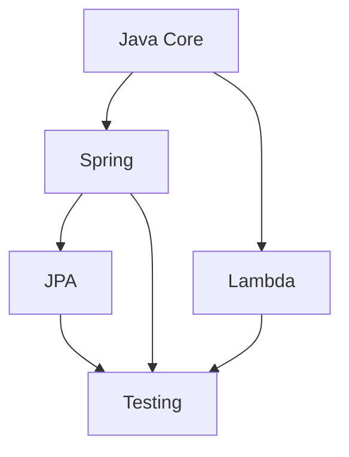

# 📚 Annotations Documentation Library

Welcome to the **annotations-docs** folder—your one-stop, interactive reference for Java annotations across:

- **Core Java**  
- **Spring / Spring Boot**  
- **Lambda & Functional Interfaces**  
- **JPA / Hibernate**  
- **Testing (JUnit, Mockito, Spring Test)**  

Each guide is a gold-standard, self-contained document with:
- ✅ **Annotation tables**  
- 💡 **Rich code examples**  
- 🔧 **Best practices & pitfalls**  
- 🎯 **Interview-ready Q&A**  

---

## 🌐 Quick Links

| Guide                              | Description                                                     |
|------------------------------------|-----------------------------------------------------------------|
| [📘 Core Java Annotations](java-annotations.md)        | Built-in & custom annotations, meta-annotations, processors      |
| [🌱 Spring Annotations](spring-annotations.md)          | DI, web MVC, security, transactions, testing                     |
| [🧩 Lambda Annotations](lambda-annotations.md)          | `@FunctionalInterface`, SAM conversion, advanced functional APIs |
| [🗃️ JPA Annotations](jpa-annotations.md)                | Entity mapping, relationships, inheritance, converters           |
| [🧪 Test Annotations](test-annotations.md)              | JUnit 5, Mockito, Spring Test, parameterized & transactional     |

---

## 📂 File Details

<details>
<summary>📘 <strong>java-annotations.md</strong></summary>

- **Built-in Annotations**: `@Override`, `@Deprecated`, `@SuppressWarnings`, etc.  
- **Meta-Annotations**: `@Retention`, `@Target`, `@Documented`, `@Inherited`, `@Repeatable`.  
- **Custom Annotations**: `@interface`, attributes, defaults, arrays.  
- **Annotation Processing**: APT, `AbstractProcessor`, `@SupportedAnnotationTypes`.  
- **Framework Examples**: Spring, Jakarta EE, JPA, Swagger.  
- **Interview Q&A** and **Best Practices**.
</details>

<details>
<summary>🌱 <strong>spring-annotations.md</strong></summary>

- **Component Stereotypes**: `@Component`, `@Service`, `@Repository`, `@Controller`, `@RestController`.  
- **DI Annotations**: `@Autowired`, `@Qualifier`, `@Value`, `@Primary`.  
- **Web Annotations**: `@RequestMapping`, `@GetMapping`, etc.  
- **Security & Validation**: `@PreAuthorize`, `@Validated`, `@Valid`.  
- **Boot & Config**: `@SpringBootApplication`, `@EnableAutoConfiguration`, `@ConfigurationProperties`.  
- **Transactions & Testing**: `@Transactional`, `@SpringBootTest`, `@WebMvcTest`.  
- **Advanced Q&A** covering proxying, scopes, AOP.
</details>

<details>
<summary>🧩 <strong>lambda-annotations.md</strong></summary>

- **Functional Interface**: `@FunctionalInterface`, SAM rule.  
- **Built-in Interfaces**: `Function`, `Predicate`, `Consumer`, etc.  
- **Method References** & **Lambda Syntax**.  
- **Advanced Techniques**: currying, composition, recursion.  
- **Type-Use Annotations**: `@NotNull`, `@Nullable` inside lambdas.  
- **Internals**: `invokedynamic`, performance insights.  
- **Interview Q&A** on all edge cases.
</details>

<details>
<summary>🗃️ <strong>jpa-annotations.md</strong></summary>

- **Entity Mapping**: `@Entity`, `@Table`, `@Column`, `@Enumerated`, `@Lob`.  
- **ID Strategies**: `AUTO`, `IDENTITY`, `SEQUENCE`, `TABLE`.  
- **Relationships**: `@OneToOne`, `@OneToMany`, `@ManyToMany`.  
- **Embeddables**: `@Embeddable`, `@Embedded`, overrides.  
- **Inheritance**: `SINGLE_TABLE`, `JOINED`, `TABLE_PER_CLASS`.  
- **Lifecycle Callbacks**: `@PrePersist`, `@PostLoad`, etc.  
- **Converters & Named Queries**: `@Converter`, `@NamedQuery`, `@SqlResultSetMapping`.  
- **Interview Q&A** and **Best Practices**.
</details>

<details>
<summary>🧪 <strong>test-annotations.md</strong></summary>

- **JUnit 5**: `@Test`, `@BeforeEach`, `@ParameterizedTest`, `@Nested`.  
- **Mockito**: `@Mock`, `@InjectMocks`, `@Captor`, `MockitoExtension`.  
- **Spring Test**: `@SpringBootTest`, `@WebMvcTest`, `@DataJpaTest`, `@MockBean`.  
- **Transactional Tests**: `@Transactional`, `@Rollback`.  
- **Test Config & Extensions**: `@TestPropertySource`, `@Sql`, `@DirtiesContext`.  
- **Interview Q&A**, **Best Practices**, and **Common Pitfalls**.
</details>

---

## 🚀 Getting Started

1. **Clone** or **download** the repo.  
2. **Browse** the file index above or use GitHub’s file search (🔍).  
3. **Click** a file link to dive into detailed annotation docs.  
4. **Copy & paste** examples directly into your code.  
5. **Run** code snippets in your project to experiment.

---

## 🎯 Learning Paths

| Level | Path | Topics | Time |
|-------|------|--------|------|
| 🟢 Beginner | Core Fundamentals | java-annotations.md → lambda-annotations.md | ~2 hours |
| 🟡 Intermediate | Spring & Web | spring-annotations.md → test-annotations.md | ~3 hours |
| 🔴 Advanced | Data & Testing | jpa-annotations.md → Advanced sections | ~4 hours |

## 🧠 Knowledge Map



## 📊 Topic Coverage

| Topic | Basic | Intermediate | Advanced |
|-------|--------|--------------|-----------|
| Core Java | ✅ Built-in | ✅ Custom | ✅ Processors |
| Spring | ✅ DI | ✅ Web | ✅ AOP |
| Lambda | ✅ Basic | ✅ Method Ref | ✅ Performance |
| JPA | ✅ Entity | ✅ Relations | ✅ Inheritance |
| Testing | ✅ Unit | ✅ Integration | ✅ Performance |

## 🎯 Quick Reference Cards

<details>
<summary>🚀 <strong>Quick Start Templates</strong></summary>

```java
// Basic Custom Annotation
@Retention(RetentionPolicy.RUNTIME)
@Target(ElementType.METHOD)
public @interface YourAnnotation {
    String value() default "";
}

// Spring REST Controller
@RestController
@RequestMapping("/api")
public class YourController {
    @GetMapping("/{id}")
    public Response get(@PathVariable Long id) {
        return service.find(id);
    }
}

// JPA Entity
@Entity
@Table(name = "your_table")
public class YourEntity {
    @Id @GeneratedValue
    private Long id;
}

// JUnit Test
@SpringBootTest
class YourTest {
    @Test
    void shouldWork() {
        assertTrue(true);
    }
}
```
</details>

## 🎓 Interactive Learning

### 1. Knowledge Check
After each section, test your understanding:
```java
// What annotation creates a REST endpoint?
@__ class UserController {}  // @RestController

// How to mark a field as transient in JPA?
@__ private String temp;     // @Transient
```

### 2. Practice Exercises
- [ ] Create custom validation annotation
- [ ] Implement Spring security with annotations
- [ ] Build JPA entity relationships
- [ ] Write parameterized tests

## 📈 Progress Tracking

### Beginner Milestones
- [ ] Understand basic Java annotations
- [ ] Create custom annotation
- [ ] Use Spring DI annotations
- [ ] Write basic unit tests

### Intermediate Goals
- [ ] Master Spring Web annotations
- [ ] Implement JPA relationships
- [ ] Create custom test annotations
- [ ] Use advanced lambda features

### Advanced Objectives
- [ ] Build annotation processors
- [ ] Implement custom Spring stereotypes
- [ ] Create advanced test frameworks
- [ ] Optimize JPA performance

---

## 🎮 Interactive Examples

Try these snippets in your IDE:

<details>
<summary>💻 <strong>Custom Validator</strong></summary>

```java
@Target(ElementType.FIELD)
@Retention(RetentionPolicy.RUNTIME)
@Constraint(validatedBy = PhoneValidator.class)
public @interface Phone {
    String message() default "Invalid phone number";
    Class<?>[] groups() default {};
    Class<? extends Payload>[] payload() default {};
}
```
</details>

---

## 🛠️ Contributing

- **Add a new topic**: Create `your-topic-annotations.md`  
- **Follow format**: Intro → Table → Examples → Best Practices → Q&A  
- **Submit PR**: We’ll review and merge!

---

_Last updated: 2025-05-18_
