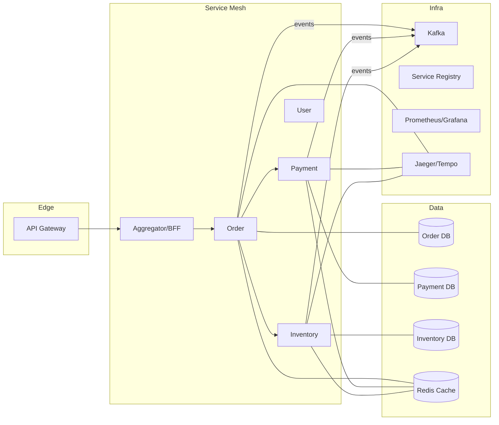
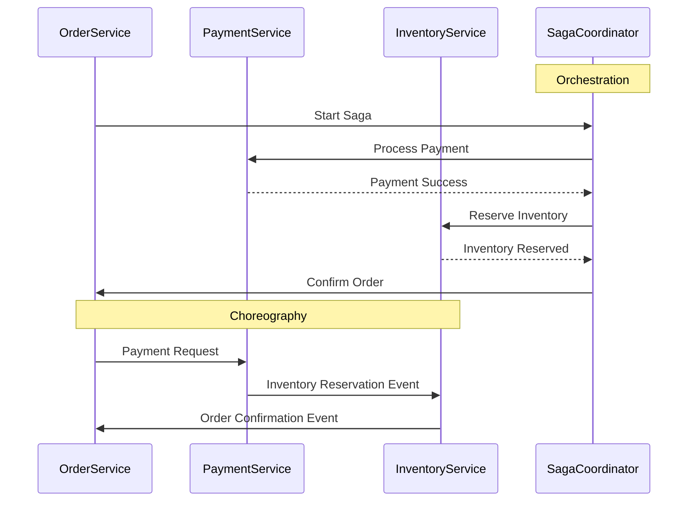

# 🏗 Microservices Architecture – Beginner to Advanced Guide

## 1. Introduction
Microservices architecture is an approach to building applications as a collection of small, independently deployable services that communicate over well-defined APIs. Each service focuses on a single business capability and can be developed, deployed, and scaled independently. This approach provides flexibility, scalability, and resilience compared to traditional monolithic architectures.

### 1.1 Topic Map (Key Topics → Subtopics)

| Key Topic | Subtopics |
|---|---|
| Service Boundaries & DDD | Bounded contexts, context mapping, anti-corruption layer, hexagonal/ports-and-adapters |
| Communication | REST, gRPC, GraphQL (BFF), Webhooks, Messaging (Kafka/RabbitMQ), WebSockets |
| Data | Database per service, schema evolution, CDC, transactional outbox, CQRS, event sourcing |
| Reliability | Timeouts, retries, circuit breakers, bulkheads, rate limiting, idempotency, DLQ |
| Security | OAuth2/OIDC, mTLS/Zero Trust, secrets management, JWT rotation, SPIFFE/SPIRE |
| Deployment | Containers, Kubernetes, autoscaling (HPA/KEDA), blue/green, canary, serverless |
| Observability | Logs, metrics, traces, SLO/SLI, OpenTelemetry, tracing context propagation |
| API Design & Governance | OpenAPI/Protobuf, versioning, schema registry, deprecation policy |
| Testing | Contract tests (Pact), Testcontainers, integration, E2E, chaos testing |
| Tooling & Platform | API gateway, service mesh, feature flags, infra-as-code, CI/CD |

### 1.2 Learning Path (Beginner → Advanced)

1. **Foundations:** Understand monolith vs microservices; basic REST; containerize a simple service.
2. **Service Design:** Define bounded contexts; design APIs; choose sync vs async.
3. **Data & Messaging:** Add a database per service; introduce Kafka/RabbitMQ; implement outbox + CDC.
4. **Reliability & Security:** Add retries/circuit breakers; implement OAuth2; enable mTLS; rate limiting.
5. **Platform & Delivery:** Deploy to Kubernetes; add autoscaling; progressive delivery (blue/green, canary).
6. **Observability & Ops:** Central logs, metrics, tracing; define SLOs and error budgets; dashboard + alerts.
7. **Governance & Testing:** Contract testing pipeline; API versioning; schema governance; chaos experiments.

### 1.3 Real-Life Scenario (Black Friday E‑commerce)

- **Context:** Traffic spikes 20× for 6 hours; order creation must stay < 300ms P95; inventory must be accurate.
- **Design moves:**
  - Orders → synchronous API, but inventory reservation via async event to reduce coupling.
  - Payment → synchronous with short timeouts + idempotency keys; use outbox so "ORDER_CREATED" always emits.
  - Scale consumers using **KEDA** on Kafka lag; enable canary for new order version at 5% traffic before 100%.
- **SLOs:** Availability 99.9%, P95 latency < 300ms, <0.1% payment retries, 0 lost orders.

---

## 2. Key Characteristics

| Characteristic       | Description                          |
|---------------------|------------------------------------|
| Single Responsibility | Each service owns one business capability |
| Decentralized Data   | Each service manages its own database |
| Independent Deployment | Services can be deployed without affecting others |
| Polyglot Programming | Services can use different tech stacks |
| API Communication   | Services interact through APIs      |

---

## 3. Monolith vs Microservices

| Aspect           | Monolith      | Microservices              |
|------------------|--------------|----------------------------|
| Codebase         | Single, large | Multiple small             |
| Deployment       | All-at-once   | Independent               |
| Scalability      | Whole app     | Per service               |
| Failure Impact   | App-wide      | Limited to service        |
| Technology       | Single stack  | Multiple possible         |

---

## 4. Core Components

| Component        | Role                          | Example                    |
|------------------|-------------------------------|----------------------------|
| API Gateway      | Routes client requests         | Kong, NGINX                |
| Service Registry | Tracks service instances       | Eureka, Consul             |
| Config Server    | Centralized configuration      | Spring Cloud Config        |
| Message Broker   | Async communication            | Kafka, RabbitMQ            |
| Monitoring       | Observability                  | Prometheus, Grafana        |

### 4.1 Additional Building Blocks

| Component | Role | Example |
|---|---|---|
| Identity Provider | OAuth2/OIDC, token issuance | Keycloak, Auth0, AWS Cognito |
| API Gateway (Edge) | External traffic, routing, rate limits, JWT validation | Kong, NGINX, APIM |
| Backend-for-Frontend (BFF) | UI-specific aggregation & schemas | GraphQL BFF, Express BFF |
| Schema Registry | Govern schemas & evolution | Confluent SR (Avro), Buf (Protobuf) |
| Distributed Cache | Reduce db load, cache aside | Redis, Memcached |
| Feature Flags | Safe rollout & experiments | Unleash, LaunchDarkly |
| CI/CD | Build, test, deploy pipelines | GitHub Actions, Argo CD |
| IaC | Reproducible infra | Terraform, Pulumi |

#### Reference Deployment Diagram (Mermaid)


---

## 5. Communication Patterns

| Pattern         | Use Case                           |
|-----------------|----------------------------------|
| Synchronous     | Request-response APIs             |
| Asynchronous    | Event-driven messaging            |
| CQRS            | Separate read/write models        |
| Saga            | Distributed transaction coordination |

### 5.1 Choosing the Right Protocol

| Scenario | Prefer | Why |
|---|---|---|
| User-facing request/response, web/mobile | REST/GraphQL | Ubiquitous, caching/CDN, dev tooling |
| High-throughput, low-latency internal calls | gRPC | HTTP/2, binary, strong contracts |
| Cross-service decoupling, spikes, workflows | Messaging (Kafka/RabbitMQ) | Buffering, resilience, async |
| UI-specific aggregation | BFF/GraphQL | Avoid chatty clients, schema for UI |

### 5.2 Reliability Building Blocks

- **Timeouts** (always set), **retries** with **exponential backoff + jitter**, **circuit breakers**, **bulkheads**, **idempotency**, **dead-letter queues**.

#### HTTP Idempotency (Example)

Client sends an `Idempotency-Key` header; server ensures same operation executes once.

```java
// Spring Boot filter (simplified)
@Component
public class IdempotencyFilter implements Filter {
  private final RedisTemplate<String, String> redis;
  public void doFilter(ServletRequest req, ServletResponse res, FilterChain chain) throws IOException, ServletException {
    HttpServletRequest r = (HttpServletRequest) req;
    String key = r.getHeader("Idempotency-Key");
    if (key != null && Boolean.TRUE.equals(redis.hasKey(key))) {
      ((HttpServletResponse) res).setStatus(409); // or return cached response
      return;
    }
    if (key != null) redis.opsForValue().set(key, "used", Duration.ofHours(24));
    chain.doFilter(req, res);
  }
}
```

---

## 6. Real-World Implementation Examples

### 6.1 E-commerce Microservices Architecture
```java
// Order Service
@Service
public class OrderService {
    private final RestTemplate restTemplate;
    private final KafkaTemplate<String, OrderEvent> kafkaTemplate;

    @Transactional
    public Order createOrder(OrderRequest request) {
        // Check inventory
        InventoryResponse inventory = restTemplate.getForObject(
            "http://inventory-service/check/" + request.getProductId(),
            InventoryResponse.class
        );
        
        if (!inventory.isAvailable()) {
            throw new OutOfStockException();
        }

        // Create order
        Order order = orderRepository.save(new Order(request));

        // Publish event
        kafkaTemplate.send("order-events", 
            new OrderEvent("ORDER_CREATED", order));

        return order;
    }
}

// Inventory Service
@RestController
@RequestMapping("/inventory")
public class InventoryController {
    @GetMapping("/check/{productId}")
    public ResponseEntity<InventoryResponse> checkStock(
            @PathVariable String productId) {
        // Check inventory logic
        return ResponseEntity.ok(new InventoryResponse(true));
    }
}
```

### 6.2 Service Discovery Pattern (Netflix Eureka)
```yaml
# application.yml
spring:
  application:
    name: order-service
eureka:
  client:
    serviceUrl:
      defaultZone: http://eureka-server:8761/eureka/
    fetch-registry: true
    register-with-eureka: true
```

### 6.3 Payment Processing Workflow Example
```java
// Payment Service
@Service
public class PaymentService {
    public PaymentResponse processPayment(PaymentRequest request) {
        // Validate payment details
        // Process payment via gateway
        // Return payment confirmation
        return new PaymentResponse("SUCCESS", UUID.randomUUID().toString());
    }
}
```

### 6.4 IoT Microservices Architecture Overview
- Device Management Service: Manages device registration and metadata.
- Telemetry Service: Collects and processes real-time sensor data.
- Command Service: Sends commands to IoT devices.
- Analytics Service: Performs data analysis and anomaly detection.

### 6.5 Minimal Node.js Service (REST)
```javascript
// product-service/index.js
const express = require('express');
const app = express();
app.get('/products/:id', async (req, res) => {
  // fetch from DB/cache, omitted for brevity
  res.json({ id: req.params.id, name: 'Widget', price: 1999 });
});
app.listen(3000, () => console.log('product-service on :3000'));
```

### 6.6 Go gRPC Service
```proto
// inventory.proto
syntax = "proto3";
service Inventory { rpc Reserve (ReserveRequest) returns (ReserveResponse); }
message ReserveRequest { string productId = 1; int32 quantity = 2; }
message ReserveResponse { bool ok = 1; string reason = 2; }
```
```go
// server.go (using google.golang.org/grpc)
func (s *Server) Reserve(ctx context.Context, in *pb.ReserveRequest) (*pb.ReserveResponse, error) {
  // reserve stock here
  return &pb.ReserveResponse{Ok: true}, nil
}
```

### 6.7 Python FastAPI BFF (Aggregator)
```python
# bff/main.py
from fastapi import FastAPI
import httpx
app = FastAPI()
@app.get('/orders/{id}')
async def get_order(id: str):
    async with httpx.AsyncClient() as client:
        order = (await client.get(f'http://order-service/orders/{id}')).json()
        payment = (await client.get(f'http://payment-service/payments/{id}')).json()
    return {"order": order, "payment": payment}
```

### 6.8 API Gateway (Kong) – Declarative Config
```yaml
_format_version: "3.0"
services:
- name: order
  url: http://order-service:8081
  routes:
  - name: order-route
    paths: ["/orders"]
plugins:
- name: rate-limiting
  config:
    minute: 60
```

---

## 7. Service Communication

Microservices communicate primarily in two ways: synchronous and asynchronous.

### Synchronous Communication
- Commonly uses RESTful HTTP APIs or gRPC.
- Client waits for response, leading to tight coupling.
- Easier to implement and debug.

### Asynchronous Communication
- Uses message brokers like Kafka or RabbitMQ.
- Services communicate via events/messages.
- Enables loose coupling, better scalability, and resilience.

| Communication Type | Protocols/Tools       | Pros                                         | Cons                                  |
|--------------------|----------------------|----------------------------------------------|--------------------------------------|
| Synchronous        | REST, gRPC           | Simplicity, immediate response, debugging ease | Tight coupling, blocking calls       |
| Asynchronous       | Kafka, RabbitMQ      | Loose coupling, scalability, resilience      | Complexity, eventual consistency     |

### gRPC Example (Java)
```java
// Proto file: order.proto
syntax = "proto3";

service OrderService {
  rpc CreateOrder (OrderRequest) returns (OrderResponse);
}

message OrderRequest {
  string productId = 1;
  int32 quantity = 2;
}

message OrderResponse {
  string orderId = 1;
  string status = 2;
}
```

```java
// Server-side implementation
public class OrderServiceImpl extends OrderServiceGrpc.OrderServiceImplBase {
    @Override
    public void createOrder(OrderRequest request, StreamObserver<OrderResponse> responseObserver) {
        // Business logic here
        OrderResponse response = OrderResponse.newBuilder()
            .setOrderId(UUID.randomUUID().toString())
            .setStatus("CREATED")
            .build();
        responseObserver.onNext(response);
        responseObserver.onCompleted();
    }
}
```

---

## 8. Advanced Patterns & Implementation

### 8.1 Circuit Breaker Pattern
```java
@Service
public class ResilientOrderService {
    private final CircuitBreaker circuitBreaker;

    @CircuitBreaker(name = "inventoryService", fallbackMethod = "fallbackCheck")
    public InventoryResponse checkInventory(String productId) {
        return restTemplate.getForObject(
            "http://inventory-service/check/" + productId,
            InventoryResponse.class
        );
    }

    public InventoryResponse fallbackCheck(String productId, Exception e) {
        return new InventoryResponse(false, "Service unavailable");
    }
}
```

### 8.2 Saga Pattern

The Saga pattern manages distributed transactions by breaking them into a series of local transactions coordinated either by orchestration or choreography.

- **Orchestration:** A central coordinator manages the transaction steps.
- **Choreography:** Each service emits events and reacts to others' events without a central coordinator.

#### Orchestration vs Choreography Diagram (Mermaid)


#### Saga Orchestration Example (Spring Boot)
```java
@Service
public class SagaCoordinator {
    public void processOrder(OrderRequest orderRequest) {
        try {
            paymentService.processPayment(orderRequest);
            inventoryService.reserveInventory(orderRequest);
            orderService.confirmOrder(orderRequest);
        } catch (Exception e) {
            // Handle compensating transactions
            paymentService.cancelPayment(orderRequest);
            inventoryService.releaseInventory(orderRequest);
        }
    }
}
```

### 8.3 API Composition

An API Composition pattern aggregates data from multiple microservices to provide a unified response.

#### Spring Boot Aggregator Service Example
```java
@RestController
@RequestMapping("/api/aggregated-orders")
public class OrderAggregatorController {

    private final RestTemplate restTemplate;

    public OrderAggregatorController(RestTemplate restTemplate) {
        this.restTemplate = restTemplate;
    }

    @GetMapping("/{orderId}")
    public ResponseEntity<AggregatedOrder> getAggregatedOrder(@PathVariable String orderId) {
        Order order = restTemplate.getForObject("http://order-service/orders/" + orderId, Order.class);
        Payment payment = restTemplate.getForObject("http://payment-service/payments/" + orderId, Payment.class);
        Inventory inventory = restTemplate.getForObject("http://inventory-service/inventory/" + order.getProductId(), Inventory.class);

        AggregatedOrder aggregatedOrder = new AggregatedOrder(order, payment, inventory);
        return ResponseEntity.ok(aggregatedOrder);
    }
}
```

### 8.4 Event Sourcing Pattern
```java
@Service
public class OrderEventSourcedService {
    private final EventStore eventStore;
    
    public Order processOrder(OrderCommand command) {
        // Create order event
        OrderEvent event = new OrderEvent(
            command.getOrderId(),
            "ORDER_CREATED",
            command.getDetails()
        );
        
        // Store event
        eventStore.append(command.getOrderId(), event);
        
        // Rebuild order state from events
        return rebuildOrderState(command.getOrderId());
    }
    
    private Order rebuildOrderState(String orderId) {
        List<OrderEvent> events = eventStore.getEvents(orderId);
        Order order = new Order();
        events.forEach(order::apply);
        return order;
    }
}
```

### 8.5 Bulkhead Pattern Implementation
```java
@Configuration
public class BulkheadConfig {
    @Bean
    public Bulkhead orderServiceBulkhead() {
        BulkheadConfig config = BulkheadConfig.custom()
            .maxConcurrentCalls(20)
            .maxWaitDuration(Duration.ofSeconds(1))
            .build();
        return Bulkhead.of("orderService", config);
    }
}
```

### 8.6 Transactional Outbox + Change Data Capture (CDC)

**Goal:** publish events reliably when writing to your DB.

- Write domain change and an **outbox event** in the same DB transaction.
- A CDC tool (e.g., Debezium) streams the outbox table to Kafka.

```sql
CREATE TABLE outbox_events (
  id UUID PRIMARY KEY,
  aggregate_id VARCHAR(64),
  type VARCHAR(64),
  payload JSONB,
  created_at TIMESTAMPTZ DEFAULT now(),
  processed BOOLEAN DEFAULT false
);
```
```java
@Transactional
public Order create(OrderRequest req) {
  Order order = repo.save(new Order(req));
  OutboxEvent evt = OutboxEvent.of("ORDER_CREATED", order.getId(), toJson(order));
  outboxRepo.save(evt); // same tx → atomic
  return order;
}
```

### 8.7 Idempotent Consumers & Exactly-Once Effects

- Store a `eventId`/`operationId` in a **dedup** table/cache.
- If seen → skip (or reconcile); if new → process then mark.

```java
@KafkaListener(topics = "order-events", groupId = "inventory")
public void handle(ConsumerRecord<String, String> r) {
  String id = r.headers().lastHeader("eventId").value().toString();
  if (dedupRepo.exists(id)) return;
  reserveInventory(parse(r.value()));
  dedupRepo.save(id);
}
```

### 8.8 Retries, Backoff & Dead Letter Queues (DLQ)

- **Producer retries** with exponential backoff + jitter.
- **Consumer retries** → on failure, requeue with delay; after N attempts, send to **DLQ** and alert.

### 8.9 Rate Limiting

Apply at gateway or service level (token bucket/leaky bucket). Example (Redis + token bucket) or gateway plugin (see 6.8).

---

## 9. Challenges

- **Complex Communication:** Managing inter-service communication and ensuring message delivery.
- **Data Consistency:** Ensuring eventual consistency across distributed databases.
- **Distributed Debugging:** Tracing issues across multiple services.
- **DevOps Maturity:** Requires automated deployment, monitoring, and scaling.
- **Testing Complexity:** Integration and contract testing become critical and complex to ensure service compatibility.
- **Network Reliability and Latency:** Network failures and latency can impact service availability and performance.
- **Security Between Services:** Implementing mutual TLS (mTLS), OAuth2, and other security protocols to protect inter-service communication.

---

## 10. Data Management in Microservices

- **Database per Service:** Each microservice owns its database to ensure loose coupling.
- **Eventual Consistency:** Changes propagate asynchronously to maintain data consistency.
- **CQRS (Command Query Responsibility Segregation):** Separates read and write models for optimization.
- **Data Replication:** Data is replicated asynchronously using event sourcing or change data capture to synchronize services.

---

## 11. Security Best Practices

- **Authentication & Authorization:** Use OAuth2, OpenID Connect for secure access control.
- **Secret Management:** Store sensitive data securely using vaults or secret management tools.
- **Input Validation:** Validate all inputs to prevent injection attacks.
- **Service-to-Service Encryption:** Use mTLS to encrypt communication between services.
- **Audit Logging:** Maintain logs of security-related events for compliance and monitoring.

### 11.1 OAuth2/OIDC Flows (Quick Map)

| Flow | Use |
|---|---|
| Authorization Code + PKCE | Web/mobile user login |
| Client Credentials | Service-to-service machine auth |
| Device Code | TV/IoT devices |

### 11.2 mTLS in the Mesh (Istio example)
```yaml
# Enforce STRICT mTLS mesh-wide
apiVersion: security.istio.io/v1beta1
kind: PeerAuthentication
metadata: { name: default, namespace: istio-system }
spec: { mtls: { mode: STRICT } }
```

### 11.3 Secrets Management

- Use a vault (e.g., HashiCorp Vault/AWS KMS) + short‑lived credentials; never bake secrets in images.

---

## 12. Deployment & Scaling

### 12.1 Docker Compose Setup
```yaml
version: '3'
services:
  order-service:
    build: ./order-service
    ports:
      - "8081:8081"
    environment:
      - SPRING_PROFILES_ACTIVE=docker
    depends_on:
      - kafka
      - eureka-server

  inventory-service:
    build: ./inventory-service
    ports:
      - "8082:8082"
    environment:
      - SPRING_PROFILES_ACTIVE=docker
    depends_on:
      - eureka-server
```

### 12.2 Kubernetes Deployment
```yaml
apiVersion: apps/v1
kind: Deployment
metadata:
  name: order-service
spec:
  replicas: 3
  selector:
    matchLabels:
      app: order-service
  template:
    metadata:
      labels:
        app: order-service
    spec:
      containers:
        - name: order-service
          image: order-service:1.0
          ports:
            - containerPort: 8081
          livenessProbe:
            httpGet:
              path: /actuator/health
              port: 8081
```

### 12.3 Deployment Models Comparison

| Feature           | Docker Compose               | Kubernetes                    | Serverless                  |
|-------------------|-----------------------------|------------------------------|-----------------------------|
| Complexity        | Low                         | High                         | Medium                      |
| Scalability       | Limited                     | High                         | Automatic                   |
| Service Discovery | Basic                       | Advanced                     | Managed                     |
| Resilience        | Basic                       | High                         | High                        |
| Monitoring        | Manual                      | Integrated                   | Provider Managed            |
| Use Case          | Local dev, small apps       | Production-grade, large apps | Event-driven, burst workloads|

### 12.4 Service Mesh

Service meshes like **Istio** and **Linkerd** provide advanced networking features such as:

- Traffic management (routing, retries, failovers)
- Secure service-to-service communication (mTLS)
- Observability (metrics, tracing, logging)
- Policy enforcement and access control

They enable microservices to communicate securely and reliably without changing application code.

### 12.5 Progressive Delivery (Blue/Green & Canary)

**Istio Canary (traffic split)**
```yaml
apiVersion: networking.istio.io/v1beta1
kind: DestinationRule
metadata: { name: order }
spec:
  host: order
  subsets:
  - name: v1
    labels: { version: v1 }
  - name: v2
    labels: { version: v2 }
---
apiVersion: networking.istio.io/v1beta1
kind: VirtualService
metadata: { name: order }
spec:
  hosts: ["order"]
  http:
  - route:
    - destination: { host: order, subset: v1, weight: 95 }
    - destination: { host: order, subset: v2, weight: 5 }
```

### 12.6 Autoscaling

- **HPA:** scale on CPU/memory/custom metrics.
- **KEDA:** scale event-driven workloads on queue lag, Kafka offset, etc.

```yaml
apiVersion: keda.sh/v1alpha1
kind: ScaledObject
metadata: { name: order-consumer }
spec:
  scaleTargetRef: { name: order-consumer }
  pollingInterval: 30
  triggers:
  - type: kafka
    metadata:
      bootstrapServers: kafka:9092
      consumerGroup: inventory
      topic: order-events
```

### 12.7 CI/CD (GitHub Actions – example)
```yaml
name: ci-cd
on: [push]
jobs:
  build:
    runs-on: ubuntu-latest
    steps:
    - uses: actions/checkout@v4
    - uses: actions/setup-java@v4
      with: { distribution: 'temurin', java-version: '21' }
    - run: ./gradlew test
    - run: docker build -t ghcr.io/acme/order:${{ github.sha }} .
    - run: echo $CR_PAT | docker login ghcr.io -u $GITHUB_ACTOR --password-stdin
    - run: docker push ghcr.io/acme/order:${{ github.sha }}
  deploy:
    needs: build
    runs-on: ubuntu-latest
    steps:
    - uses: azure/k8s-set-context@v4
      with: { method: kubeconfig, kubeconfig: ${{ secrets.KUBECONFIG }} }
    - uses: azure/k8s-deploy@v5
      with:
        manifests: |
          k8s/order-deploy.yaml
        images: |
          ghcr.io/acme/order:${{ github.sha }}
```

### 12.8 Infra as Code (Terraform – skeleton)
```hcl
provider "kubernetes" {
  config_path = var.kubeconfig
}
resource "kubernetes_namespace" "apps" { metadata { name = "apps" } }
```

---

## 13. Monitoring & Observability for Microservices

Effective monitoring and observability are critical for managing microservices.

- **Distributed Tracing:** Tools like Jaeger or Zipkin trace requests across service boundaries.
- **Metrics:** Collect service-level metrics using Prometheus for performance insights.
- **Logs:** Centralized logging (ELK stack) aggregates logs from all services for analysis.
- **Alerting:** Configure alerts based on metrics and logs to detect anomalies proactively.

### 13.1 SLIs/SLOs & Error Budgets

- **SLIs:** request latency, error rate, availability, saturation (CPU/mem), Kafka consumer lag.
- **SLOs:** e.g., 99.9% availability/month; track **error budget** burn rate to gate releases.

### 13.2 OpenTelemetry Quick Start (Java)
```java
// build.gradle (snippet)
dependencies { implementation("io.opentelemetry:opentelemetry-sdk-extension-autoconfigure:1.41.0") }
// Run with:
// OTEL_EXPORTER_OTLP_ENDPOINT=http://otel-collector:4318 java -javaagent:opentelemetry-javaagent.jar -jar app.jar
```

### 13.3 Correlation IDs

- Generate a `traceId`/`correlationId` at the edge; propagate via `traceparent` (W3C) or custom header; log it everywhere.

---

## 14. Thought Process for Microservices Design

1. Identify business domains (Domain-Driven Design).
2. Define bounded contexts for each service.
3. Choose communication style.
4. Plan deployment & orchestration.
5. Implement observability & security.

---

## 15. References

- [Microservices.io Patterns](https://microservices.io/)
- [Spring Cloud](https://spring.io/projects/spring-cloud)
- [Kubernetes Docs](https://kubernetes.io/docs/home/)
- [Istio Service Mesh](https://istio.io/)
- [Linkerd Service Mesh](https://linkerd.io/)
- [OAuth2](https://oauth.net/2/)
- [gRPC](https://grpc.io/)

---

## 16. API Design & Governance

### 16.1 REST Guidelines & Versioning
- Use nouns (`/orders/{id}`), plural resources, proper HTTP codes, ETags.
- Version in the path (`/v1/`) or via header; deprecate with headers and sunset dates.

### 16.2 OpenAPI Example (Order API)
```yaml
openapi: 3.0.3
info: { title: Order API, version: 1.0.0 }
paths:
  /orders/{id}:
    get:
      parameters:
        - in: path
          name: id
          required: true
          schema: { type: string }
      responses:
        '200':
          description: OK
          content: { application/json: { schema: { $ref: '#/components/schemas/Order' } } }
components:
  schemas:
    Order:
      type: object
      properties: { id: { type: string }, status: { type: string } }
```

### 16.3 Schema Governance
- Adopt Avro/Protobuf with a **schema registry**; use backward/forward compatibility rules; CI checks for breaking changes.

### 16.4 GraphQL as BFF
- Keep GraphQL at the edge/BFF; backend services remain REST/gRPC.

## 17. Testing Strategies

- **Unit** → fast, pure functions.
- **Contract (Consumer‑Driven, Pact)** → breakage caught before integration.
- **Integration** → Testcontainers to spin up DB/Kafka.
- **E2E** → happy path in staging with synthetic data.

```java
// Testcontainers example (JUnit)
@Container static KafkaContainer kafka = new KafkaContainer(DockerImageName.parse("confluentinc/cp-kafka:7.6.0"));
```

## 18. Reliability & Chaos Engineering

- Define failure modes; inject faults (latency, aborts, pod kill) with Chaos Mesh/Litmus.
- Alert on SLO burn; auto‑rollback on canary failure.

## 19. Performance & Capacity

- **Load testing** with k6; watch P95/P99 and error rates.
```javascript
import http from 'k6/http';
export default function () { http.get('http://gateway/orders/123'); }
```
- **Caching**: cache-aside with Redis; set TTLs; invalidate on events.

## 20. Local Development & Tooling

- **Dev containers** (VS Code), Tilt/Skaffold for live‑reload to K8s.
- **Makefile** scripts; Docker Compose for local stack; use **WireMock** for stubs.

## 21. Migration Checklist (Strangler Fig)

1. Map bounded contexts and seams of the monolith.
2. Extract read endpoints first; write paths later with outbox/CDC.
3. Introduce gateway routing; gradually shift traffic.

**Nginx Strangler Routing**
```nginx
location /api/v1/orders/ { proxy_pass http://order-service; }
location /api/v1/legacy/ { proxy_pass http://monolith; }
```

## 22. Common Pitfalls & Anti‑Patterns

- Distributed monolith (tight coupling via sync calls everywhere).
- Shared database across services.
- No idempotency → duplicate charges/orders.
- Unbounded retries without jitter → thundering herd.
- Ignoring schema evolution → consumer breakages.

## 23. Interview Questions (Quick Drill)

- When to choose gRPC over REST?
- Explain the Saga pattern (orchestration vs choreography) and give a trade‑off.
- How do you make message consumption idempotent?
- How do you implement canary rollouts in Kubernetes?
- What is the outbox pattern and why use it?

## 24. Real-World Case Studies

### 12.1 E-commerce Platform Migration
```plaintext
Challenge: Monolith to Microservices Migration

Step 1: Domain Analysis
- Identified bounded contexts: Orders, Inventory, Payments, Users
- Mapped data dependencies
- Identified integration points

Step 2: Implementation Strategy
- Started with strangler fig pattern
- Gradually moved functionality to microservices
- Used event sourcing for data migration

Results:
- 30% improvement in deployment frequency
- 50% reduction in mean time to recovery
- Improved team autonomy
```

### 12.2 Banking System Architecture
```java
// Transaction Service with Saga Pattern
@Service
public class TransactionOrchestrator {
    @Transactional
    public TransferResult processTransfer(TransferRequest request) {
        try {
            // Step 1: Reserve amount
            accountService.reserve(request.getFromAccount(), request.getAmount());
            
            // Step 2: Transfer
            paymentService.transfer(request);
            
            // Step 3: Confirm
            accountService.confirm(request.getFromAccount());
            
            return TransferResult.success();
        } catch (Exception e) {
            // Compensating transactions
            accountService.releaseReservation(request.getFromAccount());
            return TransferResult.failure(e.getMessage());
        }
    }
}
```

## 25. Glossary & Acronyms

- **DDD** – Domain‑Driven Design
- **BFF** – Backend for Frontend
- **CDC** – Change Data Capture
- **DLQ** – Dead Letter Queue
- **HPA** – Horizontal Pod Autoscaler
- **KEDA** – Kubernetes Event‑Driven Autoscaling
- **mTLS** – Mutual TLS
- **OTEL** – OpenTelemetry
- **SLA/SLO/SLI** – Agreement, Objective, Indicator