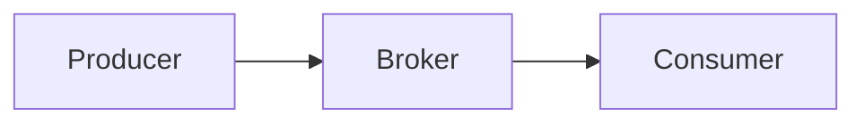
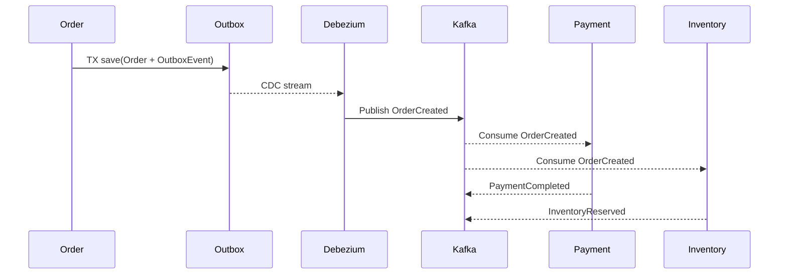
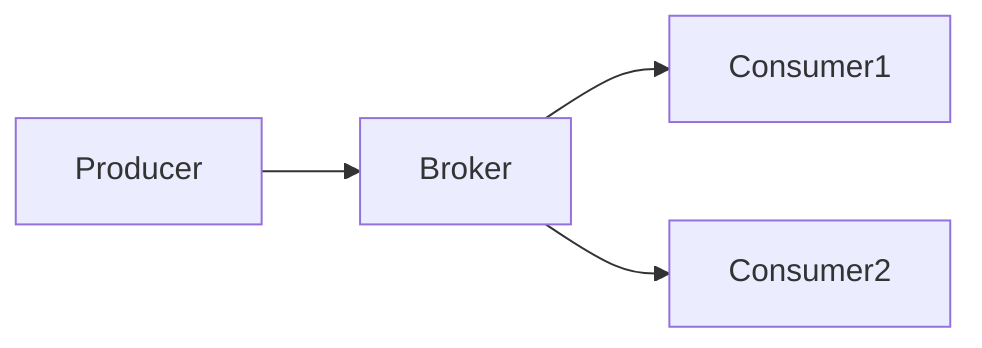
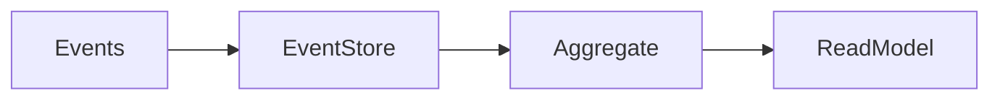
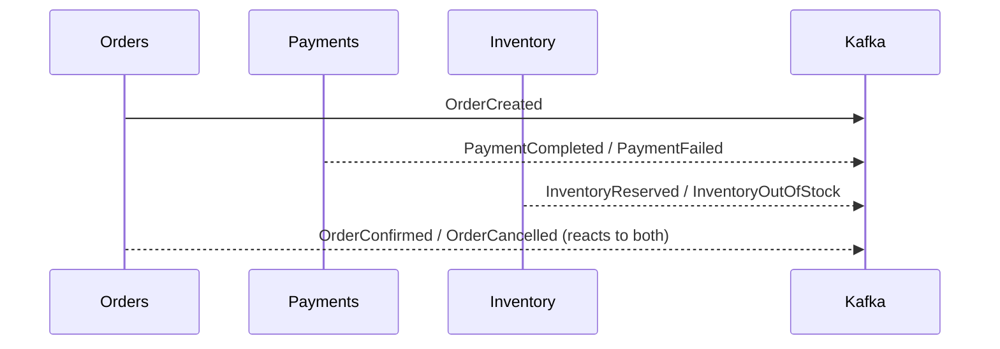

# ⚡ Event-Driven Architecture – Beginner to Advanced Guide

## 1. Introduction
Event-Driven Architecture (EDA) is a design paradigm where services communicate through events, enabling decoupled, asynchronous, and scalable systems. Instead of services calling each other directly, they publish events to a broker, which other services can subscribe to.

EDA is widely adopted across various industries:

- **Financial Trading**: Real-time processing of stock trades and market data.
- **Internet of Things (IoT)**: Devices publishing sensor data to centralized systems.
- **E-commerce**: Order processing, inventory updates, and notifications.
- **Streaming Platforms**: User activity tracking, recommendations, and analytics.

These use cases benefit from EDA’s ability to handle high throughput and support loosely coupled components.

### Simple EDA Flow Diagram



### 1.1 Topic Map (Key Topics → Subtopics)

| Key Topic | Subtopics |
|---|---|
| Brokers & Messaging | Kafka, RabbitMQ, NATS, MQTT, partitions, consumer groups, acks |
| Event Design & Schemas | Event naming, contracts, Avro/Protobuf/JSON, CloudEvents, schema registry |
| Delivery & Ordering | At-least/at-most/exactly-once, idempotency, keys, ordering constraints |
| Stream Processing | Kafka Streams, Flink, ksqlDB, windowing, watermarks, joins |
| Reliability Patterns | Retries, backoff + jitter, DLQ, outbox, CDC, replay strategies |
| Security | TLS/mTLS, SASL/SCRAM, ACLs, network policies, PII handling |
| Observability | Metrics (lag/throughput/errors), logs, traces, correlation IDs |
| Performance & Scaling | Batching, compression, partitions, autoscaling (KEDA) |
| Governance & Testing | Schema compatibility rules, consumer-driven contracts, Testcontainers |
| Multi-Region & DR | MirrorMaker 2, geo-replication, failover, idempotent processing |

### 1.2 Learning Path (Beginner → Advanced)
1. **Foundations:** Topics, partitions, producers/consumers; spin up a local broker.
2. **Produce/Consume:** Build a basic producer & consumer; add keys and headers.
3. **Schemas:** Add Avro + schema registry; enforce compatibility in CI.
4. **Reliability:** Add retries, backoff, idempotency; introduce DLQ and reprocessing.
5. **Processing:** Implement a Kafka Streams/Flink job with windowing and joins.
6. **Security & Ops:** Enable TLS/SASL; set ACLs; add dashboards & alerts.
7. **Scale & DR:** Autoscale consumers (KEDA); simulate replay; add geo-replication.

### 1.3 Real-Life Scenario (Payments & Orders)
- **Goal:** Ensure no double‑charge and no lost order during spikes.
- **Design:** Order service writes order + **outbox** in a single DB tx → Debezium (CDC) publishes `OrderCreated` → Inventory & Payment consume; Payment is **idempotent** via `Idempotency-Key` + dedup table.
- **SLOs:** P95 end‑to‑end event latency < 1s; <0.05% DLQ rate; 0 duplicate charges.



---

## 2. Key Concepts

| Term                     | Description                                                | Common Broker Implementation      |
|--------------------------|------------------------------------------------------------|----------------------------------|
| Event                    | A significant change in system state                        | Kafka, RabbitMQ, MQTT             |
| Producer                 | Service that publishes an event                             | Kafka Producer, RabbitMQ Publisher|
| Consumer                 | Service that processes an event                             | Kafka Consumer, RabbitMQ Consumer |
| Event Broker             | Middleware that routes events                               | Kafka, RabbitMQ, MQTT             |
| Topic                    | Logical channel for related events                          | Kafka Topic, RabbitMQ Exchange    |
| Event Stream             | Continuous flow of events over time                         | Kafka Topic Partition             |
| Event Envelope           | Metadata wrapper around event payload (e.g., headers, timestamps) | Kafka Headers, AMQP Properties    |
| Event Payload            | The actual data or content of the event                     | JSON, Avro, Protobuf              |
| Partition                | Subdivision of a topic for parallelism and scalability     | Kafka Partition                  |
| Offset                   | Position identifier of an event within a partition          | Kafka Offset                     |
| Retention Policy         | How long events are stored before deletion                  | Kafka Retention Time/Size        |

### 2.1 Deep Dive: Broker Mechanics

| Concept | What it means | Why it matters |
|---|---|---|
| Consumer Group | Consumers sharing a groupId split partitions | Horizontal scaling and failover |
| Acknowledgements | `acks=0/1/all` on producers; consumer commit sync/async | Controls durability & throughput |
| Delivery Semantics | At‑least‑once, at‑most‑once, exactly‑once (effectively‑once) | Choose trade‑offs consciously |
| Log Compaction | Keep latest record per key; tombstones delete | Perfect for reference data & upserts |
| Headers & Tracing | W3C `traceparent`, `correlationId` in headers | Enables cross‑service tracing |

**Producer with tracing header (Java):**
```java
ProducerRecord<String, byte[]> rec = new ProducerRecord<>("order-events", key, payload);
rec.headers().add("traceparent", currentTraceParent().getBytes(StandardCharsets.UTF_8));
producer.send(rec);
```

---

## 3. Advantages of EDA

- **Loose Coupling**: Producers and consumers are independent.
- **Scalability**: Consumers can be scaled independently.
- **Resilience**: Failure in one consumer doesn't impact others.
- **Flexibility**: New consumers can be added without changing producers.
- **Real-time Processing**: Enables near real-time system responsiveness.

---

## 4. Challenges

- **Eventual Consistency**: Systems may reflect changes at different times.
- **Complex Debugging and Tracing**: Asynchronous flows complicate root cause analysis.
- **Potential for Message Loss or Duplication**: Requires idempotent consumers and reliable delivery.
- **Requires Robust Monitoring and Error Handling**: To detect and recover from failures.
- **Handling Out-of-Order Events**: Events may arrive out of sequence, requiring ordering logic or buffering.
- **Schema Evolution and Backward Compatibility Testing**: Ensuring new event versions do not break consumers.
- **Ensuring Transactional Guarantees (Exactly-Once Delivery)**: Using idempotent producers and transactional messaging to prevent duplicates.
- **Dealing with Replay Storms**: Replaying large volumes of events can overwhelm consumers; requires rate limiting and throttling.

---

## 5. EDA vs Request-Response

| Aspect           | Event-Driven                        | Request-Response                   |
|------------------|-----------------------------------|----------------------------------|
| Coupling         | Loose                             | Tight                            |
| Communication    | Asynchronous                      | Synchronous                     |
| Scalability      | High                             | Limited                         |
| Reliability      | Depends on broker                 | Depends on service availability |
| Latency          | Typically higher due to async     | Lower due to direct calls        |
| Fault Tolerance  | Broker can buffer and retry       | Immediate failure if service down|

**Real-life Analogy:**  
EDA is like sending a letter to a mailbox (broker), where the recipient can read it anytime, while Request-Response is like a phone call requiring immediate answer.

---

## 6. Common Patterns

| Pattern                     | Description                                  | Example             |
|-----------------------------|----------------------------------------------|---------------------|
| Publish-Subscribe            | Multiple consumers receive event copies      | Notifications       |
| Event Sourcing              | Persist events as source of truth             | Financial ledger    |
| CQRS                       | Separate read/write models                     | Reporting systems   |
| Event-Carried State Transfer | Event contains all necessary state            | Cache updates       |
| Choreography vs Orchestration| Distributed event workflows vs centralized control | Microservices coordination |
| Event Replay               | Replaying stored events to rebuild state      | System recovery     |

### Choreography vs Orchestration

| Aspect        | Choreography                                | Orchestration                              |
|---------------|--------------------------------------------|-------------------------------------------|
| Control       | Decentralized, services react to events   | Central orchestrator coordinates workflow |
| Complexity    | Lower coupling, but harder to track        | Easier to manage workflow, but tighter coupling |
| Scalability   | High                                       | Can become bottleneck                      |

### Diagrams

**Publish-Subscribe**



**Event Sourcing**



### 6.1 Enterprise Integration Patterns (EIP) Quick Map

| Pattern | What it does | Example |
|---|---|---|
| Router | Directs events to destinations based on rules | Route high‑value orders to fraud topic |
| Filter | Drops irrelevant messages | Ignore heartbeat events |
| Enricher | Adds data from another source | Add user tier to OrderCreated |
| Splitter | Breaks a composite message into parts | Split bulk import into per‑item events |
| Aggregator | Combines related messages | Build shipment from multiple item events |

---

## 7. Real-World Implementation Examples

### 7.1 E-commerce Event Flow
```java
// Order Event Publisher
@Service
public class OrderEventPublisher {
    private final KafkaTemplate<String, OrderEvent> kafkaTemplate;

    public void publishOrderCreated(Order order) {
        OrderEvent event = OrderEvent.builder()
            .eventType("ORDER_CREATED")
            .orderId(order.getId())
            .timestamp(Instant.now())
            .data(order)
            .version("1.0")
            .build();
            
        kafkaTemplate.send("order-events", event);
    }
}

// Inventory Consumer with Retry and DLQ
@Service
public class InventoryEventHandler {
    private final InventoryService inventoryService;
    private final KafkaTemplate<String, OrderEvent> kafkaTemplate;

    @KafkaListener(topics = "order-events")
    public void handleOrderCreated(OrderEvent event) {
        if (event.getEventType().equals("ORDER_CREATED")) {
            try {
                inventoryService.reserveStock(
                    event.getData().getProductId(), 
                    event.getData().getQuantity()
                );
            } catch (Exception e) {
                // Retry logic or send to DLQ
                kafkaTemplate.send("order-events-dlq", event);
            }
        }
    }
}
```

### 7.2 IoT Sensor Data Flow
```java
// MQTT Sensor Publisher (pseudo-code)
mqttClient.publish("sensors/temperature", sensorData);

// Processing Service
@Service
public class SensorDataHandler {
    @MQTTListener(topic = "sensors/temperature")
    public void handleSensorData(SensorData data) {
        // Process sensor readings
    }
}
```

### 7.3 Choreographed Payment Saga (Diagram)


### 7.4 Kafka Streams – Rolling Order Totals
```java
var builder = new StreamsBuilder();
KStream<String, Order> orders = builder.stream("orders", Consumed.with(Serdes.String(), orderSerde));
orders
  .groupByKey()
  .windowedBy(TimeWindows.ofSizeWithNoGrace(Duration.ofMinutes(1)))
  .aggregate(() -> 0L, (key, order, total) -> total + order.amount())
  .toStream()
  .to("order-totals-per-minute", Produced.with(WindowedSerdes.sessionWindowedSerdeFrom(String.class), Serdes.Long()));
```

### 7.5 Apache Flink – Event Time & Watermarks
```java
DataStream<Order> stream = env
  .fromSource(kafkaSource, WatermarkStrategy
      .<Order>forBoundedOutOfOrderness(Duration.ofSeconds(10))
      .withTimestampAssigner((e, ts) -> e.eventTime()), "orders");
```

### 7.6 ksqlDB – Top Products (5‑minute tumbling window)
```sql
CREATE STREAM orders (productId STRING, amount DOUBLE) WITH (kafka_topic='orders', value_format='JSON');
CREATE TABLE top_products AS
  SELECT productId, COUNT(*) AS c
  FROM orders
  WINDOW TUMBLING (SIZE 5 MINUTES)
  GROUP BY productId
  EMIT CHANGES;
```

### 7.7 Node.js Producer (kafkajs)
```javascript
const { Kafka } = require('kafkajs');
const kafka = new Kafka({ clientId: 'orders', brokers: ['localhost:9092'] });
const p = kafka.producer();
await p.connect();
await p.send({ topic: 'orders', messages: [{ key: 'o-123', value: JSON.stringify({ id: 'o-123' }) }] });
await p.disconnect();
```

### 7.8 Python Consumer with Backoff (confluent-kafka)
```python
from confluent_kafka import Consumer
import time
c = Consumer({'bootstrap.servers':'localhost:9092','group.id':'inventory','auto.offset.reset':'earliest'})
c.subscribe(['orders'])
while True:
    msg = c.poll(1.0)
    if msg is None: continue
    try:
        process(msg.value())
        c.commit(msg)
    except Exception:
        time.sleep(min(backoff()*1.5, 30))  # simple backoff
```

---

## 8. Advanced Patterns

### 8.1 Dead Letter Queue Implementation
```java
@Configuration
public class KafkaConfig {
    @Bean
    public ConcurrentKafkaListenerContainerFactory<String, OrderEvent> 
            kafkaListenerContainerFactory(KafkaTemplate<String, OrderEvent> kafkaTemplate) {
        
        ConcurrentKafkaListenerContainerFactory<String, OrderEvent> factory = 
            new ConcurrentKafkaListenerContainerFactory<>();
            
        factory.setErrorHandler((exception, data) -> {
            // Send to DLQ topic
            kafkaTemplate.send("order-events-dlq", data);
        });
        
        return factory;
    }
}
```

### 8.2 Outbox Pattern Example
```java
@Service
public class OrderService {
    private final OrderRepository orderRepository;
    private final OutboxRepository outboxRepository;

    @Transactional
    public void createOrder(Order order) {
        orderRepository.save(order);
        outboxRepository.save(new OutboxEvent("ORDER_CREATED", order));
        // Outbox events are later published reliably by a separate process
    }
}
```

### 8.3 Transactional Messaging with Kafka’s Idempotent Producer
```java
Properties props = new Properties();
props.put("bootstrap.servers", "localhost:9092");
props.put("enable.idempotence", "true");
props.put("transactional.id", "order-producer-1");

KafkaProducer<String, OrderEvent> producer = new KafkaProducer<>(props);
producer.initTransactions();

try {
    producer.beginTransaction();
    producer.send(new ProducerRecord<>("orders", orderEvent));
    producer.commitTransaction();
} catch (Exception e) {
    producer.abortTransaction();
}
```

### 8.4 Exactly‑Once (Effectively‑Once) Explained
- Kafka provides **EOS** semantics with transactional producers + read‑process‑write in Streams/Flink.
- Still design **idempotent consumers** for safety during replays and cross‑system effects.

### 8.5 Ordering & Keys
- Define **partition key** (e.g., `orderId`) for per‑entity ordering.
- For cross‑entity workflows, prefer **eventual ordering** with reconciliation.

### 8.6 Replay & Throttling Strategy
- Reprocess by **seeking offsets** or consuming from a **DLQ**.
- Throttle replays to avoid hot partitions; pause/resume consumption when downstream is slow.

### 8.7 Backoff with Jitter (Java)
```java
long base = 200; // ms
long jitter = ThreadLocalRandom.current().nextLong(100);
long backoff = (long) Math.min(30_000, base * Math.pow(2, attempts)) + jitter;
Thread.sleep(backoff);
```

### 8.8 Schema Evolution (Avro)
```json
{
  "type":"record","name":"OrderCreated","namespace":"events",
  "fields":[{"name":"id","type":"string"},{"name":"total","type":["null","double"],"default":null}]
}
```
- **Rule:** only add optional fields or defaults to keep **backward** compatibility.

### 8.9 Using a Schema Registry
- Subject per topic (`orders-value`); enforce **BACKWARD** compatibility in CI.

### Diagram: Outbox Pattern

```mermaid
graph LR
    Application --> Database
    Database --> Outbox Table
    Outbox Table --> Event Publisher
    Event Publisher --> Broker
    Broker --> Consumers
```

---

## 9. Designing Events

Good event design is critical for maintainability and evolution.

| Good Practice                  | Bad Practice                    |
|-------------------------------|--------------------------------|
| Use clear, descriptive names (`OrderCreated`) | Vague names (`DataUpdated`)    |
| Include minimal necessary data | Overloading events with unrelated data |
| Version events for schema evolution | No versioning, breaking changes |
| Use standard formats (JSON, Avro) | Proprietary, inconsistent formats |

### Versioning Strategies

- Use semantic versioning in event metadata.
- Maintain backward compatibility by adding optional fields.
- Deprecate old versions gradually.

### CloudEvents Specification

CloudEvents is a specification for describing event data in a common way to improve interoperability:  
[CloudEvents](https://cloudevents.io/)

---

## 10. Code Example: Kafka Producer (Java)

```java
Properties props = new Properties();
props.put("bootstrap.servers", "localhost:9092");
props.put("key.serializer", "org.apache.kafka.common.serialization.StringSerializer");
props.put("value.serializer", "org.apache.kafka.common.serialization.StringSerializer");

Producer<String, String> producer = new KafkaProducer<>(props);
producer.send(new ProducerRecord<>("orders", "OrderCreated:12345"));
producer.close();
```

---

## 11. Performance Optimization & Scalability

### 11.1 Producer Batching and Compression
- Batch multiple messages to reduce network overhead.
- Use compression codecs like Snappy or LZ4 for efficient payload size.

### 11.2 Increasing Partitions
- More partitions allow higher parallelism.
- Ensure consumers are scaled accordingly.

### 11.3 Consumer Parallelism
- Use consumer groups to distribute load.
- Tune max.poll.records and session timeouts.

### 11.4 Kafka Tuning Parameters Example

```yaml
spring:
  kafka:
    producer:
      batch-size: 16384
      linger-ms: 5
      compression-type: snappy
    consumer:
      max-poll-records: 500
      fetch-min-size: 50000
```

---

## 12. Monitoring & Observability in EDA

### Metrics to Track

- Consumer lag
- Throughput (messages/sec)
- Error rates and retries
- DLQ message count

### Using Prometheus & Grafana

- Export Kafka broker and consumer metrics via JMX exporter.
- Visualize consumer lag and throughput dashboards.

### OpenTelemetry Instrumentation Example (Kafka Consumer)

```java
@KafkaListener(topics = "orders")
public void consume(ConsumerRecord<String, String> record) {
    Span span = tracer.spanBuilder("consumeOrder").startSpan();
    try (Scope scope = span.makeCurrent()) {
        // Process record
    } finally {
        span.end();
    }
}
```

### 12.1 Trace Context Propagation
- Put W3C `traceparent` into headers at publish; extract at consume and continue span.

### 12.2 Example Alert Rules (pseudo)
- **High DLQ Rate:** `rate(dlq_messages[5m]) > 1` → page.
- **Consumer Lag:** `kafka_consumer_lag > 10_000 for 10m` → warn.
- **Broker Under‑replicated Partitions > 0** → critical.

---

## 13. Thought Process for EDA Implementation

| Business Need               | EDA Pattern                | Recommended Broker          |
|----------------------------|----------------------------|----------------------------|
| High throughput, scalability| Publish-Subscribe           | Kafka                      |
| Event sourcing, audit trail | Event Sourcing              | Kafka, EventStore          |
| Low latency, IoT messaging  | MQTT-based Event Streaming  | MQTT Brokers (Mosquitto)   |
| Complex workflows           | Orchestration/Choreography | Kafka + Workflow Engine    |

---

## 14. Common Pitfalls

- Overcomplicating with too many event types.
- Not handling message ordering when required.
- Missing schema versioning.
- Ignoring backpressure.
- Not testing under production-like load.
- Over-reliance on broker defaults without tuning.
- Not defining retention periods properly.
- No strategy for DLQ message reprocessing and alerting.

---

## 15. Broker & Platform Comparison

| Capability | Kafka | RabbitMQ | NATS | MQTT |
|---|---|---|---|---|
| Model | Log/Streams | Queues/Exchanges | Pub/Sub + JetStream | Pub/Sub |
| Ordering | Per‑partition | Not guaranteed globally | Subject‑based | Topic‑based |
| Throughput | Very high | High | Very high | Medium (edge/IoT) |
| Use cases | Analytics, EDA backbone | Work queues, RPC | Low‑latency pub/sub | IoT devices |

## 16. Delivery Semantics & Ordering
- **At‑least‑once:** default; requires **idempotent** consumers.
- **At‑most‑once:** commit before processing; risk of loss.
- **Exactly‑once:** transactions/Streams; treat as **effectively‑once** with idempotent effects.

## 17. Schema & Event Governance
- Choose **Avro/Protobuf**; register schemas; CI rejects breaking changes.
- **CloudEvents Mapping** (example):

| CloudEvents Attr | Event Field |
|---|---|
| `id` | eventId |
| `source` | service name/URI |
| `type` | `OrderCreated` |
| `time` | RFC3339 timestamp |
| `datacontenttype` | `application/avro` |

## 18. Stream Processing (Overview)
- **Kafka Streams:** embedded, JVM‑native, EOS.
- **Flink:** large‑scale, event‑time, stateful, EOS.
- **ksqlDB:** SQL on streams; rapid analytics.

## 19. Security for EDA
- Enable **TLS** on brokers; use **SASL/SCRAM** for auth; enforce **ACLs** per topic.
- Scrub PII in events; use encryption at rest and in transit.

## 20. Operations & Runbooks
- **Inspect topic:** `kcat -b localhost:9092 -t orders -C -o end -c 10`
- **Consumer groups:** `kafka-consumer-groups --describe --group inventory`
- **Reprocess DLQ:** read from DLQ → validate → republish to main.

## 21. Autoscaling Consumers (KEDA)
```yaml
apiVersion: keda.sh/v1alpha1
kind: ScaledObject
metadata: { name: orders-consumer }
spec:
  scaleTargetRef: { name: orders-consumer }
  pollingInterval: 30
  triggers:
  - type: kafka
    metadata:
      bootstrapServers: kafka:9092
      consumerGroup: inventory
      topic: orders
      lagThreshold: "1000"
```

## 22. Testing EDA
- **Contract tests for events** (Pact/Ackee/AsyncAPI): consumers verify schemas & semantics.
- **Integration**: Testcontainers for Kafka; seed topics and assert outputs.
- **Load**: k6 or custom producers to hit throughput targets.

---

## 23. References

- [Kafka Documentation](https://kafka.apache.org/documentation/)
- [RabbitMQ Tutorials](https://www.rabbitmq.com/getstarted.html)
- [Event Sourcing Pattern](https://martinfowler.com/eaaDev/EventSourcing.html)
- [CloudEvents Specification](https://cloudevents.io/)
- [OpenTelemetry](https://opentelemetry.io/)
- [Prometheus](https://prometheus.io/)
- [Grafana](https://grafana.com/)