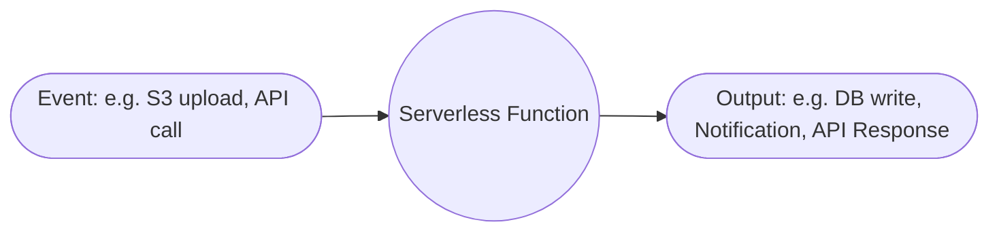
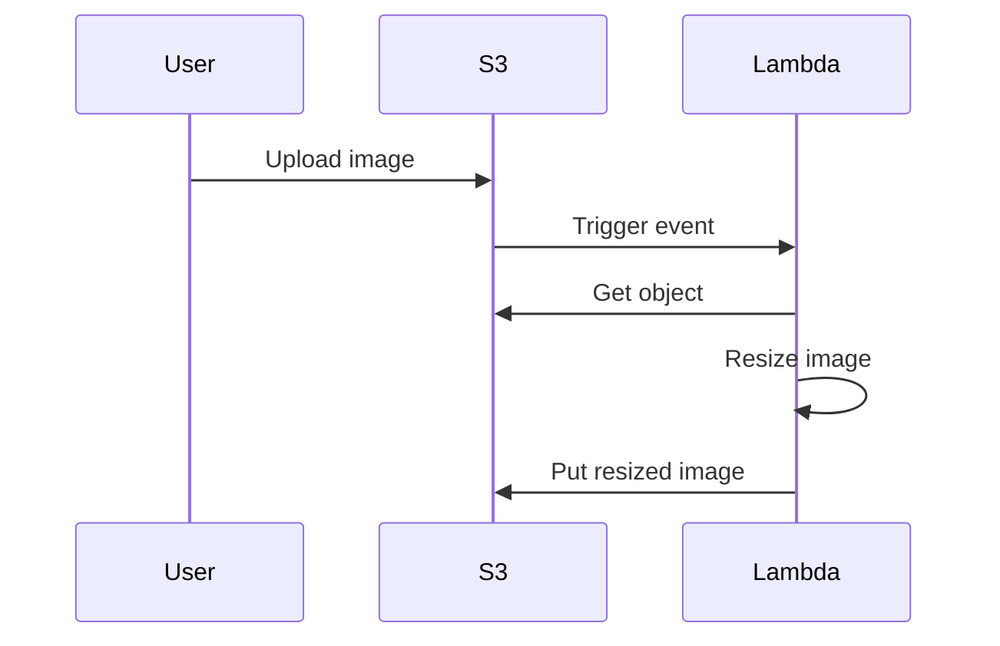
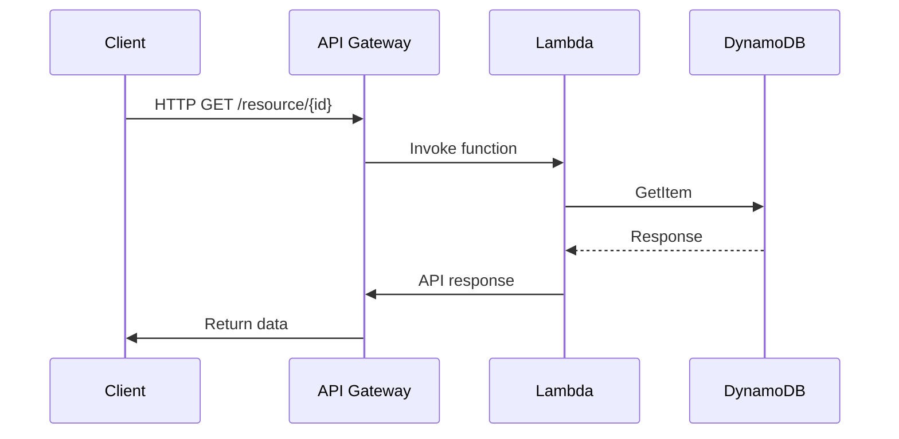
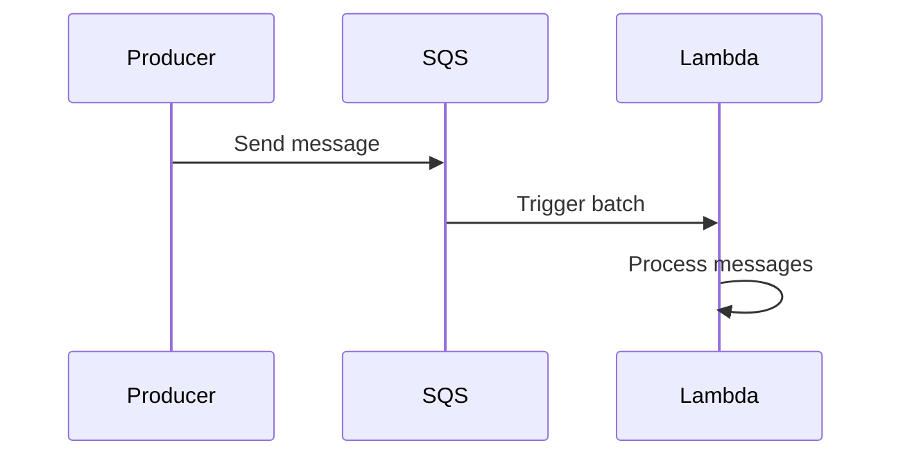
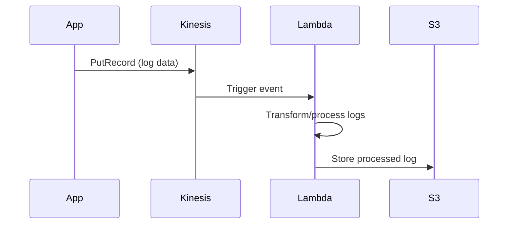
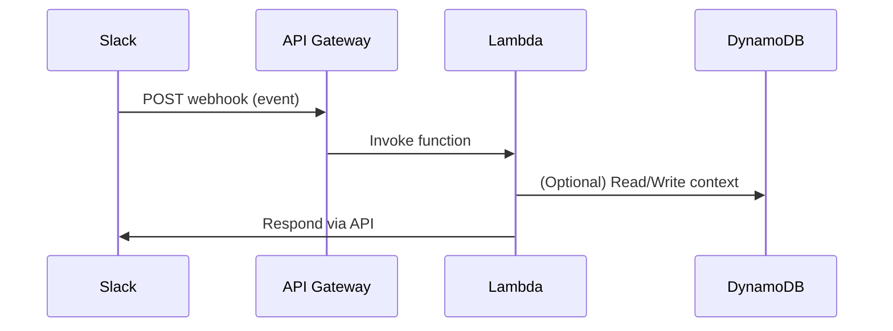
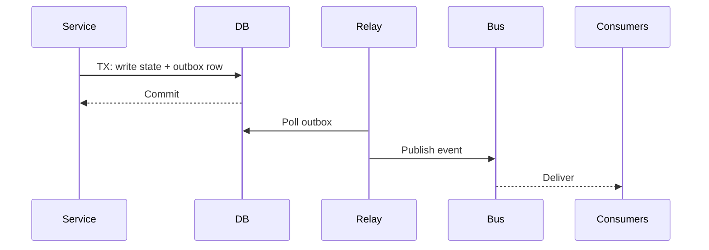
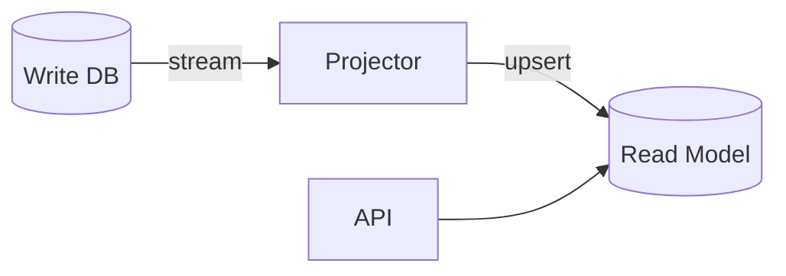
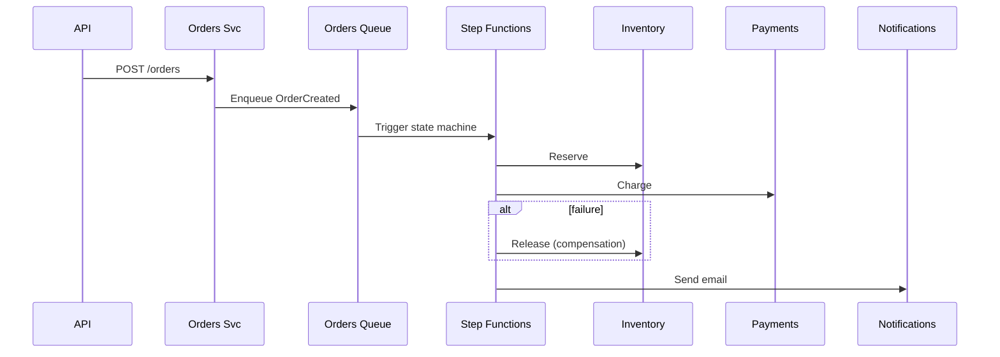

# ☁ Serverless Architecture – Beginner to Advanced Guide

> **Who this guide is for:** Beginners who want a solid foundation, and intermediate/advanced engineers who need production patterns, checklists, and battle‑tested examples.

## Table of Contents
- [1. Introduction](#1-introduction)
- [2. Key Characteristics](#2-key-characteristics)
- [3. When to Use Serverless](#3-when-to-use-serverless)
- [4. Benefits](#4-benefits)
- [5. Challenges](#5-challenges)
- [6. Serverless vs Traditional Architecture](#6-serverless-vs-traditional-architecture)
- [7. Common Patterns](#7-common-patterns)
- [8. Real-World Implementation Examples](#8-real-world-implementation-examples)
- [9. Advanced Patterns & Best Practices](#9-advanced-patterns--best-practices)
- [10. Best Practices](#10-best-practices)
- [11. Security Considerations](#11-security-considerations)
- [12. Monitoring & Observability](#12-monitoring--observability)
- [13. Thought Process for Designing a Serverless Architecture](#13-thought-process-for-designing-a-serverless-architecture)
- [14. Common Pitfalls](#14-common-pitfalls)
- [15. References](#15-references)
- [16. Prerequisites & Key Terms](#16-prerequisites--key-terms)
- [17. Provider-Neutral Triggers & Event Types](#17-provider-neutral-triggers--event-types)
- [18. Design Deep-Dive: Idempotency & Exactly-Once Illusions](#18-design-deep-dive-idempotency--exactly-once-illusions)
- [19. Error Handling, Retries, and DLQs](#19-error-handling-retries-and-dlqs)
- [20. Data & Workflow Patterns (CQRS, Event Sourcing, Saga)](#20-data--workflow-patterns-cqrs-event-sourcing-saga)
- [21. Testing Strategy (Unit → Contract → Integration → E2E)](#21-testing-strategy-unit--contract--integration--e2e)
- [22. CI/CD for Serverless](#22-cicd-for-serverless)
- [23. Performance & Cost Engineering](#23-performance--cost-engineering)
- [24. Observability in Practice (Logs, Metrics, Traces)](#24-observability-in-practice-logs-metrics-traces)
- [25. Security Hardening & Governance](#25-security-hardening--governance)
- [26. Real-Life Scenario: E‑commerce Order Workflow (Saga)](#26-real-life-scenario-ecommerce-order-workflow-saga)
- [27. Real-Life Scenario: AI Inference Endpoint](#27-real-life-scenario-ai-inference-endpoint)
- [28. Serverless Containers & Edge](#28-serverless-containers--edge)
- [29. Production Readiness Checklist](#29-production-readiness-checklist)
- [30. Interview‑Style Thought Process](#30-interviewstyle-thought-process)
- [31. Glossary](#31-glossary)

## 1. Introduction
Serverless architecture is a cloud computing execution model where the cloud provider dynamically manages the allocation and provisioning of servers. Developers focus solely on writing code, while infrastructure management (scaling, patching, provisioning) is handled automatically.

### Real-World Industry Examples
- **Netflix**: Uses AWS Lambda for video file encoding workflows and real-time event processing.
- **Slack**: Leverages serverless (AWS Lambda, Google Cloud Functions) for event-driven automation, such as message processing and workflow triggers.
- **Coca-Cola**: Uses serverless for real-time vending machine telemetry and payment processing.
- **iRobot**: Uses AWS Lambda to ingest and process data from millions of connected Roomba vacuums.

### Basic Serverless Flow Diagram


Popular serverless services include **AWS Lambda**, **Azure Functions**, **Google Cloud Functions**, and **Cloudflare Workers**.

### 16. Prerequisites & Key Terms

| Term | What it means | Why it matters |
|------|----------------|----------------|
| FaaS | Function-as-a-Service: run code on demand without managing servers | Core execution model for serverless apps |
| BaaS | Backend-as-a-Service: managed auth, storage, queues, etc. | Accelerates delivery; avoid reinventing commodity features |
| Cold start | Latency on first invoke after idle or new instance spin-up | Impacts p95/p99 latency; plan warmups/provisioned concurrency |
| Warm start | Subsequent invokes that reuse an initialized runtime | Much faster; keep memory small but not starved |
| DLQ | Dead-Letter Queue for failed async events | Retain and later reprocess poison messages |
| Idempotency | Same request can be safely retried without side effects | Critical for at-least-once delivery |
| Provisioned concurrency | Pre-warmed instances for lower latency | Use on user-facing paths with SLOs |
| Ephemeral storage | Temporary storage attached to the function sandbox | Useful for model files, tmp work; clear between invokes |
| VPC/Egress | Private networking and outbound traffic | Controls data paths and costs; beware NAT charges |
| Correlation ID | Request-scoped ID across services | Enables tracing in distributed systems |
---

## 2. Key Characteristics

| Characteristic                  | Description                                         |
|---------------------------------|-----------------------------------------------------|
| No Server Management            | Infrastructure abstracted away                      |
| Auto Scaling                    | Scales up/down automatically                        |
| Pay-as-you-go                   | Billed only for execution time                      |
| Event-Driven                    | Functions triggered by events                       |
| Stateless                       | Functions do not maintain state between invocations |
| Ephemeral Execution Environment | Short-lived, isolated runtime per invocation        |
| Provider-Managed Security Updates| Cloud provider automatically patches and updates runtime environments |

---

## 3. When to Use Serverless

Serverless is ideal for a wide range of use cases, especially those that are event-driven, require quick scaling, or have unpredictable workloads.

| Use Case                       | Example                           |
|--------------------------------|-----------------------------------|
| Event-driven data processing   | Image resizing on upload          |
| API backends                   | REST APIs for mobile apps         |
| Scheduled tasks                | Daily report generation           |
| IoT event ingestion            | Sensor data processing            |
| Chatbots                       | On-demand conversational responses|
| Real-time file processing      | Virus scanning, PDF conversion    |
| Chatbot message handling       | Slack/Teams bot triggers          |
| Machine learning inference APIs| On-demand prediction endpoints    |
| Real-time log processing       | Security alerting, anomaly detection|

### Use Case Mapping Table
| Use Case                     | Typical Trigger           | Cloud Provider Example                 |
|------------------------------|---------------------------|----------------------------------------|
| Image resizing               | S3/GCS Blob upload        | AWS Lambda + S3, GCP Functions + Storage|
| Chatbot message handling     | HTTP/Webhook, Pub/Sub     | AWS Lambda + API Gateway, GCP Functions|
| ML inference API             | HTTPS API call            | AWS Lambda, Azure Functions, GCP Functions|
| Real-time log processing     | Kinesis/Firehose, Pub/Sub | AWS Lambda + Kinesis, GCP Functions + Pub/Sub|
| Scheduled reports            | CloudWatch/Azure Scheduler| AWS Lambda Scheduled Events, Azure Timer Triggers|

---

## 4. Benefits

- Reduced operational overhead
- Cost efficiency for spiky workloads
- Faster development cycles
- Automatic scaling
- Integrated security & monitoring from providers

---

## 5. Challenges

- **Cold start latency**: Functions may take longer to start if not recently invoked.
- **Vendor lock-in**: Proprietary APIs and features can make migration difficult.
- **Limited execution time and memory**: Functions have hard limits (e.g., 15 mins for AWS Lambda).
- **Stateless nature may require external state storage**: Forces use of databases/caches for state.
- **Debugging complexity**: Harder to debug distributed, ephemeral functions.
- **Observability gaps compared to traditional systems**: Tracing and correlating logs across many short-lived functions is challenging.
- **Complexity in local development and testing**: Simulating cloud events, triggers, and integrations locally can be difficult.
- **Vendor-specific feature fragmentation**: Each provider offers unique features/APIs, complicating multi-cloud or migration strategies.

---

## 6. Serverless vs Traditional Architecture

| Aspect                | Serverless                | Traditional                |
|-----------------------|---------------------------|----------------------------|
| Server Management     | Managed by provider       | Managed by user            |
| Scaling               | Auto, event-based         | Manual or semi-auto        |
| Cost Model            | Per execution             | Pay for uptime             |
| State                 | Stateless                 | Stateful possible          |
| Deployment            | Function-level            | App/server-level           |
| Cost Predictability   | Variable (pay for usage)  | More predictable (reserved capacity) |
| Vendor Lock-in Risk   | Higher (proprietary APIs) | Lower (standardized stacks)|

---

## 7. Common Patterns

| Pattern                      | Description                               | Example                          |
|------------------------------|-------------------------------------------|----------------------------------|
| Function as a Service (FaaS) | Deploy individual functions               | AWS Lambda                       |
| Backend as a Service (BaaS)  | Use prebuilt backend services             | Firebase Auth, AWS Cognito       |
| Event Streaming              | Process real-time events                  | Lambda + Kinesis                 |
| API Gateway Integration      | Route API requests to functions           | AWS API Gateway + Lambda         |
| Fan-out / Fan-in             | Parallelize workloads                     | Lambda processing S3 events      |
| Queue-based Load Leveling    | Buffer spikes with message queues         | SQS + Lambda, Pub/Sub + Cloud Functions |
| Step Functions / State Machines | Orchestrate workflows and stateful logic| AWS Step Functions, Azure Durable Functions |
| Edge Functions               | Run logic close to users for low latency  | Cloudflare Workers, Lambda@Edge  |

---

## 8. Real-World Implementation Examples

### 8.1 Image Processing Pipeline
```javascript
// AWS Lambda function for image processing
const AWS = require('aws-sdk');
const sharp = require('sharp');
const s3 = new AWS.S3();

exports.handler = async (event) => {
    const bucket = event.Records[0].s3.bucket.name;
    const key = event.Records[0].s3.object.key;
    
    try {
        // Get image from S3
        const image = await s3.getObject({ Bucket: bucket, Key: key }).promise();
        
        // Resize image
        const resized = await sharp(image.Body)
            .resize(800, 600)
            .jpeg({ quality: 80 })
            .toBuffer();
            
        // Upload resized image
        await s3.putObject({
            Bucket: bucket,
            Key: `resized/${key}`,
            Body: resized,
            ContentType: 'image/jpeg'
        }).promise();
        
        return { status: 'success' };
    } catch (error) {
        console.error(error);
        throw error;
    }
}
```
**Sequence Diagram:**


### 8.2 REST API with DynamoDB
```typescript
// TypeScript Lambda function with DynamoDB
import { DynamoDB } from 'aws-sdk';
import { APIGatewayProxyEvent, APIGatewayProxyResult } from 'aws-lambda';

const dynamodb = new DynamoDB.DocumentClient();

export async function handler(
    event: APIGatewayProxyEvent
): Promise<APIGatewayProxyResult> {
    if (!event.pathParameters?.id) {
        return {
            statusCode: 400,
            body: JSON.stringify({ error: 'Missing ID' })
        };
    }

    try {
        const result = await dynamodb.get({
            TableName: process.env.TABLE_NAME!,
            Key: { id: event.pathParameters.id }
        }).promise();

        return {
            statusCode: 200,
            body: JSON.stringify(result.Item)
        };
    } catch (error) {
        return {
            statusCode: 500,
            body: JSON.stringify({ error: 'Internal Server Error' })
        };
    }
}
```
**Sequence Diagram:**


### 8.3 Event Processing with SQS
```python
# Python Lambda function processing SQS messages
import json
import boto3

def process_message(message):
    # Process message logic here
    print(f"Processing message: {message}")

def lambda_handler(event, context):
    processed = 0
    failed = 0
    
    for record in event['Records']:
        try:
            message = json.loads(record['body'])
            process_message(message)
            processed += 1
        except Exception as e:
            print(f"Error processing message: {str(e)}")
            failed += 1
    
    return {
        'processed': processed,
        'failed': failed
    }
```
**Sequence Diagram:**


### 8.4 Real-Time Log Processing with Kinesis + Lambda
**Description:** Ingest logs to Kinesis, automatically process and store results.


### 8.5 Slack Bot Integration with AWS Lambda
**Description:** Slack event triggers API Gateway, which invokes Lambda for processing.


## 9. Advanced Patterns & Best Practices

### 9.1 Cold Start Optimization
```yaml
# AWS SAM template with provisioned concurrency
Resources:
  MyFunction:
    Type: AWS::Serverless::Function
    Properties:
      Handler: index.handler
      Runtime: nodejs14.x
      ProvisionedConcurrencyConfig:
        ProvisionedConcurrentExecutions: 5
      AutoPublishAlias: prod
      Environment:
        Variables:
          WARMING_ENABLED: true
```

### 9.2 Circuit Breaker Pattern
```javascript
const circuitBreaker = require('opossum');

const breaker = new circuitBreaker(async () => {
    // External API call
    const response = await axios.get('https://api.example.com/data');
    return response.data;
}, {
    timeout: 3000,
    errorThresholdPercentage: 50,
    resetTimeout: 30000
});

exports.handler = async (event) => {
    try {
        const result = await breaker.fire();
        return { statusCode: 200, body: JSON.stringify(result) };
    } catch (error) {
        return { statusCode: 500, body: JSON.stringify({ error: 'Service unavailable' }) };
    }
};
```

### 9.3 Canary Deployments for Functions
- Gradually shift a percentage of traffic to the new function version and monitor for errors.
- AWS Lambda supports [traffic shifting](https://docs.aws.amazon.com/lambda/latest/dg/configuration-versions.html) with aliases.

### 9.4 Blue-Green Deployments
- Deploy new version alongside old, switch traffic over when ready.
- Rollback by redirecting alias or API Gateway to previous version.

### 9.5 Using Layers for Dependency Sharing
- Share common code (e.g., libraries, SDKs) across multiple Lambda functions using [Lambda Layers](https://docs.aws.amazon.com/lambda/latest/dg/configuration-layers.html).

### 9.6 Orchestrating Workflows with Step Functions
**Example Step Functions Definition (JSON):**
```json
{
  "Comment": "A simple serverless workflow example",
  "StartAt": "Step1",
  "States": {
    "Step1": {
      "Type": "Task",
      "Resource": "arn:aws:lambda:REGION:ACCOUNT_ID:function:Step1Function",
      "Next": "Step2"
    },
    "Step2": {
      "Type": "Task",
      "Resource": "arn:aws:lambda:REGION:ACCOUNT_ID:function:Step2Function",
      "End": true
    }
  }
}
```

---

## 10. Best Practices

- Minimize cold start impact (use provisioned concurrency)
- Keep functions small and focused
- Use environment variables for configuration
- Externalize state to managed databases or caches
- Implement retries and DLQs for async processing
- **Log correlation IDs across distributed functions** to trace requests end-to-end.
- **Use async invocations for non-critical paths** to speed up user-facing responses.
- **Apply throttling to prevent cost overruns** and protect downstream resources.

---

## 11. Security Considerations

- Principle of least privilege for IAM roles
- Encrypt sensitive data at rest and in transit
- Validate and sanitize inputs
- Monitor and log invocations
- **Audit logging of function execution**: Record who invoked, when, with what parameters.
- **Secrets management with AWS Secrets Manager or Azure Key Vault**: Never hardcode secrets in code or environment variables.
- **API Gateway WAF integration example**:
    - Use AWS WAF to protect APIs from common web exploits.
    - [AWS WAF + API Gateway Guide](https://docs.aws.amazon.com/apigateway/latest/developerguide/apigateway-web-application-firewall.html)

---

## 12. Monitoring & Observability

| Tool           | Purpose                    |
|----------------|---------------------------|
| AWS CloudWatch | Logs, metrics, alarms      |
| X-Ray          | Distributed tracing        |
| Datadog        | Advanced observability     |
| Lumigo         | Serverless monitoring      |

### Example: CloudWatch Metric Alarm Setup (AWS CLI)
```bash
aws cloudwatch put-metric-alarm \
  --alarm-name "HighLambdaErrorRate" \
  --metric-name Errors \
  --namespace AWS/Lambda \
  --statistic Sum \
  --period 300 \
  --threshold 5 \
  --comparison-operator GreaterThanThreshold \
  --evaluation-periods 1 \
  --alarm-actions arn:aws:sns:us-east-1:123456789012:NotifyMe \
  --dimensions Name=FunctionName,Value=MyFunction
```

### OpenTelemetry Integration Snippet for Lambda (Python)
```python
from opentelemetry.instrumentation.aws_lambda import AwsLambdaInstrumentor
AwsLambdaInstrumentor().instrument()
```

### Key Metrics Table
| Metric            | Description                                 |
|-------------------|---------------------------------------------|
| Cold start time   | Time to initialize a new function instance  |
| Invocation count  | Number of function calls                    |
| Error rate        | Percentage of failed invocations            |
| Duration          | Average/maximum execution time              |
| Throttles         | Number of requests rejected due to limits   |

---

## 13. Thought Process for Designing a Serverless Architecture

1. Identify event sources and triggers.
2. Determine data flow and required integrations.
3. Design stateless functions and choose storage.
4. Address latency and scaling requirements.
5. Implement monitoring and security from the start.

### Decision Matrix Example
| Business Need                   | Serverless Pattern         | AWS Service         | Azure Service          | GCP Service              |
|---------------------------------|---------------------------|---------------------|------------------------|--------------------------|
| RESTful API                     | API Gateway + FaaS        | API Gateway + Lambda| API Management + Functions| API Gateway + Cloud Functions|
| Real-time file processing       | Event-driven FaaS         | S3 + Lambda         | Blob Storage + Functions| Cloud Storage + Functions|
| Workflow orchestration          | State Machine             | Step Functions      | Durable Functions      | Workflows                |
| ML inference                    | FaaS + Model Endpoint     | Lambda + SageMaker  | Functions + ML Studio  | Cloud Functions + AI Platform|
| Chatbot/event integration       | Webhook + FaaS            | API Gateway + Lambda| Functions + Logic Apps | Cloud Functions + Pub/Sub|

---

## 14. Common Pitfalls

- Overcomplicating with too many small functions
- Not optimizing for cold starts
- Ignoring execution time limits
- Overlooking observability setup
- **Ignoring network egress costs**: Data transfer between cloud services or to the internet can incur high costs.
- **Overusing synchronous calls between functions**: Leads to increased latency and cost; prefer async/event-driven where possible.
- **Poor error handling causing retry storms**: Unhandled errors with automatic retries can amplify failures and cost.

---

## 15. References

- [AWS Lambda Documentation](https://docs.aws.amazon.com/lambda/)
- [Azure Functions Documentation](https://learn.microsoft.com/en-us/azure/azure-functions/)
- [Google Cloud Functions](https://cloud.google.com/functions)
- [Serverless Framework](https://www.serverless.com/)
- [AWS Step Functions](https://docs.aws.amazon.com/step-functions/)
- [AWS Lambda Layers](https://docs.aws.amazon.com/lambda/latest/dg/configuration-layers.html)
- [OpenTelemetry for AWS Lambda](https://opentelemetry.io/docs/instrumentation/aws-lambda/)
- [Serverless Patterns Collection](https://serverlessland.com/patterns)
- [AWS WAF + API Gateway](https://docs.aws.amazon.com/apigateway/latest/developerguide/apigateway-web-application-firewall.html)


---

## 17. Provider-Neutral Triggers & Event Types

> Think in *events*, not vendors. Model the business event first; then map it to cloud-native triggers.

| Category | Typical Triggers | Example Business Events |
|---------|------------------|--------------------------|
| Storage | Object created/updated, signed URL access | User uploads avatar → resize thumbnails |
| HTTP/API | REST, GraphQL, WebSocket | Submit order, webhook from SaaS, mobile app API |
| Messaging | Queue message, topic publish/subscribe | OrderCreated, PaymentAuthorized |
| Schedules | Cron/Timer | Nightly reconciliation, daily digest |
| Streams | Append to log/stream shards | Clickstream, IoT telemetry, logs |
| DB change | CDC/stream, trigger | Update projections after write to primary table |
| Edge | CDN/worker events | A/B routing, header normalization, bot mitigation |

**Design tip:** Keep event payloads *self-descriptive* with versioned `type`, `id`, `time`, `specVersion`, and `data` fields (CloudEvents-style) to decouple producers and consumers.

```json
{
  "specversion": "1.0",
  "type": "com.acme.order.created.v2",
  "id": "4b3e0b52-0b2e-4aef-9f1a-33c2e3a7d9bd",
  "source": "/orders/",
  "time": "2025-01-10T12:34:56Z",
  "datacontenttype": "application/json",
  "data": { "orderId": "O-123", "amount": 49.99, "currency": "USD" }
}
```

---

## 18. Design Deep-Dive: Idempotency & Exactly-Once Illusions

Message delivery is typically *at-least-once*. You must design handlers to be **idempotent**.

### 18.1 Idempotency with a DynamoDB gate (Node.js)
```javascript
// idempotency.js
import { DynamoDBClient } from '@aws-sdk/client-dynamodb';
import { DynamoDBDocumentClient, PutCommand, GetCommand } from '@aws-sdk/lib-dynamodb';

const ddb = DynamoDBDocumentClient.from(new DynamoDBClient({}));
const TABLE = process.env.IDEMPOTENCY_TABLE; // PK: requestId

export async function withIdempotency(handler) {
  return async (event) => {
    const requestId = event.headers?.['Idempotency-Key'] || event.requestContext?.requestId;
    if (!requestId) return handler(event); // best-effort fallback

    const key = { requestId };
    const existing = await ddb.send(new GetCommand({ TableName: TABLE, Key: key }));
    if (existing.Item?.result) {
      return existing.Item.result; // return cached response
    }

    const result = await handler(event);
    await ddb.send(new PutCommand({
      TableName: TABLE,
      Item: { requestId, result, ttl: Math.floor(Date.now()/1000) + 24*3600 },
      ConditionExpression: 'attribute_not_exists(requestId)'
    }));
    return result;
  };
}
```

### 18.2 Outbox Pattern for Side Effects
Persist outgoing events in the same transactional store as the command, then *reliably* publish them via a relay.



---

## 19. Error Handling, Retries, and DLQs

### 19.1 Async Lambda destinations (SAM)
```yaml
Resources:
  ProcessPayment:
    Type: AWS::Serverless::Function
    Properties:
      Runtime: nodejs20.x
      Handler: index.handler
      Events:
        OrderCreated:
          Type: SQS
          Properties:
            Queue: !GetAtt OrdersQueue.Arn
      DeadLetterQueue: # for sync invokes via SQS, also use queue-level DLQ
        Type: SQS
        TargetArn: !GetAtt OrdersDLQ.Arn
      EventInvokeConfig:
        MaximumRetryAttempts: 2
        DestinationConfig:
          OnFailure:
            Type: SQS
            Destination: !GetAtt OrdersDLQ.Arn
```

### 19.2 Partial Batch Response for SQS (Python)
```python
# lambda_function.py
import json

def lambda_handler(event, context):
    failures = []
    for record in event["Records"]:
        try:
            body = json.loads(record["body"])
            process(body)
        except Exception:
            failures.append({"itemIdentifier": record["messageId"]})
    return {"batchItemFailures": failures}
```

---

## 20. Data & Workflow Patterns (CQRS, Event Sourcing, Saga)

### 20.1 CQRS Read Models
Use streams/CDC to build denormalized projections for fast reads.



### 20.2 Saga (Orchestration vs Choreography)
- **Choreography**: lightweight, but harder to reason about.
- **Orchestration**: State machine (e.g., Step Functions) centralizes flow and compensations.

```json
{
  "Comment": "Order Saga (orchestrated)",
  "StartAt": "ReserveInventory",
  "States": {
    "ReserveInventory": { "Type": "Task", "Resource": "arn:aws:lambda:REGION:ACCT:function:reserve", "Next": "ChargePayment", "Catch": [{"ErrorEquals":["States.ALL"], "Next":"FailAndRelease"}] },
    "ChargePayment": { "Type": "Task", "Resource": "arn:aws:lambda:REGION:ACCT:function:charge", "Next": "SendConfirmation", "Catch": [{"ErrorEquals":["States.ALL"], "Next":"ReleaseInventory"}] },
    "ReleaseInventory": { "Type": "Task", "Resource": "arn:aws:lambda:REGION:ACCT:function:release", "Next": "FailAndRelease" },
    "SendConfirmation": { "Type": "Task", "Resource": "arn:aws:lambda:REGION:ACCT:function:notify", "End": true },
    "FailAndRelease": { "Type": "Fail", "Cause": "Order failed with compensations" }
  }
}
```

---

## 21. Testing Strategy (Unit → Contract → Integration → E2E)

| Layer | Goal | Tools & Tips |
|------|------|--------------|
| Unit | Logic correctness | Local runners, mocks (aws-sdk v3), small pure functions |
| Contract | Provider/schema compatibility | OpenAPI/AsyncAPI contracts; schema validation in CI |
| Integration | Cloud service boundaries | Test stacks with SAM/Serverless Framework; seed data |
| E2E | User journey & SLOs | Synthetic canaries, k6/Artillery load tests |

**Example: Contract test for an event (AJV)**
```javascript
import Ajv from 'ajv';
const ajv = new Ajv();
const schema = { type: 'object', properties: { type: {const: 'com.acme.order.created.v2'} }, required: ['type','data'] };
const validate = ajv.compile(schema);
if (!validate(event)) throw new Error('Invalid event');
```

---

## 22. CI/CD for Serverless

### 22.1 GitHub Actions – AWS SAM
```yaml
name: ci-cd-sam
on:
  push:
    branches: [ main ]
    paths: [ 'template.yaml', 'src/**' ]
jobs:
  build-deploy:
    runs-on: ubuntu-latest
    steps:
      - uses: actions/checkout@v4
      - uses: aws-actions/setup-sam@v2
      - run: sam build
      - run: sam deploy --stack-name serverless-app --no-confirm-changeset --resolve-s3
        env:
          AWS_ACCESS_KEY_ID: ${{ secrets.AWS_ACCESS_KEY_ID }}
          AWS_SECRET_ACCESS_KEY: ${{ secrets.AWS_SECRET_ACCESS_KEY }}
          AWS_REGION: us-east-1
```

### 22.2 GitHub Actions – Serverless Framework
```yaml
name: ci-cd-sls
on: { push: { branches: [ main ] } }
jobs:
  deploy:
    runs-on: ubuntu-latest
    steps:
      - uses: actions/checkout@v4
      - uses: actions/setup-node@v4
        with: { node-version: '20' }
      - run: npm ci
      - run: npx serverless deploy --stage prod
        env:
          AWS_ACCESS_KEY_ID: ${{ secrets.AWS_ACCESS_KEY_ID }}
          AWS_SECRET_ACCESS_KEY: ${{ secrets.AWS_SECRET_ACCESS_KEY }}
          AWS_REGION: us-east-1
```

---

## 23. Performance & Cost Engineering

- **Right-size memory**: Higher memory increases CPU/IO; measure duration vs cost.
- **Keep packages lean**: Tree-shake, bundle, exclude SDKs you don’t use.
- **Avoid chatty sync calls**: Prefer events/queues over RPC between functions.
- **Batching**: For streams/queues, tune batch size and parallelism.
- **Warm paths**: Use provisioned concurrency on p95-critical routes.

**Cost model sketch (per function)**
```
Total = Requests * Price_per_request + (GB-s * Price_per_GB_s) + Network_egress + Managed_service_fees
GB-s = (Memory_GB * Duration_s * Requests)
```

---

## 24. Observability in Practice (Logs, Metrics, Traces)

### 24.1 Structured Logging (Node.js)
```javascript
const log = (level, msg, extra={}) => console.log(JSON.stringify({ level, msg, ...extra }));
export const handler = async (event) => {
  const correlationId = event.headers?.['x-correlation-id'] || crypto.randomUUID();
  log('info', 'received', { correlationId });
  try {
    // ... work ...
    log('info', 'success', { correlationId });
    return { statusCode: 200, body: 'ok' };
  } catch (e) {
    log('error', 'failure', { correlationId, err: String(e) });
    throw e;
  }
};
```

### 24.2 OpenTelemetry (Python)
```python
from opentelemetry import trace
tracer = trace.get_tracer(__name__)

def handler(event, context):
    with tracer.start_as_current_span("handle-request") as span:
        span.set_attribute("correlation_id", event.get("headers",{}).get("x-correlation-id"))
        # do work
        return {"statusCode": 200, "body": "ok"}
```

---

## 25. Security Hardening & Governance

- **Least-privilege IAM** with scoped resource ARNs.
- **Rotate secrets**; use Secrets Manager/Key Vault; never hardcode.
- **WAF & rate limits** in front of public APIs.
- **Tag everything** (owner, env, cost-center); require tags in CI.
- **Budget alarms** and anomaly detection for spend spikes.

**Example: Budget alarm (CLI)**
```bash
aws budgets create-budget \
  --account-id 123456789012 \
  --budget 'Name=Serverless-Monthly,BudgetType=COST,TimeUnit=MONTHLY,BudgetLimit={Amount=100,Unit=USD}'
```

---

## 26. Real-Life Scenario: E‑commerce Order Workflow (Saga)

**Context:** User places an order. We reserve inventory, charge payment, and notify.



**Lambda handler (TypeScript)**
```typescript
import { SQSEvent } from 'aws-lambda';
export async function handler(event: SQSEvent) {
  for (const r of event.Records) {
    const order = JSON.parse(r.body);
    // validate, enrich, publish to state machine
  }
}
```

---

## 27. Real-Life Scenario: AI Inference Endpoint

**Goal:** Low-latency text classification with a small model cached on `/tmp`.

```python
# app.py (Lambda + API Gateway)
import json, os
from transformers import AutoTokenizer, AutoModelForSequenceClassification

MODEL_NAME = os.getenv('MODEL_NAME', 'distilbert-base-uncased-finetuned-sst-2-english')
_tokenizer = None
_model = None

def load():
    global _tokenizer, _model
    if _tokenizer is None:
        _tokenizer = AutoTokenizer.from_pretrained(MODEL_NAME, cache_dir='/tmp')
        _model = AutoModelForSequenceClassification.from_pretrained(MODEL_NAME, cache_dir='/tmp')

def handler(event, context):
    load()
    text = json.loads(event.get('body','{}')).get('text','')
    inputs = _tokenizer(text, return_tensors='pt')
    outputs = _model(**inputs)
    score = float(outputs.logits.softmax(-1)[0][1])
    return { 'statusCode': 200, 'body': json.dumps({ 'positive': score }) }
```

**SAM snippet with provisioned concurrency**
```yaml
Resources:
  Inference:
    Type: AWS::Serverless::Function
    Properties:
      Runtime: python3.11
      MemorySize: 2048
      EphemeralStorage: { Size: 2048 }
      AutoPublishAlias: live
      ProvisionedConcurrencyConfig: { ProvisionedConcurrentExecutions: 2 }
```

---

## 28. Serverless Containers & Edge

Sometimes a *function* isn’t right (large deps, long-lived connections). Use **serverless containers** or **edge workers**.

- **Serverless containers**: Cloud Run / Azure Container Apps / AWS Fargate.
- **Edge**: Cloudflare Workers, Lambda@Edge, Vercel/Netlify edge functions.

**Cloudflare Worker example**
```javascript
export default {
  async fetch(request, env, ctx) {
    return new Response('hello from the edge');
  }
}
```

---

## 29. Production Readiness Checklist

- [ ] Clear SLOs (latency, availability) and error budgets
- [ ] Idempotency on all async handlers
- [ ] DLQs configured and monitored
- [ ] Structured logs with correlation IDs
- [ ] Dashboards: p50/p95/p99 latency, cold starts, throttles
- [ ] Alarms: error rate, retry storms, queue age, budget spend
- [ ] IAM least-privilege, KMS encryption, WAF in front of APIs
- [ ] CI/CD with manual approval for prod
- [ ] Runbook for incident response and rollback

---

## 30. Interview‑Style Thought Process

1. **Clarify the event & boundaries**: what triggers the function? who consumes the result?
2. **SLOs**: p95 latency targets? throughput? concurrency forecast?
3. **Data**: schema, size, read/write patterns, retention, GDPR/PII handling.
4. **Failure modes**: retries, backoff, DLQ, compensation, idempotency keys.
5. **Observability**: which logs/metrics/traces prove it works in prod?
6. **Cost**: request volume, GB‑s, egress; budgets and alerts.
7. **Security**: authn/z, secrets, network egress, tenant isolation.

---

## 31. Glossary

- **At-least-once delivery**: messages may be delivered multiple times; handle duplicates.
- **Compensation**: undoing actions when part of a workflow fails.
- **Correlation ID**: ID used to stitch logs/spans across services.
- **Dead-letter queue (DLQ)**: store messages that repeatedly fail processing.
- **Provisioned Concurrency**: pre-initialized Lambda instances to reduce cold starts.
- **Saga**: pattern for managing distributed transactions via commands & compensations.