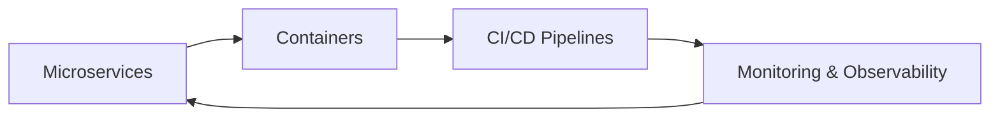
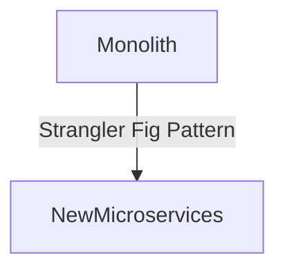
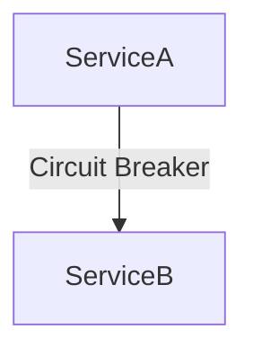
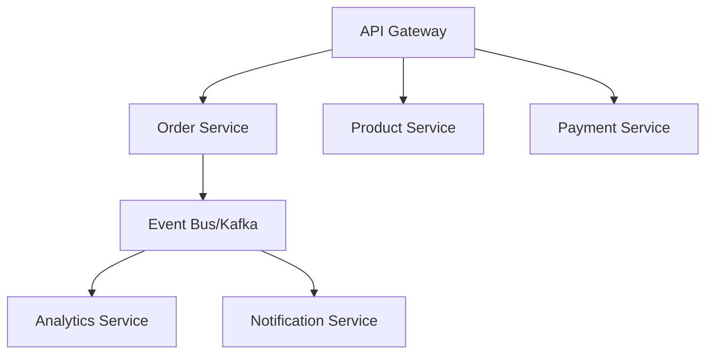

# ☁ Cloud-Native Patterns – Beginner to Advanced Guide

## 1. Introduction
Cloud-native patterns are design principles and practices for building scalable, resilient, and maintainable applications that take full advantage of cloud computing environments. They focus on microservices, containerization, automation, and continuous delivery.

These patterns align closely with the Cloud Native Computing Foundation (CNCF)’s principles, which emphasize container orchestration, dynamic management, and declarative APIs to enable scalable and resilient systems. Cloud-native approaches enable organizations to innovate faster, respond to market changes promptly, and improve operational efficiency.

Industries rapidly adopting cloud-native patterns include fintech, streaming media, e-commerce, Internet of Things (IoT), healthcare, and telecommunications. These sectors benefit from the agility, scalability, and fault tolerance that cloud-native architectures provide.



---

## 2. Key Characteristics of Cloud-Native Applications

| Characteristic           | Description                              | Why It Matters                          |
|-------------------------|------------------------------------------|---------------------------------------|
| Microservices Architecture | Small, loosely coupled services        | Enables independent development, deployment, and scaling |
| Containerization        | Portable and consistent environments      | Ensures environment parity from dev to prod |
| DevOps & CI/CD          | Automated build, test, and deployment     | Accelerates release cycles and reduces human error |
| Resilience              | Fault tolerance and self-healing          | Improves availability and user experience |
| Scalability             | Dynamic scaling up/down                   | Handles varying workloads efficiently |
| Observability           | Monitoring, logging, tracing              | Provides insights for troubleshooting and optimization |
| API-First Design        | Clear contracts for interaction           | Facilitates integration and decoupling |
| Immutable Infrastructure | Infrastructure components are never modified after deployment | Ensures consistency and simplifies rollback |
| API-Driven Automation   | Automate infrastructure and application management via APIs | Enables repeatable, scriptable operations |
| Elastic Scalability     | Automatic scaling based on demand          | Optimizes resource usage and cost |
| Self-Service DevOps     | Developers can provision and manage resources without centralized bottlenecks | Increases productivity and autonomy |

---

## 3. Common Cloud-Native Patterns

### 3.1 Decomposition Patterns
- **Decompose by Business Capability**: Align services with business domains (DDD).
- **Decompose by Subdomain**: Use bounded contexts for separation.
- **Strangler Fig Pattern**: Gradually replace monolith parts with microservices.



| Pattern                   | Pros                                            | Cons                                      |
|---------------------------|-------------------------------------------------|-------------------------------------------|
| Business Capability       | Clear ownership, aligns with business goals     | Requires good domain knowledge            |
| Subdomain                | Strong separation of concerns                    | Can increase complexity                    |
| Strangler Fig            | Incremental migration, reduces risk              | Requires careful integration and testing  |

### 3.2 Data Management Patterns
- **Database per Service**: Each service manages its own data.
- **CQRS**: Separate read/write models.
- **Event Sourcing**: Persist events as the source of truth.

| Pattern                   | Pros                                            | Cons                                      |
|---------------------------|-------------------------------------------------|-------------------------------------------|
| Database per Service      | Decouples services, improves scalability         | Data consistency challenges                |
| CQRS                     | Optimizes read/write operations separately       | Increased complexity                       |
| Event Sourcing           | Complete audit trail, easier rollback             | Higher storage and complexity              |

### 3.3 Communication Patterns
- **API Gateway**: Central entry point for clients.
- **Service Mesh**: Manage service-to-service communication.
- **Publish-Subscribe**: Asynchronous event delivery.


| Pattern                   | Pros                                            | Cons                                      |
|---------------------------|-------------------------------------------------|-------------------------------------------|
| API Gateway              | Simplifies client access, security enforcement    | Single point of failure if not managed    |
| Service Mesh             | Fine-grained control over communication           | Adds operational complexity               |
| Publish-Subscribe        | Loose coupling, scalability                        | Eventual consistency, debugging challenges|

### 3.4 Resilience Patterns
- **Circuit Breaker**: Prevent cascading failures.
- **Retry**: Automatic retry on transient failures.
- **Bulkhead**: Isolate failures within one component.
- **Failover**: Redirect traffic on failure.



| Pattern                   | Pros                                            | Cons                                      |
|---------------------------|-------------------------------------------------|-------------------------------------------|
| Circuit Breaker          | Prevents cascading failures                       | Needs tuning to avoid false positives     |
| Retry                    | Improves success rates on transient faults       | Can increase load if not configured well  |
| Bulkhead                 | Limits impact of failures                          | Resource fragmentation                     |
| Failover                 | Increases availability                            | Complexity in failover logic               |

### 3.5 Observability Patterns
- **Log Aggregation**: Centralize logs for analysis.
- **Distributed Tracing**: Track requests across services.
- **Health Check API**: Expose system status.

| Pattern                   | Pros                                            | Cons                                      |
|---------------------------|-------------------------------------------------|-------------------------------------------|
| Log Aggregation          | Simplifies troubleshooting                        | Requires storage and indexing              |
| Distributed Tracing     | Understands request flows                          | Adds overhead and complexity               |
| Health Check API         | Enables automated monitoring                      | Needs to be comprehensive and accurate    |

### 3.6 Deployment Patterns
- **Blue-Green Deployment**: Maintain two production environments, switch traffic between them.
- **Canary Deployment**: Gradually roll out changes to a subset of users.
- **Rolling Updates**: Incrementally update instances without downtime.

| Pattern                   | Pros                                            | Cons                                      |
|---------------------------|-------------------------------------------------|-------------------------------------------|
| Blue-Green               | Zero downtime, easy rollback                      | Requires double infrastructure            |
| Canary                   | Minimizes impact of faulty releases               | Complex monitoring and rollout             |
| Rolling Updates          | No downtime, resource efficient                    | Risk of partial failures during update    |

### 3.7 Security Patterns
- **Sidecar for Security Scanning**: Offload security tasks to sidecar containers.
- **Zero Trust Networking**: Authenticate and authorize every request regardless of network location.

| Pattern                   | Pros                                            | Cons                                      |
|---------------------------|-------------------------------------------------|-------------------------------------------|
| Sidecar Security         | Decouples security from business logic           | Additional resource overhead               |
| Zero Trust Networking    | Strong security posture                            | Complex to implement and manage            |

---

## 4. Implementation Examples

### 4.1 API Gateway Pattern (Spring Cloud Gateway)
```java
@Configuration
public class GatewayConfig {
    @Bean
    public RouteLocator customRouteLocator(RouteLocatorBuilder builder) {
        return builder.routes()
            .route("order_service", r -> r.path("/api/orders/**")
                .filters(f -> f
                    .circuitBreaker(c -> c.setName("orderCB")
                        .setFallbackUri("/fallback"))
                    .rateLimiter(c -> c.setCapacity(100)
                        .setRefillTokens(10)
                        .setRefillPeriod(Duration.ofSeconds(1)))
                    .addRequestHeader("X-Request-Source", "API-Gateway")
                    .rewritePath("/api/orders/(?<segment>.*)", "/${segment}")
                    .filter((exchange, chain) -> {
                        System.out.println("Request logged: " + exchange.getRequest().getURI());
                        return chain.filter(exchange);
                    }))
                .uri("lb://order-service"))
            .build();
    }
}
```

### 4.2 Kubernetes Deployment YAML
```yaml
apiVersion: apps/v1
kind: Deployment
metadata:
  name: order-service
spec:
  replicas: 3
  selector:
    matchLabels:
      app: order-service
  template:
    metadata:
      labels:
        app: order-service
    spec:
      containers:
      - name: order-service
        image: order-service:latest
        ports:
        - containerPort: 8080
```

### 4.3 Canary Deployment Manifest (Kubernetes)
```yaml
apiVersion: apps/v1
kind: Deployment
metadata:
  name: order-service
spec:
  replicas: 5
  selector:
    matchLabels:
      app: order-service
  template:
    metadata:
      labels:
        app: order-service
        version: stable
    spec:
      containers:
      - name: order-service
        image: order-service:v1
        ports:
        - containerPort: 8080
---
apiVersion: apps/v1
kind: Deployment
metadata:
  name: order-service-canary
spec:
  replicas: 1
  selector:
    matchLabels:
      app: order-service
      version: canary
  template:
    metadata:
      labels:
        app: order-service
        version: canary
    spec:
      containers:
      - name: order-service
        image: order-service:v2
        ports:
        - containerPort: 8080
```

### 4.4 Bulkhead Pattern with Resilience4j
```java
@Service
public class ResilientOrderService {
    private final Bulkhead bulkhead = Bulkhead.ofDefaults("orderServiceBulkhead");

    public CompletionStage<OrderResponse> processOrder(OrderRequest request) {
        return bulkhead.executeCompletionStage(() -> orderProcessor.processAsync(request));
    }
}
```

---

## 5. Real-World Implementation Examples

### 5.1 Service Mesh Implementation (Istio)
```yaml
apiVersion: networking.istio.io/v1alpha3
kind: VirtualService
metadata:
  name: order-service
spec:
  hosts:
  - order-service
  http:
  - route:
    - destination:
        host: order-service
        subset: v1
      weight: 90
    - destination:
        host: order-service
        subset: v2
      weight: 10
  - fault:
      delay:
        percentage:
          value: 5
        fixedDelay: 2s
```

### 5.2 Distributed Configuration (Spring Cloud Config)
```yaml
spring:
  cloud:
    config:
      server:
        git:
          uri: https://github.com/company/config-repo
          searchPaths: '{application}'
          clone-on-start: true
        encrypt:
          enabled: true
```

### 5.3 Advanced Observability Setup
```java
@Configuration
public class ObservabilityConfig {
    @Bean
    public MeterRegistry meterRegistry() {
        return new CompositeMeterRegistry();
    }

    @Bean
    public TracerBuilder tracerBuilder() {
        return OpenTelemetry.getTracerProvider()
            .tracerBuilder("order-service")
            .setInstrumentationVersion("1.0.0");
    }

    @Bean
    public LoggingAspect loggingAspect(Tracer tracer) {
        return new LoggingAspect(tracer);
    }
}
```

### 5.4 Real-World Case Study: E-commerce Platform

#### Architecture Overview:


#### Implementation Details:
1. **Service Discovery**
```java
@SpringBootApplication
@EnableDiscoveryClient
public class OrderServiceApplication {
    @Bean
    public RestTemplate restTemplate() {
        return new RestTemplate();
    }

    @Bean
    public Resilience4jCircuitBreakerFactory circuitBreakerFactory() {
        CircuitBreakerConfig config = CircuitBreakerConfig.custom()
            .failureRateThreshold(50)
            .waitDurationInOpenState(Duration.ofSeconds(20))
            .build();
        return new Resilience4jCircuitBreakerFactory(config);
    }
}
```

2. **Event-Driven Communication**
```java
@Service
public class OrderEventHandler {
    @KafkaListener(topics = "order-events")
    public void handleOrderEvent(OrderEvent event) {
        switch(event.getType()) {
            case ORDER_CREATED:
                processNewOrder(event);
                break;
            case PAYMENT_COMPLETED:
                updateOrderStatus(event);
                break;
            // Handle other events
        }
    }
}
```

---

## 6. Best Practices

- Design for failure from the start.
- Use infrastructure as code (Terraform, Pulumi).
- Automate deployments with CI/CD pipelines.
- Implement security at every layer.
- Monitor business and system metrics.
- Standardize logging format across services (e.g., JSON logs).
- Implement distributed configuration management (e.g., Spring Cloud Config, HashiCorp Consul).
- Ensure chaos testing is part of resilience validation to uncover hidden faults.

---

## 7. Thought Process for Applying Cloud-Native Patterns

| Requirement                    | Pattern               | Technology Choice             |
|-------------------------------|-----------------------|------------------------------|
| Real-time async communication  | Publish-Subscribe     | Kafka, NATS                  |
| High availability & fault tolerance | Circuit Breaker, Bulkhead | Resilience4j, Envoy          |
| Gradual deployment             | Canary Deployment     | Kubernetes, Istio            |
| Service discovery             | API Gateway, Service Mesh | Spring Cloud Gateway, Istio  |
| Configuration management       | Distributed Config    | Spring Cloud Config, Consul  |

Steps:
1. Identify business requirements and SLAs.
2. Map requirements to cloud-native capabilities.
3. Select decomposition and communication patterns.
4. Integrate resilience and observability from day one.
5. Choose appropriate tooling and technologies.
6. Continuously iterate based on feedback and monitoring.

---

## 8. Common Pitfalls

- Overengineering with too many patterns.
- Ignoring cost optimization.
- Poor observability setup.
- Vendor lock-in without exit strategy.
- Over-optimizing for scale too early.
- Not accounting for data consistency challenges.
- Ignoring observability in MVP phase.
- Choosing tools that don’t integrate well.

---

## 9. References

- [Microservices.io Patterns](https://microservices.io/patterns/index.html)
- [The Twelve-Factor App](https://12factor.net/)
- [CNCF Cloud-Native Definition](https://github.com/cncf/toc/blob/main/DEFINITION.md)
- [Kubernetes Patterns Book](https://www.oreilly.com/library/view/kubernetes-patterns/9781492050285/)
- [CNCF Projects List](https://landscape.cncf.io/)
- [Cloud Native Trail Map](https://www.cncf.io/certification/trailmap/)