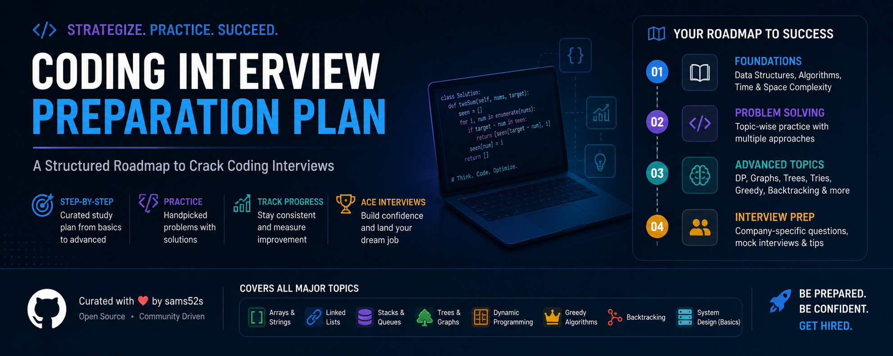

  

# Java Software Engineering Interview Preparation Documentation

This repository is a structured documentation system for preparing for Java backend, Spring Boot, system design, DevOps/cloud, AI/ML integration, database, and behavioral interviews. This README is now the main index and learning guide.

Use this file as the front door. Each major folder has its own `README.md` that acts as a topic-level index.

---

## Start Here

| Need | Go To |
|------|-------|
| Understand the whole repository | [Project Architecture](PROJECT_ARCHITECTURE.md) |
| Choose a role-specific path | [Interview Tracks](INTERVIEW_TRACKS.md) |
| Find external books, docs, papers, and videos | [References](REFERENCES.md) |
| Study Java, Spring, and DSA | [Java & Spring Interview Preparation](Java%20%26%20Spring%20Interview%20Preparation/README.md) |
| Study system design chapters | [System Design Fundamentals](System%20Design%20Fundamentals/README.md) |
| Practice interview questions | [Question Bank](Question%20Bank/README.md) |
| Read complete case studies | [Real-World Case Studies](Real-World%20Case%20Studies/README.md) |
| Build portfolio projects | [Projects](projects/README.md) |
| Prepare for mock interviews | [Mock Interview Scorecard](MOCK_INTERVIEW_SCORECARD.md) |
| Prepare behavioral answers | [Behavioral Answer Bank](BEHAVIORAL_ANSWER_BANK.md) |

---

## System Summary

The documentation is organized into five learning stages:

1. **Java foundation:** syntax, JVM, OOP, collections, exceptions, memory, and core language behavior.
2. **Advanced Java and DSA:** generics, IO/NIO, lambdas, concurrency, annotations, recursion, linked lists, stacks, queues, heaps, sorting, and binary search.
3. **Spring Boot backend engineering:** IoC, REST APIs, persistence, security, observability, DevOps automation, cloud integration, and frontend communication.
4. **System design and architecture:** scalability, availability, distributed systems, databases, load balancing, caching, microservices, events, resilience, performance, DevSecOps, IaC, ML integration, cloud, and observability.
5. **Interview execution:** question-bank review, mock scoring, behavioral stories, project storytelling, company-style preparation, benchmarks, and cost trade-off practice.

The repository can be used in order as a full curriculum, or selectively as a reference index during interview preparation.

---

## Learning Roadmap

| Stage | Focus | Primary Docs | Practice |
|-------|-------|--------------|----------|
| 1 | Java fundamentals, OOP, collections, basic DSA | [Java Fundamentals](Java%20%26%20Spring%20Interview%20Preparation/JAVA/Java%20Fundamentals/README.md), [OOP](Java%20%26%20Spring%20Interview%20Preparation/JAVA/OOP/README.md), [Collections](Java%20%26%20Spring%20Interview%20Preparation/JAVA/Java%20Collections%20Framework/README.md), [DSA](Java%20%26%20Spring%20Interview%20Preparation/DSA/README.md) | [Student Record Project](projects/01_student_record_management.md), [Core Java Q&A](Question%20Bank/core-java.md), [DSA Q&A](Question%20Bank/dsa.md) |
| 2 | Advanced Java, annotations, intermediate DSA | [JAVA Hub](Java%20%26%20Spring%20Interview%20Preparation/JAVA/README.md), [Annotations Docs](Java%20%26%20Spring%20Interview%20Preparation/annotations-docs/README.md), [Java History](Java%20%26%20Spring%20Interview%20Preparation/JAVA/Java%20History%2C%20Features%2C%20and%20Evolution/README.md) | [Library Project](projects/02_library_management_system.md), [Multithreading Q&A](Question%20Bank/multithreading.md), [Testing Q&A](Question%20Bank/testing-quality.md) |
| 3 | Spring Boot backend development | [Spring Boot](Java%20%26%20Spring%20Interview%20Preparation/Spring%20Boot/README.md), [Java & Spring Hub](Java%20%26%20Spring%20Interview%20Preparation/README.md) | [Spring Boot REST API Project](projects/03_spring_boot_rest_api.md), [Spring Boot Q&A](Question%20Bank/spring-boot.md), [REST API Q&A](Question%20Bank/rest-api.md) |
| 4 | System design and production architecture | [System Design Fundamentals](System%20Design%20Fundamentals/README.md), [Core Infrastructure](Core%20Infrastructure%20Components/README.md), [Microservices](Microservices%20and%20Architecture/README.md), [Advanced Distributed Systems](Advanced%20Distributed%20Systems/README.md), [Performance Engineering](Performance%20Engineering/README.md), [DevSecOps and Frontend](DevSecOps%20and%20Frontend/README.md), [Infra and ML](Infra%20and%20ML/README.md), [Cloud and Observability](Cloud%20and%20Observability/README.md) | [Real-World Case Studies](Real-World%20Case%20Studies/README.md), [Microservice Project](projects/04_microservice_architecture.md), [System Design Template](SYSTEM_DESIGN_CASE_STUDY_TEMPLATE.md) |
| 5 | Final interview readiness | [Question Bank](Question%20Bank/README.md), [DBA Cheat Sheet](DBA_CHEAT_SHEET.md), [Company Interview Guides](COMPANY_INTERVIEW_GUIDES.md), [Behavioral Answer Bank](BEHAVIORAL_ANSWER_BANK.md) | [Mock Interview Scorecard](MOCK_INTERVIEW_SCORECARD.md), [Daily Problem Log](DAILY_PROBLEM_LOG.md), [Cost Calculator](COST_CALCULATOR.md), [Performance Benchmarks](PERFORMANCE_BENCHMARKS.md) |

---

## Documentation Index

### Core Navigation

- [PROJECT_ARCHITECTURE.md](PROJECT_ARCHITECTURE.md) — complete repository map, chapter sequence, role sequences, and maintenance notes.
- [INTERVIEW_TRACKS.md](INTERVIEW_TRACKS.md) — role-based paths for backend, senior/staff, full-stack backend, DevOps/SRE, ML systems, and payment/trading systems.
- [REFERENCES.md](REFERENCES.md) — curated external references: official docs, books, papers, engineering blogs, famous videos, and interview resources.
- [DOCUMENTATION_COMPLETION_SUMMARY.md](DOCUMENTATION_COMPLETION_SUMMARY.md) — record of added documentation and remaining implementation work.

### Java, Spring, DSA, and Annotations

- [Java & Spring Interview Preparation](Java%20%26%20Spring%20Interview%20Preparation/README.md) — main Java/Spring hub.
- [JAVA](Java%20%26%20Spring%20Interview%20Preparation/JAVA/README.md) — core and advanced Java hub.
- [Java Fundamentals](Java%20%26%20Spring%20Interview%20Preparation/JAVA/Java%20Fundamentals/README.md) — syntax, JVM/JDK/JRE, variables, control flow, strings, arrays, static/final, and memory basics.
- [OOP](Java%20%26%20Spring%20Interview%20Preparation/JAVA/OOP/README.md) — classes, objects, encapsulation, inheritance, polymorphism, abstraction, composition, and SOLID.
- [Java Collections Framework](Java%20%26%20Spring%20Interview%20Preparation/JAVA/Java%20Collections%20Framework/README.md) — collection hierarchy, List/Set/Map/Queue, concurrency, performance, and interview Q&A.
- [Java History, Features, and Evolution](Java%20%26%20Spring%20Interview%20Preparation/JAVA/Java%20History%2C%20Features%2C%20and%20Evolution/README.md) — Java version timeline and feature catalog.
- [DSA](Java%20%26%20Spring%20Interview%20Preparation/DSA/README.md) — recursion, linked lists, stacks, queues, priority queues, sorting, binary search, and DSA prompts.
- [Annotations Docs](Java%20%26%20Spring%20Interview%20Preparation/annotations-docs/README.md) — Java, Spring, JPA, lambda, and test annotations.
- [Spring Boot](Java%20%26%20Spring%20Interview%20Preparation/Spring%20Boot/README.md) — Spring Core, enterprise integration, persistence, security, cloud, observability, DevOps, frontend communication, ML, best practices, and certificates.
- [CODE_REFACTORING_EXAMPLES.md](CODE_REFACTORING_EXAMPLES.md) — before/after Java and Spring refactoring examples.

### System Design and Architecture

Read these in numeric chapter order:

1. [System Design Fundamentals](System%20Design%20Fundamentals/README.md) — chapters `01` to `05`.
2. [Core Infrastructure Components](Core%20Infrastructure%20Components/README.md) — chapters `06` to `10`.
3. [Microservices and Architecture](Microservices%20and%20Architecture/README.md) — chapters `11` to `15`.
4. [Advanced Distributed Systems](Advanced%20Distributed%20Systems/README.md) — chapters `16` to `19`.
5. [Performance Engineering](Performance%20Engineering/README.md) — chapters `20` to `23`.
6. [DevSecOps and Frontend](DevSecOps%20and%20Frontend/README.md) — chapters `24` to `25`.
7. [Infra and ML](Infra%20and%20ML/README.md) — chapters `26` to `27`.
8. [Cloud and Observability](Cloud%20and%20Observability/README.md) — chapters `28` to `29`.

Supporting system design tools:

- [Real-World Case Studies](Real-World%20Case%20Studies/README.md) — complete Netflix, Uber, Instagram, production incident, and interview story case studies.
- [SYSTEM_DESIGN_CASE_STUDY_TEMPLATE.md](SYSTEM_DESIGN_CASE_STUDY_TEMPLATE.md) — reusable answer structure.
- [VISUAL_ARCHITECTURE_DIAGRAMS.md](VISUAL_ARCHITECTURE_DIAGRAMS.md) — Mermaid diagrams for system explanations.
- [COST_CALCULATOR.md](COST_CALCULATOR.md) — traffic, compute, storage, and observability cost worksheet.
- [PERFORMANCE_BENCHMARKS.md](PERFORMANCE_BENCHMARKS.md) — benchmark planning and result templates.

### AI and ML

- [Basic AI & ML](Basic%20AI%20%26%20ML/README.md) — AI overview, ML basics, data preparation, training, metrics, validation, and NLP.
- [AI ML Models and ALGO](AI%20ML%20Models%20and%20ALGO/README.md) — ML workflow, supervised/unsupervised learning, evaluation, feature engineering, neural networks, and LLM application patterns.
- [Infra and ML](Infra%20and%20ML/README.md) — infrastructure-as-code and ML integration in production systems.

### Practice, Projects, and Interview Execution

- [projects/README.md](projects/README.md) — portfolio project map and build specifications.
- [Question Bank](Question%20Bank/README.md) — indexed interview questions across Java, Spring, DSA, system design, LLD, database, security, testing, cloud, frontend, and behavioral topics.
- [Question Bank.md](Question%20Bank.md) — older consolidated question-bank file retained for reference.
- [BLIND_75_PROBLEM_MAPPING.md](BLIND_75_PROBLEM_MAPPING.md) — curated coding-problem map by pattern, difficulty, and interview frequency.
- [QUICK_REFERENCE_GUIDES.md](QUICK_REFERENCE_GUIDES.md) — fast lookup for annotations, SQL, Spring, API, and interview patterns.
- [INTERVIEW_SIMULATION_GUIDE.md](INTERVIEW_SIMULATION_GUIDE.md) — realistic interview scripts, timing, evaluation criteria, and recovery strategies.
- [DOCUMENTATION_STYLE_GUIDE.md](DOCUMENTATION_STYLE_GUIDE.md) — repository writing, linking, diagram, and case-study standards.
- [DAILY_PROBLEM_LOG.md](DAILY_PROBLEM_LOG.md) — coding practice tracker.
- [MOCK_INTERVIEW_SCORECARD.md](MOCK_INTERVIEW_SCORECARD.md) — rubric for scoring mock interviews.
- [BEHAVIORAL_ANSWER_BANK.md](BEHAVIORAL_ANSWER_BANK.md) — STAR-format story bank.
- [COMPANY_INTERVIEW_GUIDES.md](COMPANY_INTERVIEW_GUIDES.md) — company-style preparation guide.
- [CONCEPT_TO_CODE_MAPPING.md](CONCEPT_TO_CODE_MAPPING.md) — map from concepts to implementation evidence.
- [PRODUCTION_READINESS_CHECKLIST.md](PRODUCTION_READINESS_CHECKLIST.md) — production checklist for Spring Boot/backend systems.
- [DBA_CHEAT_SHEET.md](DBA_CHEAT_SHEET.md) — database, operations, Kafka, Elasticsearch, Linux, and DBA reference.

---

## Recommended Reading Paths

### Backend Engineer

1. [Java Fundamentals](Java%20%26%20Spring%20Interview%20Preparation/JAVA/Java%20Fundamentals/README.md)
2. [OOP](Java%20%26%20Spring%20Interview%20Preparation/JAVA/OOP/README.md)
3. [Java Collections Framework](Java%20%26%20Spring%20Interview%20Preparation/JAVA/Java%20Collections%20Framework/README.md)
4. [DSA](Java%20%26%20Spring%20Interview%20Preparation/DSA/README.md)
5. [Spring Boot](Java%20%26%20Spring%20Interview%20Preparation/Spring%20Boot/README.md)
6. [Question Bank](Question%20Bank/README.md)

### Senior Backend / System Design

1. Complete the backend path above.
2. Read [System Design Fundamentals](System%20Design%20Fundamentals/README.md) through [Cloud and Observability](Cloud%20and%20Observability/README.md).
3. Study [Real-World Case Studies](Real-World%20Case%20Studies/README.md), then use [SYSTEM_DESIGN_CASE_STUDY_TEMPLATE.md](SYSTEM_DESIGN_CASE_STUDY_TEMPLATE.md), [VISUAL_ARCHITECTURE_DIAGRAMS.md](VISUAL_ARCHITECTURE_DIAGRAMS.md), and [COST_CALCULATOR.md](COST_CALCULATOR.md) for each design practice.
4. Score yourself with [MOCK_INTERVIEW_SCORECARD.md](MOCK_INTERVIEW_SCORECARD.md).

### DevOps / SRE

1. Skim [JAVA](Java%20%26%20Spring%20Interview%20Preparation/JAVA/README.md) and [Spring Boot](Java%20%26%20Spring%20Interview%20Preparation/Spring%20Boot/README.md).
2. Focus on [Core Infrastructure Components](Core%20Infrastructure%20Components/README.md), [Performance Engineering](Performance%20Engineering/README.md), [DevSecOps and Frontend](DevSecOps%20and%20Frontend/README.md), [Infra and ML](Infra%20and%20ML/README.md), and [Cloud and Observability](Cloud%20and%20Observability/README.md).
3. Practice with [cloud-devops.md](Question%20Bank/cloud-devops.md), [security.md](Question%20Bank/security.md), and [testing-quality.md](Question%20Bank/testing-quality.md).

### ML Systems Engineer

1. Build backend basics with [Spring Boot](Java%20%26%20Spring%20Interview%20Preparation/Spring%20Boot/README.md).
2. Study [Basic AI & ML](Basic%20AI%20%26%20ML/README.md), [AI ML Models and ALGO](AI%20ML%20Models%20and%20ALGO/README.md), and [Infra and ML](Infra%20and%20ML/README.md).
3. Practice ML system designs using [SYSTEM_DESIGN_CASE_STUDY_TEMPLATE.md](SYSTEM_DESIGN_CASE_STUDY_TEMPLATE.md), [VISUAL_ARCHITECTURE_DIAGRAMS.md](VISUAL_ARCHITECTURE_DIAGRAMS.md), and [PERFORMANCE_BENCHMARKS.md](PERFORMANCE_BENCHMARKS.md).

---

## How To Use This Repository

1. Pick your target role in [INTERVIEW_TRACKS.md](INTERVIEW_TRACKS.md).
2. Follow the learning roadmap above, using each folder `README.md` as the local table of contents.
3. Build or at least design the portfolio projects in [projects/README.md](projects/README.md).
4. Track coding practice in [DAILY_PROBLEM_LOG.md](DAILY_PROBLEM_LOG.md).
5. Use [Question Bank](Question%20Bank/README.md) after each topic, not only at the end.
6. Use [MOCK_INTERVIEW_SCORECARD.md](MOCK_INTERVIEW_SCORECARD.md) to measure readiness before real interviews.

---

## Maintenance Notes

When adding new documentation:

- Add it to the nearest folder `README.md`.
- Add major new files to [PROJECT_ARCHITECTURE.md](PROJECT_ARCHITECTURE.md).
- Add high-value external material to [REFERENCES.md](REFERENCES.md).
- Connect interview-relevant material to [Question Bank](Question%20Bank/README.md) or [INTERVIEW_TRACKS.md](INTERVIEW_TRACKS.md).
- Keep root-level docs listed in this README so the project remains navigable.
- Follow [DOCUMENTATION_STYLE_GUIDE.md](DOCUMENTATION_STYLE_GUIDE.md) for tone, structure, diagrams, and link conventions.

---

## Final Outcome

After completing the documentation flow, you should be able to write and explain Java code, reason about DSA, build Spring Boot services, design scalable systems, discuss infrastructure and observability, understand ML-backed architecture at a practical level, and communicate clearly in technical and behavioral interviews.
