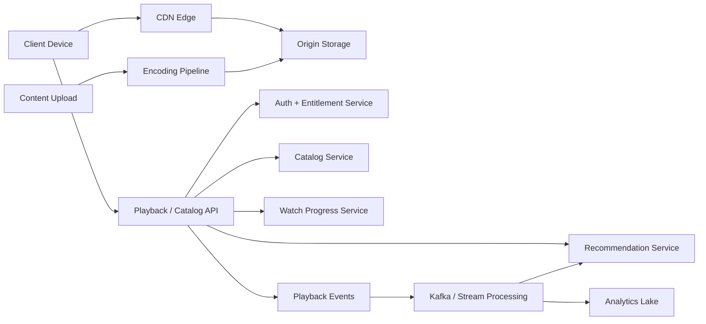

# Case Study: Netflix-Style Video Streaming Platform

Navigation: [Case Studies](README.md) | [System Design Template](../SYSTEM_DESIGN_CASE_STUDY_TEMPLATE.md) | [CDN and Caching](../Core%20Infrastructure%20Components/07_caching.md) | [Cloud Native](../Cloud%20and%20Observability/28_cloud_native_practices.md)

## Problem statement

Design a global video streaming platform that supports browsing, personalized recommendations, playback on multiple devices, adaptive bitrate streaming, downloads, and high availability during regional failures.

## Functional requirements

- Users can browse movies and shows.
- Users can play videos with low startup latency.
- Playback adapts to network speed and device.
- Content owners can upload source videos.
- The platform transcodes videos into multiple formats and bitrates.
- Users receive personalized recommendations.
- The system tracks watch progress and playback events.

## Non-functional requirements

- High availability for playback.
- Low startup latency for popular content.
- Strong durability for video assets and metadata.
- Eventual consistency is acceptable for recommendations and analytics.
- Stronger consistency is needed for billing, entitlements, and account state.

## Scale assumptions

| Metric | Example assumption |
|--------|--------------------|
| Active users | 100M+ monthly |
| Peak concurrent streams | millions |
| Video catalog | hundreds of thousands of titles/assets |
| Playback event rate | millions per minute |
| Availability target | 99.99% for playback APIs |

## High-level architecture



## Core services

| Service | Responsibility |
|---------|----------------|
| Catalog service | title metadata, search facets, availability windows |
| Playback service | manifest URL, DRM/license checks, bitrate options |
| Entitlement service | subscription, region, parental controls, account state |
| Encoding pipeline | transcode source video into device/bitrate profiles |
| Recommendation service | ranked rows and personalized lists |
| Watch progress service | resume point per profile/device/title |
| Event pipeline | playback telemetry, errors, QoE, analytics |

## API sketch

```http
GET /v1/catalog/titles/{titleId}
GET /v1/search?q=dark+comedy&page=1
POST /v1/playback/sessions
PATCH /v1/profiles/{profileId}/progress/{titleId}
GET /v1/profiles/{profileId}/recommendations
```

## Data model

| Entity | Fields |
|--------|--------|
| Title | `titleId`, `type`, `name`, `genres`, `maturityRating`, `regions`, `availabilityWindow` |
| Asset | `assetId`, `titleId`, `language`, `sourcePath`, `encodedVariants[]`, `drmPolicy` |
| PlaybackSession | `sessionId`, `profileId`, `titleId`, `deviceId`, `startedAt`, `manifestUrl` |
| WatchProgress | `profileId`, `titleId`, `positionSeconds`, `updatedAt` |
| PlaybackEvent | `sessionId`, `bitrate`, `bufferMs`, `errorCode`, `timestamp` |

## Scaling strategy

- Serve video bytes from CDN edges, not application servers.
- Cache catalog metadata aggressively with short TTLs and invalidation on content changes.
- Partition watch progress by `profileId`.
- Use stream processing for telemetry instead of synchronous writes in playback flow.
- Precompute recommendations and cache per profile.
- Use active-active regional read paths for catalog and playback metadata.

## Consistency decisions

| Area | Consistency | Reason |
|------|-------------|--------|
| Playback entitlement | strong or bounded-stale | prevent unpaid access |
| Watch progress | eventual with last-write-wins | user experience can tolerate small lag |
| Recommendations | eventual | model output changes over time |
| Catalog metadata | eventual with controlled publish | content changes are planned |
| Billing | strong | money movement and subscriptions need correctness |

## Failure handling

- CDN edge miss falls back to regional origin.
- Regional API failure routes clients to another region.
- Recommendation failure returns cached or generic rows.
- Playback event pipeline failure buffers events locally or drops non-critical telemetry.
- Encoding job failure retries with idempotent job IDs.

## Observability

- Startup time, rebuffer ratio, bitrate switches, playback errors.
- CDN hit ratio and origin fetch latency.
- API p50/p95/p99 latency by region/device.
- Encoding queue depth and failed transcode jobs.
- Recommendation service latency and fallback rate.

## Security

- DRM and signed manifest/segment URLs.
- OAuth/OIDC login and device registration.
- Entitlement checks before playback session creation.
- Rate limits on account, profile, and device.
- Audit logs for content publishing and account changes.

## Cost discussion

The largest cost is video delivery bandwidth. Reduce cost by increasing CDN hit ratio, using efficient codecs, pre-positioning popular content, and avoiding repeated origin fetches. Compute-heavy encoding should run asynchronously with spot/preemptible capacity where possible.

## Interview talking points

- Keep video delivery out of the API tier.
- Separate control plane APIs from media data plane.
- Make personalization graceful: recommendations can fail without blocking playback.
- Treat telemetry as a stream, not as synchronous request work.
- Use multi-region strategy for playback, but be stricter for billing and entitlements.

