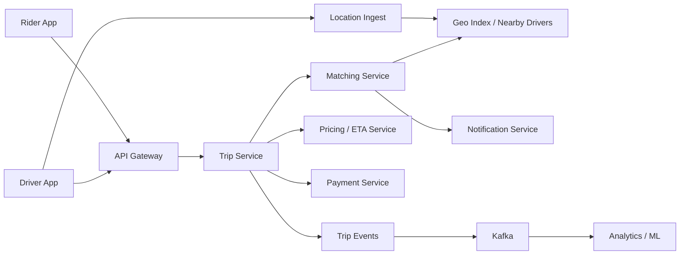
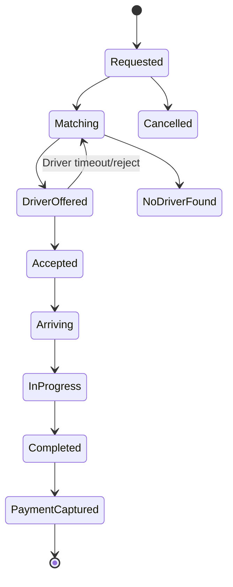

# Case Study: Uber-Style Ride Matching Platform

Navigation: [Case Studies](README.md) | [Service Communication](../Core%20Infrastructure%20Components/09_service_communication.md) | [Distributed Transactions](../Advanced%20Distributed%20Systems/17_distributed_transactions.md) | [System Design Q&A](../Question%20Bank/system-design.md)

## Problem statement

Design a ride-sharing platform that matches riders with nearby drivers, tracks driver locations in real time, estimates prices and ETAs, processes payments, and handles trip state reliably.

## Functional requirements

- Riders can request rides from a pickup to a destination.
- Drivers publish live location and availability.
- System matches riders to nearby eligible drivers.
- Riders and drivers receive trip updates.
- The platform estimates ETA and price.
- Payment is authorized and captured.
- Support cancellation, timeout, and no-driver-found flows.

## Non-functional requirements

- Low-latency dispatch.
- High availability in busy cities.
- Correct trip state transitions.
- Idempotent payment and dispatch operations.
- Real-time location updates without overwhelming storage.

## High-level architecture



## Core services

| Service | Responsibility |
|---------|----------------|
| Location ingest | receives driver GPS updates, filters noise, updates geo index |
| Matching service | selects drivers using distance, ETA, supply, acceptance history |
| Trip service | owns trip lifecycle and state machine |
| Pricing service | estimates fare using distance, time, demand, promotions |
| Payment service | authorizes and captures payment idempotently |
| Notification service | push updates to rider/driver |
| Event pipeline | analytics, fraud detection, model training |

## Trip state machine



## API sketch

```http
POST /v1/rides
PATCH /v1/drivers/{driverId}/location
POST /v1/rides/{rideId}/accept
POST /v1/rides/{rideId}/cancel
GET /v1/rides/{rideId}
```

## Data model

| Entity | Fields |
|--------|--------|
| DriverLocation | `driverId`, `lat`, `lon`, `heading`, `speed`, `updatedAt`, `geohash` |
| Ride | `rideId`, `riderId`, `driverId`, `pickup`, `destination`, `status`, `priceEstimate`, `createdAt` |
| DriverAvailability | `driverId`, `cityId`, `vehicleType`, `status`, `lastSeenAt` |
| PaymentIntent | `paymentId`, `rideId`, `amount`, `status`, `idempotencyKey` |
| RideEvent | `rideId`, `eventType`, `payload`, `timestamp` |

## Geo indexing

Options:

- Geohash or S2 cells for nearby lookup.
- In-memory city partitions for hot dispatch zones.
- Redis GEO for simpler early implementation.
- Dedicated spatial index service for large-scale matching.

The matching service should query nearby cells, then rank drivers by ETA, availability, vehicle type, fairness, and predicted acceptance.

## Consistency decisions

| Area | Consistency | Reason |
|------|-------------|--------|
| Trip state | strong per ride | avoid duplicate drivers or invalid state transitions |
| Driver location | eventual, fresh within seconds | GPS is noisy and frequent |
| Matching offer | conditional write / lock | avoid offering one driver to many riders |
| Payment | strong with idempotency | prevent duplicate charges |
| Analytics | eventual | not user blocking |

## Failure handling

- If notification fails, trip state remains authoritative and clients poll.
- If matching service fails, request remains in `Matching` until timeout or retry.
- If driver accepts after timeout, conditional state update rejects stale acceptance.
- If payment capture fails, trip completion remains pending payment resolution.
- Location pipeline can drop old updates and keep latest driver position.

## Observability

- Match latency p95/p99 by city.
- Driver offer acceptance rate.
- No-driver-found rate.
- GPS freshness and dropped location updates.
- Trip state transition failures.
- Payment authorization/capture error rate.

## Interview talking points

- Keep trip state transitions strict and idempotent.
- Treat location as high-volume, short-lived data.
- Separate matching from trip ownership.
- Use event streams for analytics and ML feedback.
- Explain how you prevent duplicate driver assignment.

