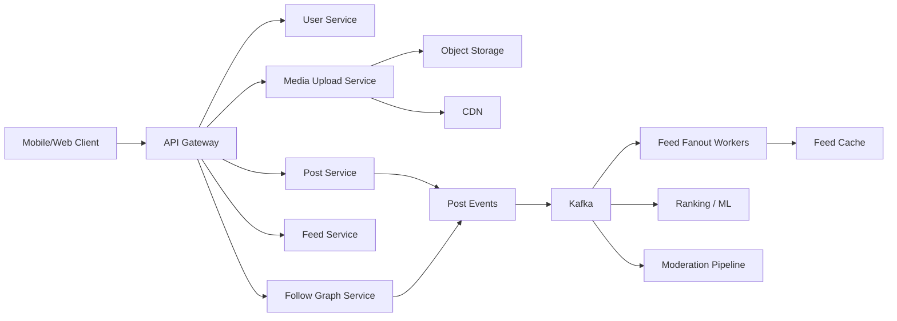

# Case Study: Instagram-Style Feed and Media Platform

Navigation: [Case Studies](README.md) | [Caching](../Core%20Infrastructure%20Components/07_caching.md) | [Data Storage](../Core%20Infrastructure%20Components/08_data_storage.md) | [System Design Q&A](../Question%20Bank/system-design.md)

## Problem statement

Design a social media platform where users upload photos/videos, follow other users, view ranked feeds, like/comment, receive notifications, and search/discover content.

## Functional requirements

- Users can upload images and videos.
- Users can follow/unfollow accounts.
- Users can view a home feed.
- Users can like, comment, and save posts.
- Users can receive notifications for social actions.
- Moderation systems can flag abusive content.

## Non-functional requirements

- Low-latency feed reads.
- Durable media storage.
- High write throughput for likes/comments.
- Eventual consistency for feed ranking and counters.
- Stronger consistency for account privacy and deletes.

## High-level architecture



## Feed strategies

| Strategy | Good for | Trade-off |
|----------|----------|-----------|
| Fanout on write | normal users with moderate follower count | write amplification |
| Fanout on read | celebrities/high-follower accounts | slower reads |
| Hybrid | most production social feeds | complexity |

For celebrity accounts, do not push every post to every follower immediately. Store the post separately and merge it into follower feeds at read time or via selective fanout.

## API sketch

```http
POST /v1/posts
GET /v1/feed/home?cursor=...
POST /v1/users/{userId}/follow
POST /v1/posts/{postId}/likes
POST /v1/posts/{postId}/comments
DELETE /v1/posts/{postId}
```

## Data model

| Entity | Fields |
|--------|--------|
| User | `userId`, `username`, `privacy`, `createdAt` |
| FollowEdge | `followerId`, `followeeId`, `status`, `createdAt` |
| Post | `postId`, `authorId`, `mediaIds`, `caption`, `visibility`, `createdAt`, `deletedAt` |
| MediaAsset | `mediaId`, `postId`, `type`, `storagePath`, `variants[]`, `status` |
| FeedItem | `userId`, `postId`, `score`, `createdAt`, `cursor` |
| Comment | `commentId`, `postId`, `authorId`, `text`, `createdAt` |

## Scaling strategy

- Store media in object storage and serve through CDN.
- Use async media processing for thumbnails, video variants, and safety checks.
- Partition feed cache by `userId`.
- Use event streams for fanout, ranking, notifications, and counters.
- Cache hot profiles and post metadata.
- Use approximate counters for likes/views at high scale.

## Consistency decisions

| Area | Consistency | Reason |
|------|-------------|--------|
| Follow/private access | strong or bounded-stale | privacy is user trust |
| Feed ranking | eventual | small delay is acceptable |
| Likes/comments counters | eventual | exact count can lag |
| Post delete | strong tombstone + async cleanup | deleted content must stop showing |
| Media processing | async eventual | upload can show processing state |

## Failure handling

- If feed fanout lags, read path can merge recent posts.
- If ranking service fails, fall back to chronological feed.
- If media processing fails, mark asset failed and allow retry.
- If counters lag, show approximate values.
- If moderation is delayed, use risk scoring and quarantine for suspicious uploads.

## Observability

- Feed generation latency.
- Fanout lag by shard.
- Media processing queue depth.
- CDN hit ratio and media error rate.
- Post visibility/delete propagation time.
- Abuse report and moderation backlog.

## Interview talking points

- Explain fanout-on-write vs fanout-on-read clearly.
- Discuss celebrity/hot account handling.
- Separate media storage from metadata.
- Treat ranking and counters as eventually consistent.
- Address privacy, deletes, abuse, and moderation explicitly.

