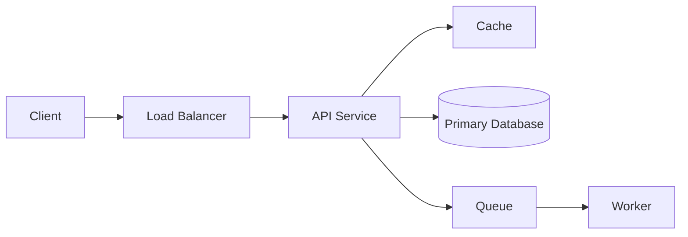

# System Design Case Study Template

Navigation: [Main README](README.md) | [System Design Fundamentals](System%20Design%20Fundamentals/README.md) | [System Design Q&A](Question%20Bank/system-design.md) | [Cost Calculator](COST_CALCULATOR.md)

Use this template for every system-design case study. Copy the sections into a new case file or use them as an interview speaking structure.

## 1. Problem statement

```text
Design:
Users:
Primary actions:
Out of scope:
```

## 2. Requirements

### Functional requirements

- 
- 
- 

### Non-functional requirements

| Requirement | Target |
|-------------|--------|
| Availability | |
| Latency | |
| Consistency | |
| Throughput | |
| Durability | |
| Security | |
| Cost sensitivity | |

## 3. Capacity estimate

| Metric | Estimate | Notes |
|--------|----------|-------|
| Daily active users | | |
| Requests per second | | |
| Read/write ratio | | |
| Storage per day | | |
| Bandwidth | | |
| Peak multiplier | | |

## 4. API design

| Method | Endpoint | Purpose | Notes |
|--------|----------|---------|-------|
| POST | | | |
| GET | | | |
| PUT/PATCH | | | |
| DELETE | | | |

## 5. Data model

| Entity | Key fields | Storage choice |
|--------|------------|----------------|
| | | |

## 6. High-level architecture



## 7. Critical flows

### Write path

1. 
2. 
3. 

### Read path

1. 
2. 
3. 

## 8. Scaling plan

- Stateless services:
- Database:
- Cache:
- Queue/stream:
- CDN/edge:
- Multi-region:

## 9. Consistency and failure handling

| Failure | Mitigation |
|---------|------------|
| Duplicate request | Idempotency key |
| Downstream timeout | Retry with backoff, circuit breaker |
| Message failure | DLQ and replay |
| Database failover | Replication and recovery plan |
| Cache inconsistency | TTL and invalidation strategy |

## 10. Observability

- Metrics:
- Logs:
- Traces:
- Alerts:
- Dashboards:

## 11. Security

- Authentication:
- Authorization:
- Rate limiting:
- Data protection:
- Audit logging:
- Abuse prevention:

## 12. Cost and trade-offs

Use [COST_CALCULATOR.md](COST_CALCULATOR.md) to estimate rough cost. In an interview, call out the main cost driver and one optimization.

## 13. Final summary

```text
I chose this design because...
The biggest trade-off is...
If traffic grows 10x, I would...
If consistency becomes stricter, I would...
```
