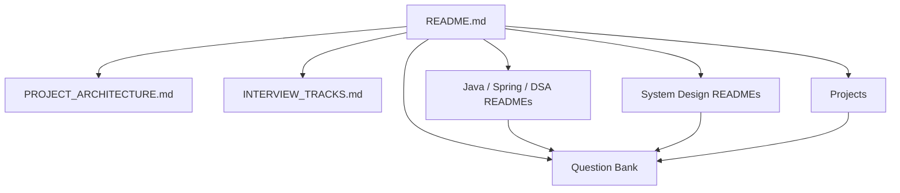
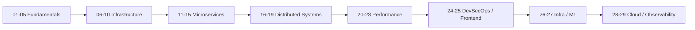
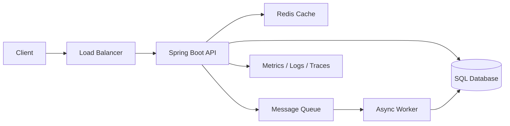
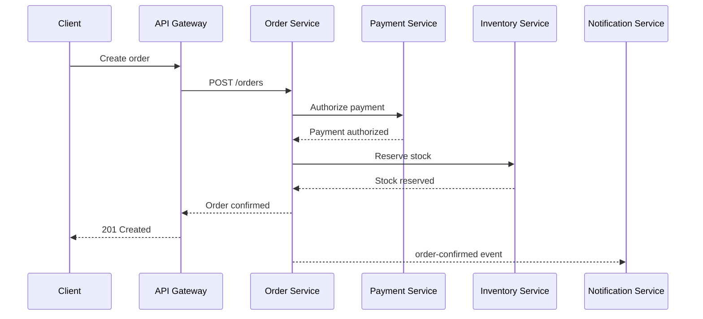
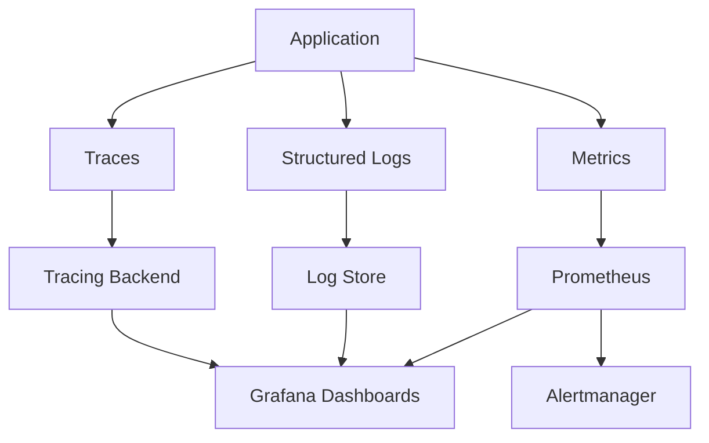
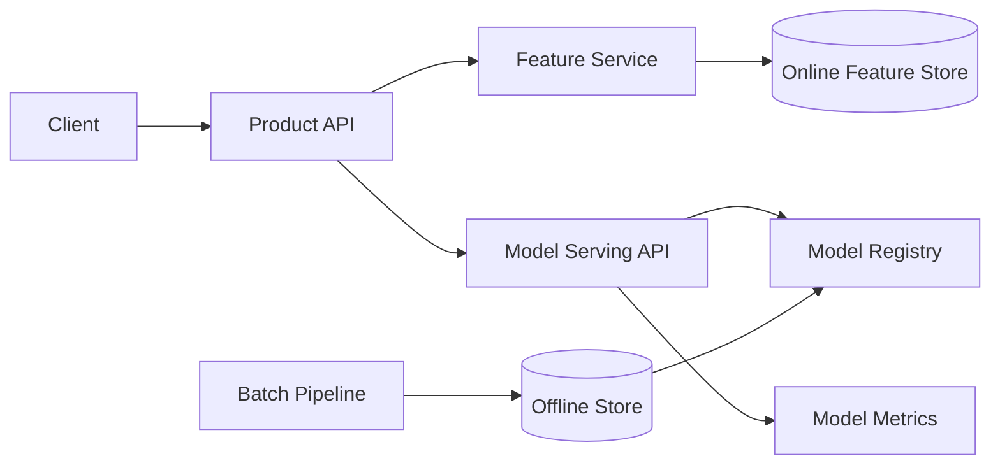
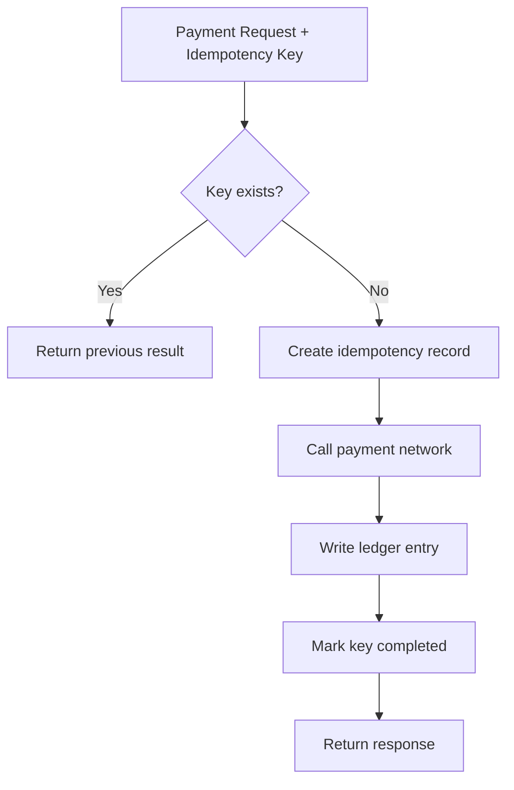

# Visual Architecture Diagrams

Navigation: [Main README](README.md) | [Project Architecture](PROJECT_ARCHITECTURE.md) | [System Design Template](SYSTEM_DESIGN_CASE_STUDY_TEMPLATE.md)

Use these Mermaid diagrams as starting points for notes, case studies, and interview explanations.

For complete case-specific diagrams, see:

- [Netflix-style streaming platform](Real-World%20Case%20Studies/01_netflix_streaming_platform.md)
- [Uber-style ride matching](Real-World%20Case%20Studies/02_uber_ride_matching.md)
- [Instagram-style feed and media platform](Real-World%20Case%20Studies/03_instagram_feed_media.md)

## Repository learning flow

## System design chapter sequence

## Production Spring Boot service

## Microservice order flow

## Observability flow

## ML serving flow

## Payment idempotency flow

