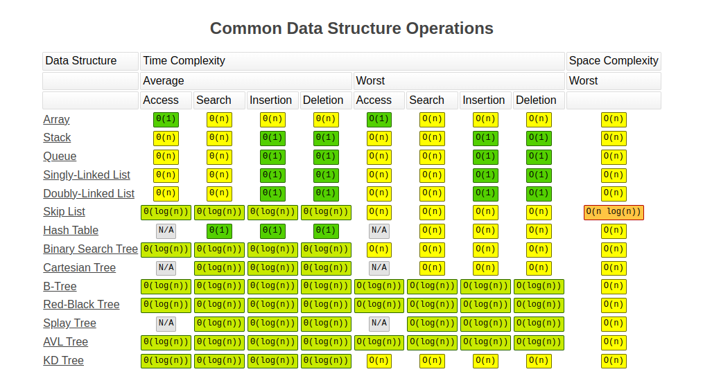
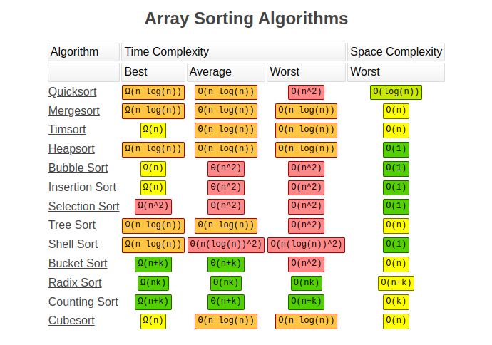

# Big O notation
> Big O notation is used in computer science to define an upper bound of an algorithm. It is mostly used to define the maximum time of an algorithm as a function of the input size, but it can also be used to define memory usage. Big O notation tells you how fast an algorithm is. Big O doesn't tell you the speed in seconds. Big O notation lets you compare the number of operations.

### Why is Big O Important?
> Big O notation helps developers and computer scientists analyze the efficiency of algorithms. It provides a way to predict how an algorithm will scale as the size of the input grows. This is crucial for optimizing code and ensuring that applications perform well under different conditions.

- [Big-O Cheat Sheet](https://www.bigocheatsheet.com/)


> The chart above visually represents the growth rates of different Big O complexities. It helps in understanding how the runtime or memory usage of an algorithm increases with input size.

### Common Complexities

### O(1) - Constant Time
> A real-world example of an O(1) operation is accessing an array by its index. The runtime does not depend on the size of the input.

**Example:**
```java
int[] arr = {1, 2, 3, 4, 5};
System.out.println(arr[2]);  // Accessing the third element is O(1)
```
**Explanation:** Accessing an element in an array by its index is a constant-time operation because it does not depend on the size of the array.

### O(log n) - Logarithmic Time
> The most common real-world example of an O(log n) operation is a binary search of an ordered array. The runtime grows logarithmically as the input size increases.

**Example:**
```java
public static int binarySearch(int[] arr, int target) {
    int low = 0, high = arr.length - 1;
    while (low <= high) {
        int mid = (low + high) / 2;
        if (arr[mid] == target) {
            return mid;
        } else if (arr[mid] < target) {
            low = mid + 1;
        } else {
            high = mid - 1;
        }
    }
    return -1;
}

int[] arr = {1, 3, 5, 7, 9};
System.out.println(binarySearch(arr, 5));  // O(log n)
```
**Explanation:** Binary search repeatedly divides the search interval in half, reducing the problem size logarithmically.

### O(n) - Linear Time
> An example of an O(n) operation is a naive search for an item in an array. The runtime grows linearly with the input size.

**Example:**
```java
public static int naiveSearch(int[] arr, int target) {
    for (int i = 0; i < arr.length; i++) {
        if (arr[i] == target) {
            return i;
        }
    }
    return -1;
}

int[] arr = {1, 3, 5, 7, 9};
System.out.println(naiveSearch(arr, 7));  // O(n)
```
**Explanation:** The algorithm iterates through the array, checking each element, so the runtime grows linearly with the input size.

### O(n log n) - Linearithmic Time
> Sorting algorithms like Merge Sort and Quick Sort often have O(n log n) complexity. This is a combination of linear and logarithmic growth.

**Example:**
```java
public static void mergeSort(int[] arr, int left, int right) {
    if (left < right) {
        int mid = (left + right) / 2;

        mergeSort(arr, left, mid);
        mergeSort(arr, mid + 1, right);

        merge(arr, left, mid, right);
    }
}

public static void merge(int[] arr, int left, int mid, int right) {
    int n1 = mid - left + 1;
    int n2 = right - mid;

    int[] leftArr = new int[n1];
    int[] rightArr = new int[n2];

    for (int i = 0; i < n1; i++) {
        leftArr[i] = arr[left + i];
    }
    for (int j = 0; j < n2; j++) {
        rightArr[j] = arr[mid + 1 + j];
    }

    int i = 0, j = 0, k = left;
    while (i < n1 && j < n2) {
        if (leftArr[i] <= rightArr[j]) {
            arr[k] = leftArr[i];
            i++;
        } else {
            arr[k] = rightArr[j];
            j++;
        }
        k++;
    }

    while (i < n1) {
        arr[k] = leftArr[i];
        i++;
        k++;
    }

    while (j < n2) {
        arr[k] = rightArr[j];
        j++;
        k++;
    }
}

int[] arr = {38, 27, 43, 3, 9, 82, 10};
mergeSort(arr, 0, arr.length - 1);
System.out.println(Arrays.toString(arr));  // O(n log n)
```
**Explanation:** Merge Sort divides the array into halves recursively and then merges them in sorted order, resulting in O(n log n) complexity.

### O(n^2) - Quadratic Time
> A real-world example of an O(n^2) operation is a naive search for duplicates in an array. In this scenario, you loop through all the items in the array, and for each of those items, loop through the array again to see if there are any matches.

**Example:**
```java
public static List<Integer> findDuplicates(int[] arr) {
    List<Integer> duplicates = new ArrayList<>();
    for (int i = 0; i < arr.length; i++) {
        for (int j = i + 1; j < arr.length; j++) {
            if (arr[i] == arr[j]) {
                duplicates.add(arr[i]);
            }
        }
    }
    return duplicates;
}

int[] arr = {1, 2, 3, 2, 4, 5, 1};
System.out.println(findDuplicates(arr));  // O(n^2)
```
**Explanation:** The algorithm compares each element with every other element, leading to a quadratic growth in runtime.

### O(2^n) - Exponential Time
> Algorithms that solve problems using recursion with multiple branches, such as the Fibonacci sequence, often have O(2^n) complexity. The runtime doubles with each additional input.

**Example:**
```java
public static int fibonacci(int n) {
    if (n <= 1) {
        return n;
    }
    return fibonacci(n - 1) + fibonacci(n - 2);
}

System.out.println(fibonacci(5));  // O(2^n)
```
**Explanation:** The Fibonacci algorithm makes two recursive calls for each input, leading to exponential growth in runtime.

### O(n!) - Factorial Time
> Real-world examples of O(n!) operations are anything that requires analyzing a list of permutations. These algorithms are highly inefficient for large inputs.

**Example:**
```java
public static List<List<Integer>> generatePermutations(int[] arr) {
    List<List<Integer>> result = new ArrayList<>();
    permute(arr, 0, result);
    return result;
}

private static void permute(int[] arr, int start, List<List<Integer>> result) {
    if (start == arr.length) {
        List<Integer> permutation = new ArrayList<>();
        for (int num : arr) {
            permutation.add(num);
        }
        result.add(permutation);
    } else {
        for (int i = start; i < arr.length; i++) {
            swap(arr, start, i);
            permute(arr, start + 1, result);
            swap(arr, start, i);
        }
    }
}

private static void swap(int[] arr, int i, int j) {
    int temp = arr[i];
    arr[i] = arr[j];
    arr[j] = temp;
}

int[] arr = {1, 2, 3};
System.out.println(generatePermutations(arr));  // O(n!)
```
**Explanation:** Generating all permutations involves exploring all possible arrangements, leading to factorial growth in runtime.


> The image above summarizes the time complexities of common operations on data structures like arrays, linked lists, stacks, and queues.


> This image provides a comparison of different sorting algorithms and their time complexities in best, average, and worst-case scenarios.

