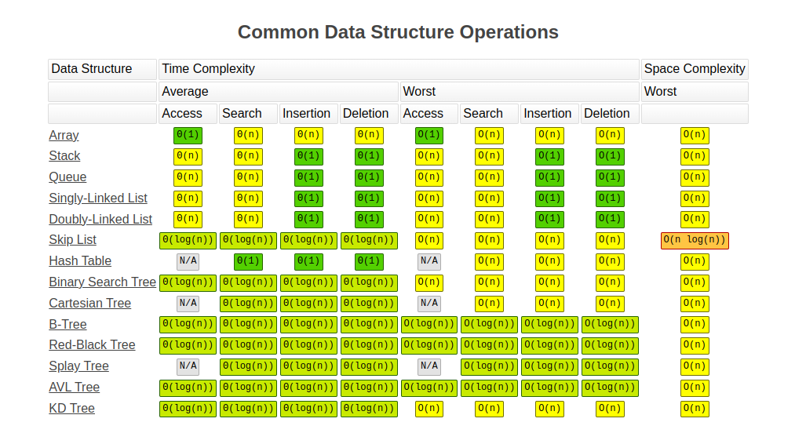

# Big O notation
> Big O notation is used in computer science to define an upper bound of an algorithm. It is mostly used to define the maximum time of an algorithm as a function of the input size, but it can also be used to define memory usage.

- [Big-O Cheat Sheet](https://www.bigocheatsheet.com/)

### O(1) - Constant Time
> A real world example of an O(1) operation is accessing an array by its index.

### O(log n) - Logarithmic Time
> The most common real world example of an O(log n) operation is a binary search of an ordered array.

### O(n) - Linear Time
> Example of an O(n) operation is a naive search for an item in an array.

### O(n^2) - Quadratic Time
> A real world example of an O(n^2) operation is a naive search for duplicates in an array. In this scenario, you loop through all the items in the array, and for each of those items, loop through the array again to see if there are any matches.

### O(n!) - Factorial Time
> Real world examples of O(n!) operations are anything that requires analysing a list of permutations

